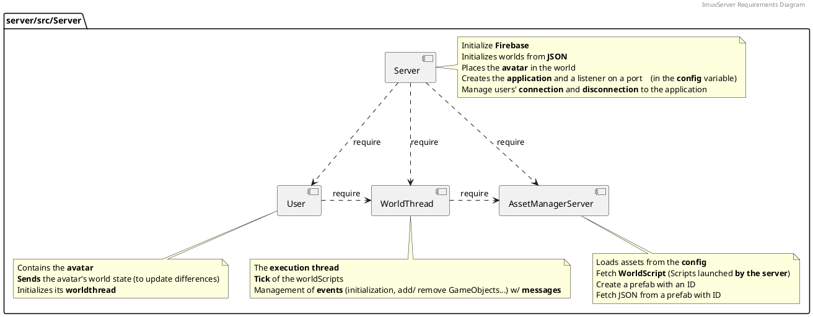

```plantuml
@startuml
header ImuvServer Requirements Diagram
folder server/src/Server{
    component Server
    note right
    Initialize **Firebase**
    Initializes worlds from **JSON**
    Places the **avatar** in the world
    Creates the **application** and a listener on a port    (in the **config** variable)
    Manage users' **connection** and **disconnection** to the application
    end note
    component User
    note bottom
    Contains the **avatar**
    **Sends** the avatar's world state (to update differences)
    Initializes its **worldthread**
    end note
    component WorldThread
    note bottom
    The **execution thread**
    **Tick** of the worldScripts
    Management of **events** (initialization, add/ remove GameObjects...) w/ **messages**
    end note
    component AssetManagerServer
    note bottom
    Loads assets from the **config**
    Fetch **WorldScript** (Scripts launched **by the server**)
    Create a prefab with an ID
    Fetch JSON from a prefab with ID
    end note
}

User .>WorldThread : require
WorldThread .> AssetManagerServer : require

Server ...> AssetManagerServer : require
Server ...> User : require
Server ...> WorldThread : require


@enduml
```
