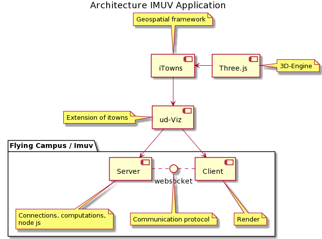
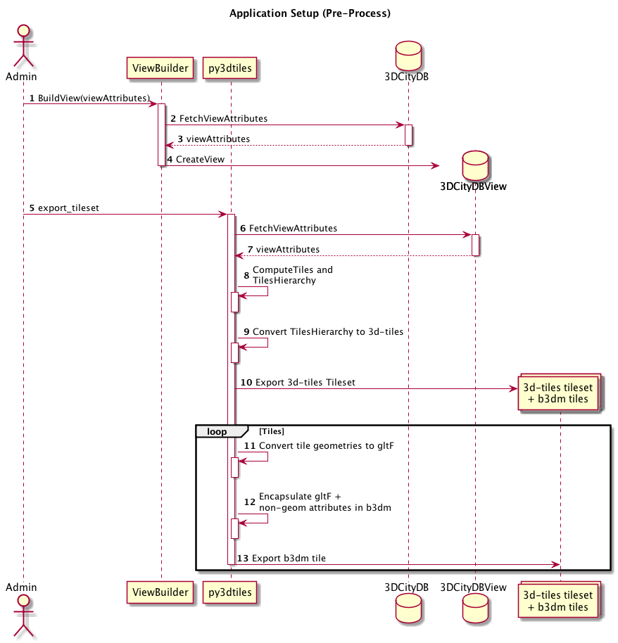
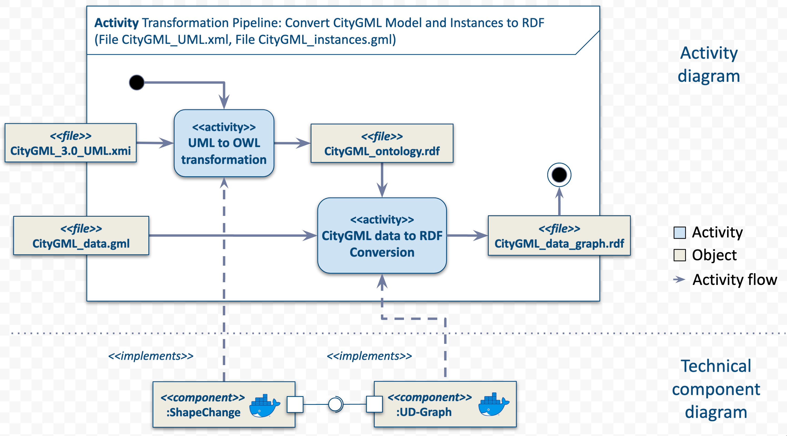
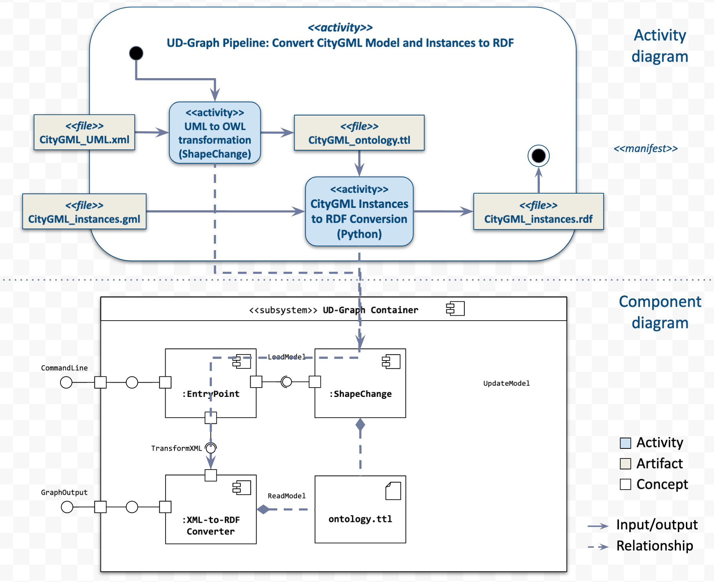

# Architecture

**Quick links**
 * List of [UD-SV software Components](https://github.com/VCityTeam/UD-SV/tree/master/SoftwareComponents)
 * Wikipedia's [Sofware Architecture page](https://en.wikipedia.org/wiki/Software_architecture)
 * Martin Fowler's [Sofware Architecture Guide](https://martinfowler.com/architecture/)

## [Structure diagrams](https://www.uml-diagrams.org/uml-25-diagrams.html#structure-diagram) examples of the UD-SV project

### [Component diagrams](https://www.uml-diagrams.org/component-diagrams.html) examples

     
The component diagram of the [UD-Imuv application](https://github.com/VCityTeam/UD-Imuv) (and it's [Puml source](./Diagrams/GlobalDiagramIMUV.puml))

Another example of a UML look-alike (not strictly UML) diagram

An informal artistic depiction of some generic structure of an UD-SV GUI application

### [Class diagrams](https://www.uml-diagrams.org/class-diagrams-overview.html) examples

Abstract data model of geographically attached multimedia assets (of the 
[Spatial-Multimedia-DB](https://github.com/VCityTeam/Spatial-Multimedia-DB) component)

## [Behavior diagrams](https://www.uml-diagrams.org/uml-25-diagrams.html#behavior-diagram) examples of the UD-SV project

### [sequence diagrams](https://www.uml-diagrams.org/sequence-diagrams.html) examples

Preprocessing stage of a 3d-tiles tileset computation (and its **[Puml source](Diagrams/ApplicationSetup.puml)**)

#### GUI navigation in a 3D representation of a city

**Navigation in a City in 3D diagram:** [Puml source](Diagrams/3DNavigation.puml)

## Hybrid/combination-of diagrams (not strictly UML)

Two examples of class diagrams juxtaposed with component diagrams

## Architecture related recommended material

### UD-SV level

At the level of the UD-SV project:
 * [Thick client vs Thin Client server strategy](./ThickVsThinClientStrategy.md)
 * [Tools for diagramming](/Tools/ToolForDiagramming.md)
 * [3DCityDB component](3DCityDB.md) architectural elements

### General architecture
 * Introductory material: watch (35') the [C4-Model short presentation](https://c4model.com/)
 * [Software architecture](http://ftacademy.org/sites/ftacademy.org/files/materials/fta-m11-soft_arch-pre.pdf) by Bijlsma, Heerendr, Roubtsova, Stuurman
 * [A Reminder On Three/MultiTier Layer Architecture Design](https://www.hanselman.com/blog/AReminderOnThreeMultiTierLayerArchitectureDesignBroughtToYouByMyLateNightFrustrations.aspx) (by Scott Hanselman): **"If you are designing a layer, know your in's and out's and for Goodness' Sake know your responsibility.  If you don't, back to the drawing board until you do."**
 * [Difference between CRUD and REST](https://softwareengineering.stackexchange.com/questions/120716/difference-between-rest-and-crud): [CRUD](https://en.wikipedia.org/wiki/Create,_read,_update_and_delete) means the basic operations to be done in a data repository. [REST](https://en.wikipedia.org/wiki/Representational_state_transfer) operates on resource  representations (complex objects abstractions), each one identified by an URL. In short: **same thing, different layers** (CRUD falls within the Data Access layer while REST fits in the Business layer).
 * [Stateless vs Stateful](https://en.wikipedia.org/wiki/Stateless_protocol) protocols: there can be **complex interactions between stateful and stateless protocols** among **different protocol layers**. For example, HTTP is an example of a stateless protocol layered on top of TCP, a stateful protocol, which is layered on top of IP, another stateless protocol, which is routed on a network that employs BGP, another stateful protocol. Note: REST**ful** is state**less**.
