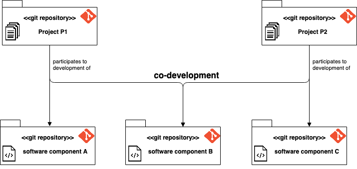

# Organizational logic of git repositories

The [VCityTeam organisation](https://github.com/VCityTeam)
 * manages [list of projects](https://github.com/VCityTeam/VCity/wiki/Projects) which 
   requires the handling of information
 * produces [software components](https://github.com/VCityTeam/UD-SV/tree/master/SoftwareComponents)
 * handles all the above information (project artifacts and software) with git

## Repositories break down
The good practices applied for the break down of the orgnisation information into git repositories is as follows
 * [separate concerns](https://en.wikipedia.org/wiki/Separation_of_concerns): keep project (managerial) information
   separated from software
 * Create a repository for every project e.g. [this UD-SV project](/Readme.md) 
 * [Reusability](https://en.wikipedia.org/wiki/Reusability) (among which [modularity](https://en.wikipedia.org/wiki/Modular_programming)) drives the break down of the software components:
   - create a repository for every [(software) library](https://en.wikipedia.org/wiki/Library_(computing)) (e.g. [py3dtiles](https://github.com/VCityTeam/py3dtiles) which is a python library) or [(software) package] (e.g. [UD-Viz](https://github.com/VCityTeam/UD-Viz) is a JS package)...
   - create a repository for every [(software) application](https://en.wikipedia.org/wiki/Application_software) e.g. [UD-Viz-demo](https://github.com/VCityTeam/UD-Viz-demo) is an application demo based on UD-Viz
   - create a repository for every docker component e.g. [UD-Viz-demo-docker](https://github.com/VCityTeam/UD-Viz-demo-docker)
   - but a demo can be a **directory** (within a repository) usually holding a docker-compose (located e.g. in [UD-Reproducibility/Demos](https://github.com/VCityTeam/UD-Reproducibility/tree/master/Demos)

The above practices are summarized by the following illustration

## Relationships between project/software repositories
Project repositories and software repositories are in a [many-to-many](https://en.wikipedia.org/wiki/Cardinality_(data_modeling)#Application_program_modeling_approaches) (cardinality) relationship i.e.
 - a (software) component repository can be the results of one or many projects
 - a project repository uses one or many component repositories (library, application, demo)

This [many-to-many](https://en.wikipedia.org/wiki/Cardinality_(data_modeling)#Application_program_modeling_approaches) is illustrated by the following diagram

## Separation of public from private information
The organisation also applies the [separation of concerns](https://en.wikipedia.org/wiki/Separation_of_concerns) to the public vs private criteria.
This directly translates to the fact that private information (be it project or component) is held in private (git) repositories when public information (project or component) is kept in ...  public (git) repositories. For example
 - the [VCity project repository](https://github.com/VCityTeam/VCity/wiki/Projects) is private when the [UD-SV project repository](https://github.com/VCityTeam/UD-SV) is its public counterpart
 - [GMAOBIM software](https://github.com/VCityTeam/GMAOBIM) is a private software repository when [py3dTilers software repository](https://github.com/VCityTeam/py3dtilers) is a public repository

This can be summarized by the following illustration

