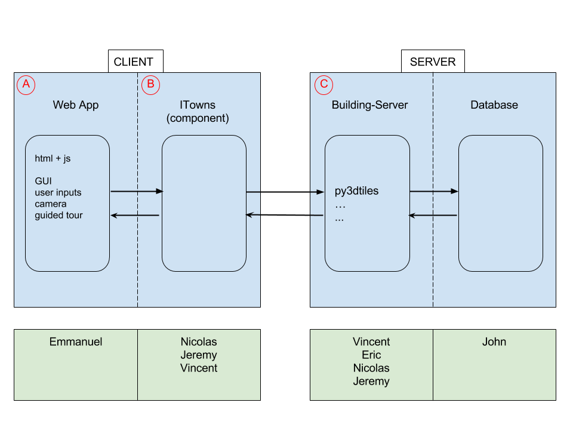

# Architecture & Repartition

[direct link to edit the schema](https://docs.google.com/drawings/d/1Fn3ur8uXsjrH7YFseKu7XJrqCqmqu6xaxsCB6kSajzg/edit?usp=sharing) (after edition you need to download it as a .png, rename it as Architecture.png and upload it here, in .../devel/images)

* : it's the web application 

* : When the (A) send a request (a tileset) here, iTowns request to the (C) the adapter the data. When the (C) return the data on format 3dtiles, iTowns parse this and put the data on Three.js class. iTowns also manages the display.

* : The adapter receive the request ask to the server, the database, recovere the data and convert to 3dtiles format like b3dm, pnts... and send to the iTowns.
