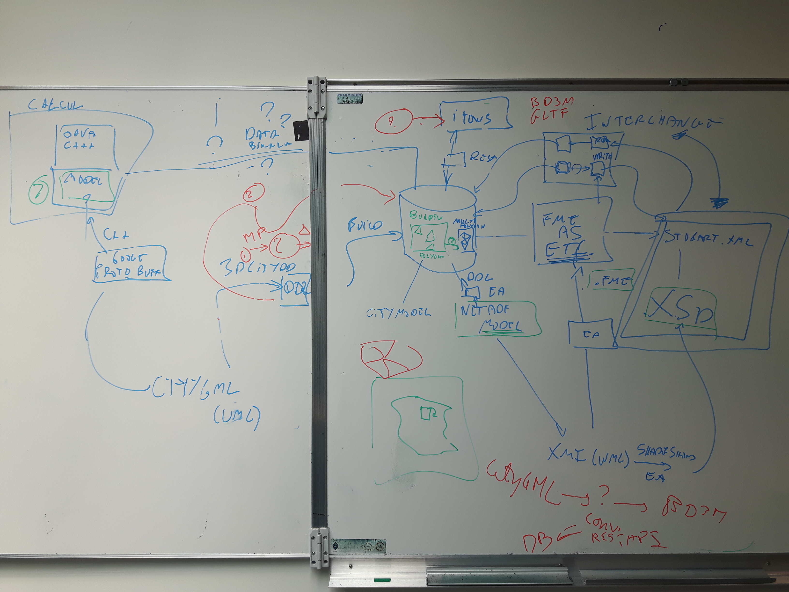
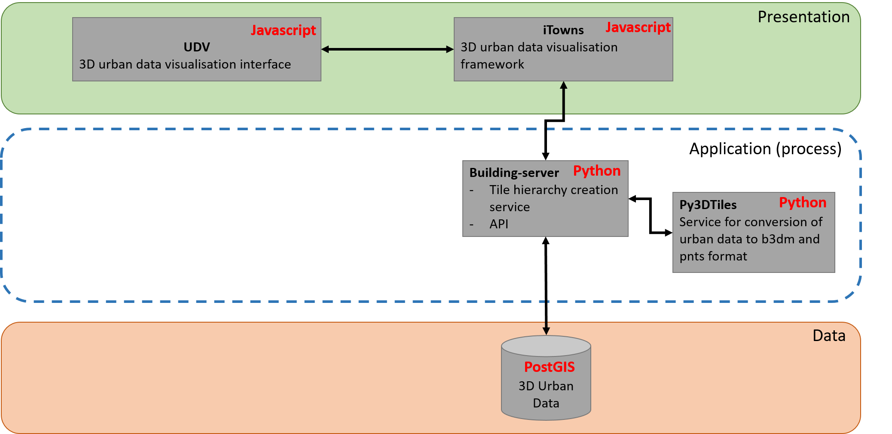
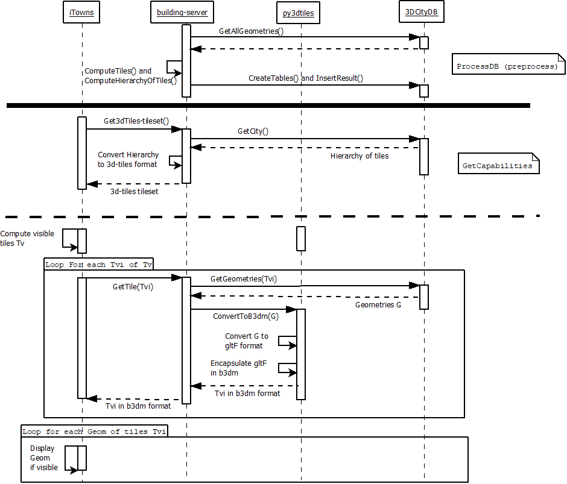

# Application Architecture 

Architecture and related diagrams regarding the whole application.

## Architecture Diagrams

### Architecture diagram of Oslandia developping context with iTowns:

### Global architecture diagram (06/2017):

### Software Architecture diagram (17/10/2017)

The following diagram present the current software architecture of our application, its component and associated technologies.

## Sequence diagrams

### Sequence diagram describing the workflow when displaying a city using our application (without temporality)

The purpose of this sequence is to display a 3D urban area in a web client from a database containing georeferenced and standardized data.

