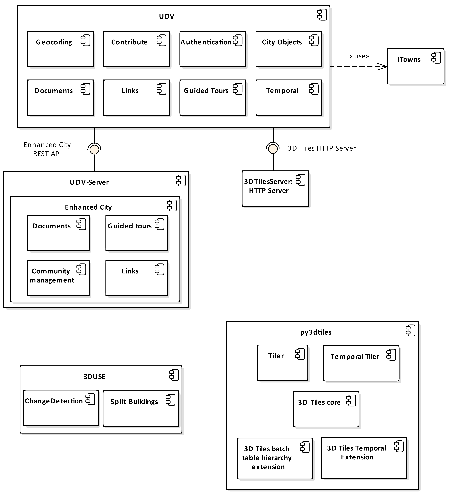

## Components (quick) description
 * **Client side**: 
   [Urban Data Viewer (UDV)](https://github.com/MEPP-team/UDV) is a repository gathering [WebGL](https://en.wikipedia.org/wiki/WebGL), [iTowns](https://github.com/iTowns/itowns), javascript components dedicated to Uban Data (with a 3D geospatial description) visualisation. The UDV sub-components are regrouped in [UDV/UDV-Core](https://github.com/MEPP-team/UDV/tree/master/UDV-Core) and include
     - [UDV/Guided Tour](https://github.com/MEPP-team/UDV/tree/master/UDV-Core/src/Modules/GuidedTour)
     - [UDV/Temporal](https://github.com/MEPP-team/UDV/tree/master/UDV-Core/src/Modules/Temporal)
     - [UDV/Documents](https://github.com/MEPP-team/UDV/tree/master/UDV-Core/src/Modules/Documents), [UDV/DocumentComments](https://github.com/MEPP-team/UDV/tree/master/UDV-Core/src/Extensions/DocumentComments), [UDV/DocumentValidation](https://github.com/MEPP-team/UDV/tree/master/UDV-Core/src/Extensions/DocumentValidation)
     - [UDV/Crontibute](https://github.com/MEPP-team/UDV/tree/master/UDV-Core/src/Extensions/Contribute)
     - [UDV/Authentication](https://github.com/MEPP-team/UDV/tree/master/UDV-Core/src/Extensions/Authentication)
     - [UDV/Links](https://github.com/MEPP-team/UDV/tree/master/UDV-Core/src/Modules/Links)
     - [UDV/Geocoding](https://github.com/MEPP-team/UDV/tree/master/UDV-Core/src/Extensions/Geocoding)
     
   Third party components: 
     - [iTowns](https://github.com/iTowns/itowns)
      
 * **Backend**      
   - [UDV-Server/API_Enhanced_City](https://github.com/MEPP-team/UDV-server/tree/master/API_Enhanced_City): a server handling building attached "Documents" (file and metadata), Guided tours (sequences of documents with additional texts), User accounts and associated rights, "Links" (between documents and some city objects)
   - [City Tilers](https://github.com/MEPP-team/py3dtiles/tree/Tiler/Tilers/CityTiler): various algorithms computing [3dTiles tilesets](https://github.com/AnalyticalGraphicsInc/3d-tiles) (e.g. [City Temporal Tiler](https://github.com/MEPP-team/py3dtiles/blob/Tiler/Tilers/CityTiler/CityTemporalTiler.py))
   - LibCityProcess: a library [repackaging 3DUse filters](https://github.com/MEPP-team/3DUSE/issues/39) as a separate component
      * [SplitBUilding](https://github.com/EricBoix/3DUSE/blob/master/src/utils/cmdline/splitCityGMLBuildings.cxx)
      * [ChangeDetection](https://github.com/EricBoix/3DUSE/blob/master/src/utils/cmdline/extractBuildingsConstructionDemolitionDates.cxx)
      
   Third party components:     
   - [py3dtiles](https://github.com/MEPP-Team/py3dtiles/) : a fork of [Oslandia's py3dtiles](https://github.com/Oslandia/py3dtiles/)
   - [3DCityDB](https://www.3dcitydb.org/3dcitydb/) (provided by [TUM](https://www.lrg.tum.de/gis/startseite/)): a geographical database based on the CityGML conceptual model
   - [3DTiles samples](https://github.com/AnalyticalGraphicsInc/3d-tiles-samples): a [node.js](https://nodejs.org/en/) based simple file server (by Analytical Graphics Inc) used to web deliver [3dTiles tilesets](https://github.com/AnalyticalGraphicsInc/3d-tiles) (developing context)
   - [Apache](https://en.wikipedia.org/wiki/Apache_HTTP_Server) or [nginx](https://nginx.org/en/) http servers: used to web deliver [3dTiles tilesers](https://github.com/AnalyticalGraphicsInc/3d-tiles) (demo context)
   

       
## Historical notes
Here is a list of aging/deprecated components
 * **Client side**:
   - [UDV/EarlyPrototype](https://github.com/MEPP-team/UDV/tree/master/EarlyPrototype) holds the first prototype version
   - Vilo3D: refers to an ancient [UDV release tag](https://github.com/MEPP-team/UDV/releases/tag/Vilo3D-Demo-1.0) used in the context of [Vilo3D project](http://imu.universite-lyon.fr/projet/vilo-3d-la-fabrique-urbaine-des-processus-a-leurs-representations-3d/) )
 * **Backend**      
   - [building-server](https://github.com/MEPP-team/building-server/): a fork of [Oslandia's building-server](https://github.com/Oslandia/building-server/) that can be seen as API delivering 3DTiles (build with [py3dtiles](https://github.com/MEPP-Team/py3dtiles/)) and using a pre-computed index.
