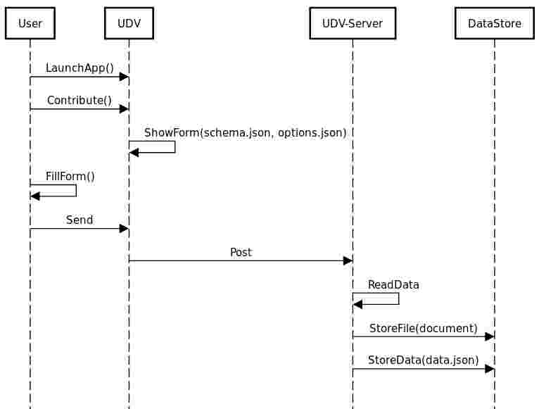

# Design note of [need 31](https://github.com/MEPP-team/RICT/blob/master/Doc/Devel/Needs/Need031.md)

To anwser this need, we give the user the possibility of browsing their files to choose a document to upload and to give information about it.

## Proposition and Discussions

The user interface that is provided is a form. 
* __Solution n°1:__ implement a simple HTML form.
* __Solution n°2:__ implement a configurable HTML form.

### Solution n°1 description:
If we choose this solution, we need to:
 - know all the metadata that is required
 - send the data to the server using a post method
 - store the data on the server
 
### Solution n°2 description:
If we choose this solution, we need to:
  - create a minimal form that can be easily adapted if the requirements for the metada change
  - send the data to the server using a post method
  - store the file and the data on the server
 
 ### Motivation for choosing solution 2:
The data model is yet undefined so we need to have a configurable form. 

Design choices:
We chose to use the [Alpaca library](http://www.alpacajs.org/) for jQuery because it provides a very easy way to implement such a form. 
The minimal requirements for using Alpaca so that it generates the form are two json files, stored on the server. The script that handles the data, on form submit, runs on the server as well.
The data are stored as a .json file.

The following sequence diagram explains how the solution has been designed:

 

