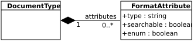
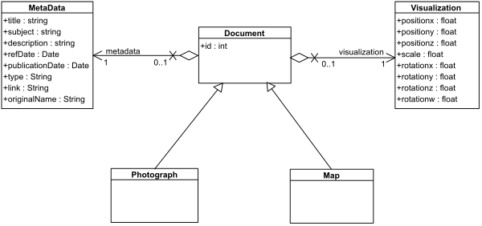

  # Context

The model of document needs to be the most generic as possible in order to be modify and eventually reuse in the future and its conceptual model is used by the back-end and the front-end.

# Static model

## Document type model

In the current situation (2018_06_29), the back-end owns a single class of **Document**.
All the documents object belong to this class and are composed of two objects : **MetaData** and **Visualization**.

*The class diagram below can show how a document is defined:*


## Repercussions
 
Everything perfectly works today, but in case of evolution of the document model, it will be necessary to modify mainly the back-side. 
However, for the front-end, the model is already dynamic and only few or even no modifications will be needed in case of this evolution.

# Dynamic model

## Preamble

SSE + LTA : On vise à définir un modèle générique de document qui permet de supporter de nouveaux types (évolutif). 

> We need to define exactly what is the meaning of a **type of documents**. 
>* Is it a **format**, like a photography, a letter, a text, etc.?
>* Or is it a more **usage métier** that can be associated to a group of users, for instance an evacuation plan for firemen ?

***
**Following the meeting with GGE (2018_06_29)**

A document is defined by what is calls a **media**, like a photo, a video, a text, etc. This media is associated with a **format**, for a photo for instance, this format can be png, jpg, svg...
This is different from what the document wants to represents (a photo in a jpg format can represent a text), so we need to define the **media meaning** of the document.

A document can also be associated with one or several type of users and can have a *usage orienté métier* (like an evacuation time.

## Document type model

### Normalisation de la défintion des attributs

In the following, we use a JSON scheme that allows us to create a new class dynamically.
For each attribute of the class we have to precise:
* a **type** value : the type of the attribute
* an **optional** value : the attribute can be unspecified
* an **enum** value : the object attribute can only have certain values 



### First: document types have the same structure (generic attributes)

In this case the JSON scheme is used to create or update only the class Document 

*The class diagram is the same than in the [[static model|udvcore_document_model#document-type-model]].*

A complete JSON file of the class document can be found [[here|udvcore_document_class_description.json]]

*The JSON file below can show an example of what can be the attributes of the class **Document**:*

```json
{
  "Document": {
    "type": "class",
    "properties": {
      "title": {
        "type": "string",
        "optional": "false"
      },
      "type": {
        "type": "int",
        "optional": "false",
        "enum": [
          "drawing",
          "photo",
          "letter",
          "text"
        ]
      }
    }
  }
}
```

### Second: document types can have complementar attributes (specific attributes)

The JSON scheme allows us to create a new document type class, for instance named *Photograph*. This new class inherits from *Document*. the JSON file is overall the same, we just have to add : 
> "extend": "Document"

We do not need to put the attributes already defined in the parent class, only if we want to override their definitions.

*The class diagram below can show how a **document** is defined:*



*The JSON file below can show an example of a document type (a **Photograph**):*

```json
{
  "Photograph": {
    "type": "class",
    "extend": "Document",
    "properties": {
      "type": {
        "enum": [
          "photo"
        ]
      },
      "height": {
        "type": "int",
        "optional": "false"
      }
    }
  }
}
```

> This approach is just a generalization of the previous one, and can be then develop later, if the model of document changes, without needed to mainly refactor.

## Document type object

FRONT INTERFACE
When a type of document is created, it is possible to instantiate an object of this new class. 

For example, if we have created the class *Photograph* we can create a new photograph object by using another JSON file. 
In this file we define
* the **class** of the object:
* the **name** of the object:
* the **value** of its attributes:

*The JSON file below can show an example of a **Photograph** object:*

```json
{
  "aPhotograph": {
    "type": "Photograph",
    "properties": {
      "title": "This is a photograph",
      "type": "photo"
    }
  }
}
```

## Document type display

Another JSON file will configure *Document* forms. This new JSON object is used by the JS library [Alpaca](http://alpacajs.org/), which will create dynamic forms. 

To be the more precise as possible, we specify for each attribute of the class some options, that can allow *Alpaca* to be more precise when creating the form. All the optional parameters can be found [here](http://alpacajs.org/docs/fields/optiontree.html).

```json
{
  "Document": {
    "options": {
      "helper": "Used to display form",
      "fields": {
        "title": {
          "size": 40,
          "placeholder": "Enter a title"
        },
        "type": {
          "type": "textarea",
          "rows": 5,
          "cols": 40
        }
      }
    }
  }
}
```

## Repercussions

The back-end (see the [[doc|https://github.com/MEPP-team/VCity/wiki/API_Extended_Documents_FR]]) that handles documents is based on an MVC architecture and was developed in php (using symfony), but if we wanted to make documents dynamic in the back, we need to modify directly the code of the application, both in the **M**odel 
([Document](https://github.com/JorisMillot/APIExtendedDocument/blob/master/src/ExtendedDocument/APIBundle/Entity/Document.php), 
[Metadata](https://github.com/JorisMillot/APIExtendedDocument/blob/master/src/ExtendedDocument/APIBundle/Entity/Metadata.php) 
and 
[Visualization](https://github.com/JorisMillot/APIExtendedDocument/blob/master/src/ExtendedDocument/APIBundle/Entity/Visualization.php))
and in the **C**ontroller ([DocumentController](https://github.com/JorisMillot/APIExtendedDocument/blob/master/src/ExtendedDocument/APIBundle/Controller/DocumentController.php))

### first solution

If we want to keep the technologies used in the back-side, a first approach can be to create a script, for instance in python, that can directly generate the php files, named above, from the JSON file. This will need some developments but can be done quite quickly.
However, if we want to develop the system of 
[[authentication|https://github.com/MEPP-team/VCity/wiki/udvcore_authentication]],
it will be necessary to make much more development and modifications.

### Second solution

A second approach can be to re-develop the back-end, in python this time, in order to be the most generic. We will need to generate the class models in a dynamic way, by using even then a 
[[JSON file|udvcore_document_class_description.json]] in this form.

This will be a consequent job, because this needs to go back from scratch to totally rebuild the server. However we can in the same way develop, or at least prepare, the handling of [[authentication|https://github.com/MEPP-team/VCity/wiki/udvcore_authentication]].

# Conclusion

Different approaches can be chosen in the future, we can:
* keep the [[static model|udvcore_document_model#repercussions]], but it implies a redevelopment or a re-font for the authentication
* use the [[dynamic model|udvcore_document_model#first-solution]] in the back with the same technologies (PHP, symfony), but we have the same problem for the authentication
* use the [[dynamic model|udvcore_document_model#second-solution]] in the back with other technologies (python), it implies to recreate totally the server but can lay the foundation for the arrival of authentication 

Avis LTA: le choix de la troisième approche semble à privilégier : évolutivité (architecture et données manipulées), généricité et facilité de développement. 
