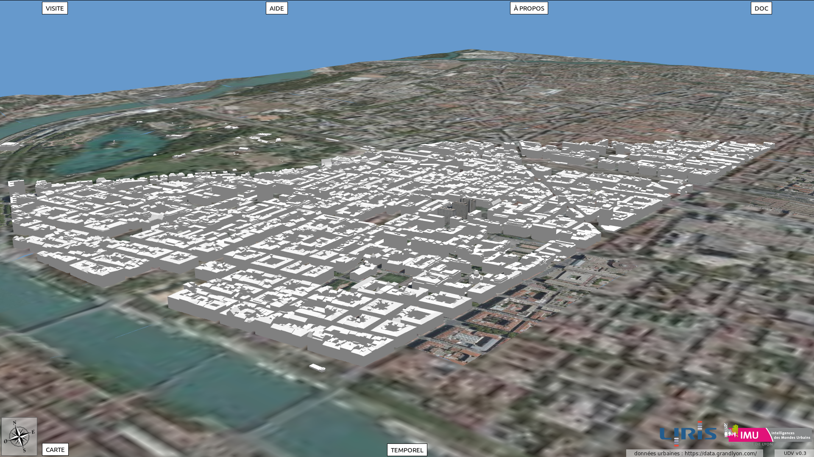

# Interface Design

OPEN QUESTIONS :
* modularity : this GUI is originally for Vilo3D. Will some of its elements be used by other projects ?
* priorities : what do we focus on first ?
* editor mode (ability for end users to edit/add elements) accessed through this interface ? or another tool ?

The GUI will need to provide access to the following functionalities (with associated time priority) :

* (prio : high) 3d scene window : camera controls, map (prio : medium)
* (prio : high) temporal evolution : jump to a date, specify start/end date (animation), move slider to change time
* (prio : medium) document browser : previous/next doc, related doc, filters, search, orient doc + camera in the 3d scene
* (prio : high) guided tour : means to access the tour(s), start, exit, previous/next step
* (prio : low) city browser (tree view of the city objects) : select scene object by selecting an item in the list, and vice-versa; provides info about the selected object.
* (prio : medium) menu : preferences, tools

The GUI will use minimizing/maximimizing windows and tabs to keep from being too cluttered.

Ergonomy is important : end users will include people with no technical background.

## Prototyped GUI (free tour mode)

## Prototyped GUI (guided tour mode)

[Video playlist](https://www.youtube.com/playlist?list=PLDmMAvwsWZe_Pw0d0Kd7aDZE_VCRfTjKD) of Unity prototype

## Web interface concept

## Web demo interface

Closer to google maps (minimalist, separate closable windows)

For more info : [Web demo video](https://www.youtube.com/watch?v=plZ2xftTcF4)

