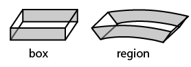
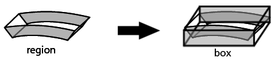

# Need 001: Contribution à 3dtiles - Lecture des regions - les boundings volumes 

### User story
  Actuellement iTowns possède un système de tuile. Chaque tuile posséde un attribue qui s'appelle le bounding volume.
  Ce bounding volume est une boite englobante qui regroupe l'intégralité des objets d'une tuile
  
  
  
  Comme le montre cet exemple, il y a une tuile principale qui regroupe 4 tuiles qui elle regroupe des batiments.
  Là ou les boundings volume sont importants c'est que pour savoir si la camera de la scène voit ou pas un objet.
  On regarde si le frustum de la camera intersecte avec le bounding volume si oui on rentre dans les enfants de la tuile 
  et ainsi de suite.

  Sur notre schéma nous avons donc les box, les régions et les sphères le but de ce need est donc d'implémenter les régions.
  Les régions sont utiles pour la vision globe de iTowns, car ce n'est pas des boites:
  
  
  
  Cette contribution à iTowns apportera la possiblité de pouvoir lire certain fichier de tuile qui utilisé les regions.
  
  ref: [issue 185 itowns](https://github.com/iTowns/itowns/issues/185)
### Beneficiary role: iTowns et la norme 3dtiles

### Impact: Major

### Maturity: done

### Cost evaluation: 2 man week (?)

### Description

Pour faire ce need, nous avons adapté les coordonnées des regions pour qu'elles soient englobées par des box
  
  
  
  Ce qui du coup qui à permis de pouvoir utiliser les fonctions que nous avions pour les box, comme par exemple le culling.
  
### Notes:

La solution proposée n'est pas obptimale car il y a du vide superflux dans la boite qui englobe la région. 
Elle est néanmoins négligeable pour l'instant mais nous avons quand même noté ce changement à faire dans une issue.
