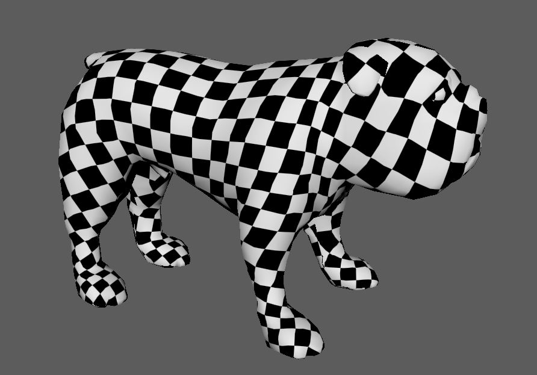
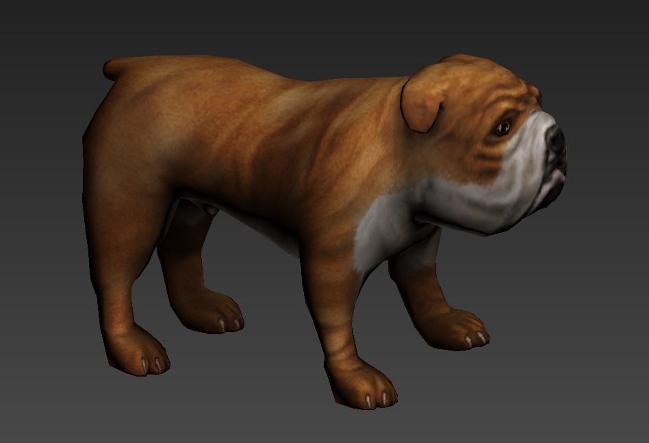
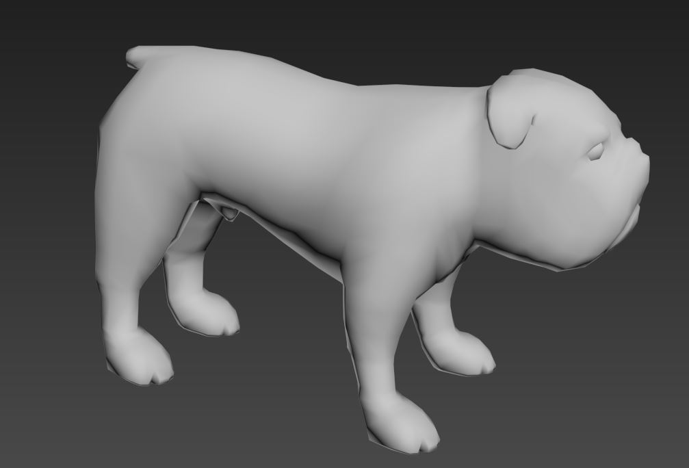
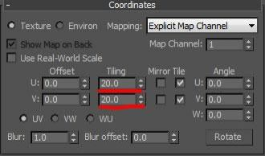
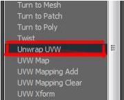
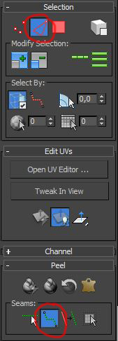
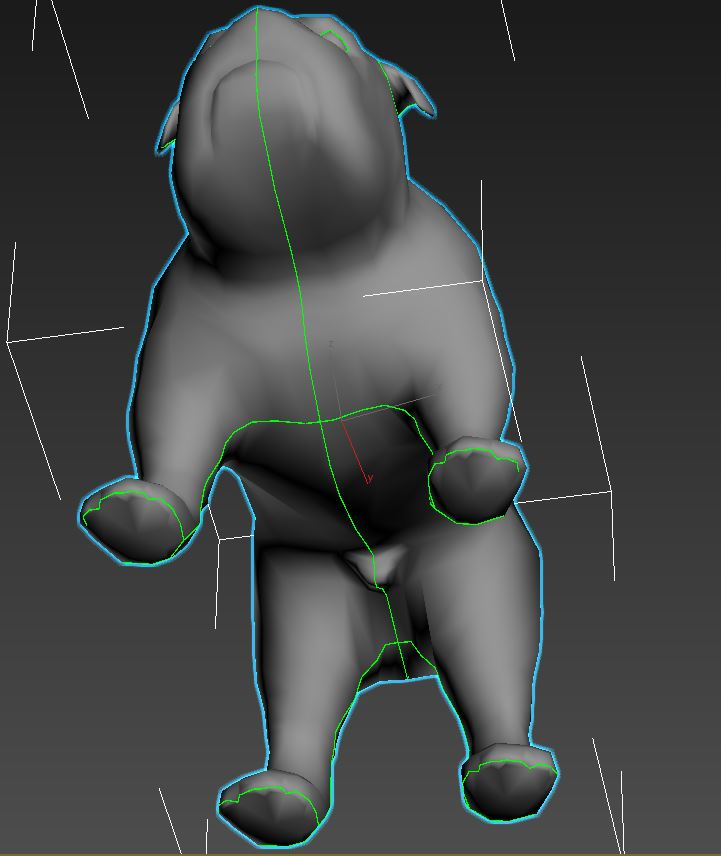
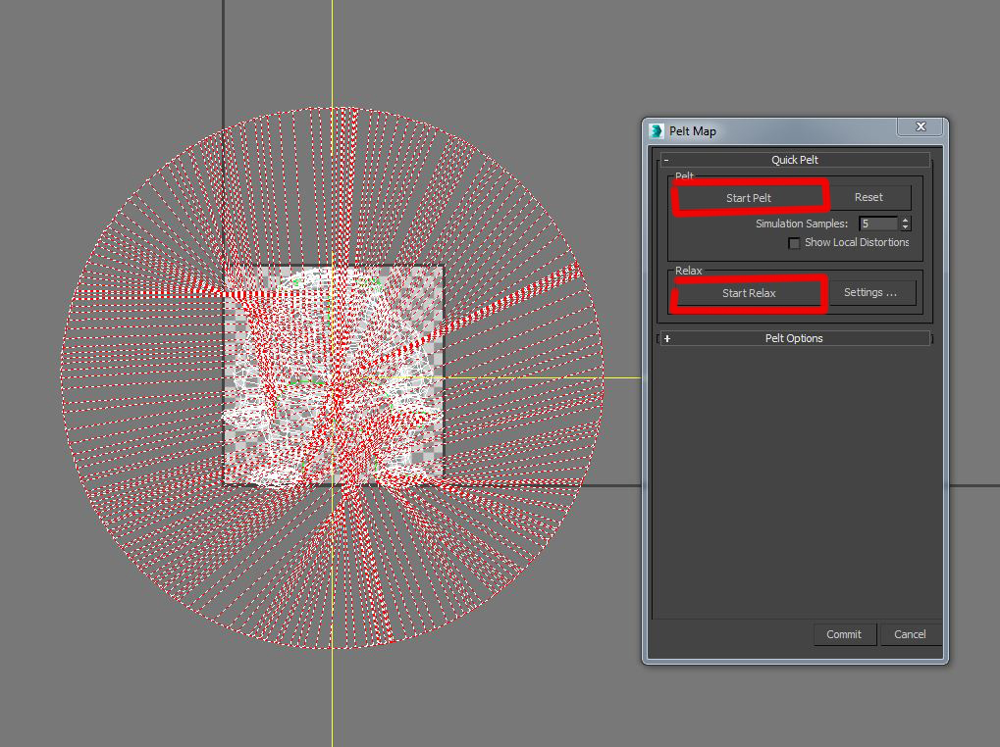
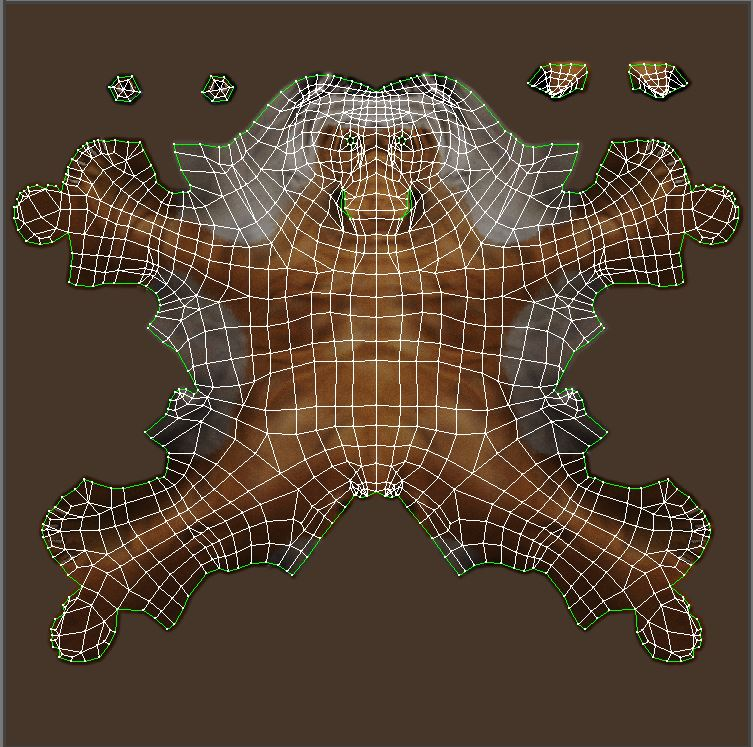
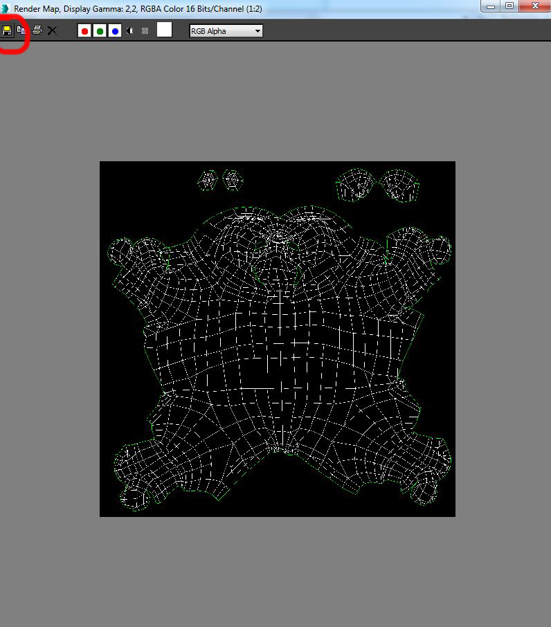

                                                      3DS Max Unwrapping
                                                     Step by step tutorial

**Objective**

In this tutorial we will go through the process of unwrapping in 3DS
Max.

For this tutorial, we will go unwrap a dog.

  
           
                                              Final Preview

**Getting started**

Let’s get started. Go ahead and launch 3DS Max if you do not already
have it up and open your file. Inside you should see an unshaded dog.

                      Figure 1

**Setting Up a Checker Pattern**

A checker pattern? Why do we need a checker pattern? This checker
pattern that we make will become a very important part of our unwrapping
process. With the checker pattern we can visually see where stretching
is occurring in our unwrap and easily fix the problem.

Go ahead and open the material editor by going to “Rendering &gt;
material Editor…” in the top menu of Max or by simply hitting the
shortcut “M.”

Once in the material editor, select a material slot to build you checker
pattern on. (**Figure2, 1**)

Next under the “Blinn Basic Parameters” you’ll see three properties
named Ambient, Diffuse, and Specular.

We want to make this pattern in the “Diffuse” property. Click on the
little square diffuse. **(Figure 2, 2)**

*Figure 2*

Click that square will bring up the Material/Map Browser. From that list
go ahead and double click on the “Checker” map (Figure 3)

*Figure 3*

Now that the map is loaded into our material we want to setup some
tiling coordinates so that we can better see where stretching will
occur. Under the Coordinates Section locate the U and V Tiling and
change the 0 to a higher value like 20. (Figure 4)

*Figure 4*

Click and drag the material you just created over to your model. (Figure
5)

*Figure 5*

Even though we dragged the material over to our model it still shows up
grey.

To have our material show up we have to activate it so it can be viewed
in the viewport.

With your material selected click the “Show Standard Map in Viewport”
Button (Figure 5.1). The checker pattern should now be visible in the
viewport.

*Figure 5.1*

Looking at our model we can see that there is very bad stretching going
on. (Figure 6)

We’re going to fix that.

***Unwrapping***

First and foremost we’re going to have to add an Unwrap modifier to our
model.
To do this, go to the modifier dropdown menu (Figure 7) and select the “Unwrap UVW” modifier (Figure 8).

    

*Figure 7* and *Figure 8*

Once you’ve selected the modifier we’re going to be able to edit the UVs
of our model. In the Parameters section of the Unwrap modifier there’s a
big button called “Edit…” (Figure 9)

Go ahead and click that button to bring up the Edit UVW window.

*Figure 9*

This window contains all you UV information for your model. As you can
see the UV layout is all over the place and it’s very hard to tell what
is what. (Figure 10)

Trying to texture a layout like this will get you terrible results and
bring lot of frustration. We’re going to be cleaning these up and
setting them up in a way that you’ll be able to know exactly where
everything is and make your texturing process a lot more simpler.

*Figure 10*

**Peel mode**

The Peel toolset provides an implementation of the LSCM (Least Square
Conformal Maps) method of unwrapping texture coordinates, for an easy
and intuitive workflow in flattening complex surfaces.

This procedure shows some of the basic methods available with the Peel
tools used on a simple character model.

The idea is to give you a rough idea of how to use them in your own
projects with more-complex objects such as character meshes.

For this method, we need to create seams for subdividing the model for
peeling.

*Figure 11*

> We are going to create the seams directly on the dog. We are going to
> cut the mesh, what will allow us to apply better the texture, and to
> render “peel mode” easier and cleaner.
>
> In the tab “Selection”, select the edges and in the tab “Peel”, select
> Point to Point seams. (Figure 11)
>
> Tip: When you create your seams, the best way is to hide your seams
> where we see it least. For example, for the dog, we’ll create seams in
> the interior side of his body.

So, with the tool “Point to Point seams”, you are going to create your
seams (Figure 12 and 12.1)

      

*Figure 12* and *Figure 12.1*

When you ended your seams, you can pass in the peel mode. The latter is
in the tab “Peel”. Here, several mode offer themselves to you, I am
going to explain them to you one by one. (Figure 13)

 **Quick Peel**

Performs a "best-guess" Peel operation on all vertices that belong to the selected texture polygons.
To do so, Quick Peel distributes the vertices evenly based on their average locations while trying to maintain existing polygon shapes.

 **Peel Mode**

Applies a Quick Peel and then stays active so you can adjust the layout of the texture coordinates interactively.
While Peel Mode is active, you can create seams with the Edit Seams and Point-to-Point Seams tools and they automatically "peel" off as you go.

 **Reset Peel**

Merges existing map seams of the polygon selection, converts Peel seams to new map seams, and then Peels the resulting clusters.

The borders of the selection are separated from the other clusters and become new map seams.

 **Pelt**

Applies pelt mapping to selected polygons. Clicking this button activates Pelt mode, in which you can adjust the mapping and edit the
pelt map.

**Watch Out**: Pelt mapping always uses a single planar mapping for the entire pelt. If you've applied a different type of mapping, such as Box,and then switch to Pelt, the previous mapping is lost.
Here, for the dog tutorial, we are going to use the Pelt Mode (Figure 14)

*Figure 14*

The primary function of the Pelt Map dialog is to let you stretch out
the UVW coordinates into a flat, unified map that you can then use for
texturing.

When the dialog is open, the stretcher appears in the Edit UVWs dialog
window as a circle of points, each of which is attached to a vertex on a
pelt seam.

You can manipulate these vertices exactly as any other vertex in the
editor, selecting, rotating, and moving. Other special functions
available on the dialog let you straighten out stretcher vertices, snap
them to the pelt seams.

**Start Pelt**

Runs the simulation, pulling the pelt seam vertices towards the
stretcher points. The simulation runs continuously until you stop it by
pressing Esc or clicking Stop Pelt.

Pelt affects only selected texture vertices. However, if no texture
vertices are selected, it affects all of them.

**Start Relax**

Normalizes the distances between mapping vertices. The relaxation
process runs continuously until you stop it by pressing Esc or clicking
Stop Relax.

Click on “Start Pelt” and “Start Relax”.

You should obtain this result, in little meadows. (Figure 15)

*Figure 15*

After this step, you just have to clean the mesh and reposition certain
points to be able to texture more easily.

In the tab “Selection” click on the points and clean/reposition certain
points.

**Export UVW in Photoshop**

When you finished to clean/reposition the mesh, you can export your UVW
Template in Photoshop for texturing.

In the UV Editor, click on the tab “Tool” and “Render UVW Template”.
Now, you have the window “Render Uvs” (Figure 16)

*Figure 16*

In this window, you can change the size of your image, or put a color on your edges.
Click on “Render UV Template”.

A new windowappears with your UV. Click in the left corner on “Save”.(Figure17)

*Figure 17*

You can save your file where you want. In jpg, png or tga.

You can import your photo in Photoshop and begin texturing.

