*Méthodology CityGML*

1.  Recovering a part of a city in .gml

2.  Tilling and recovering of the part which interest us.

3.  Import in 3D Use and export in .obj

4.  Import in 3ds Max, modification and export in .obj

5.  Convert .obj in .gml

6.  Application of the date of construction and destruction.

7.  Saving in .gml

To illustrate our example, we will make a tower of 300 meters high in
the middle of the place Bellecour in Lyon.

1.  *Recovering a part of a city in .gml*

The recovery of part of city is made on this website :
[*http://data.grandlyon.com/*](http://data.grandlyon.com/)

In the search bar, we will search the 2nd arrondisssement
(where Bellecour is).

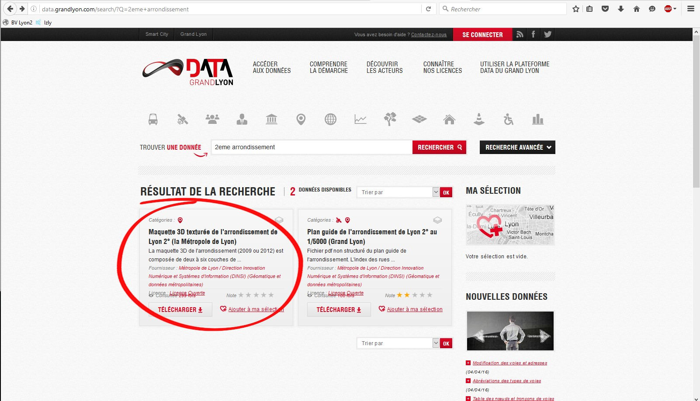

You can see there are several CityGML, if you let your cursor above,
you’ll see that is the same model but with different dates. We will take
2012 for the example.

Now, you have a zip these files:

For the future, we shall need that the .gml which interests us is alone
in a file, we are going to create a case LyonTilling and copy him
inside.

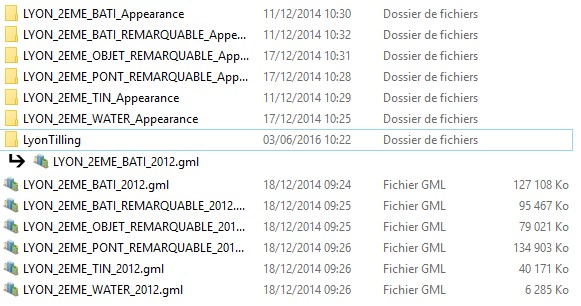

1.  *Tilling et recovering of a part which
    interest us.*

Open the software 3D use

Click on « Tiling CityGML » in the tab « Tools ».

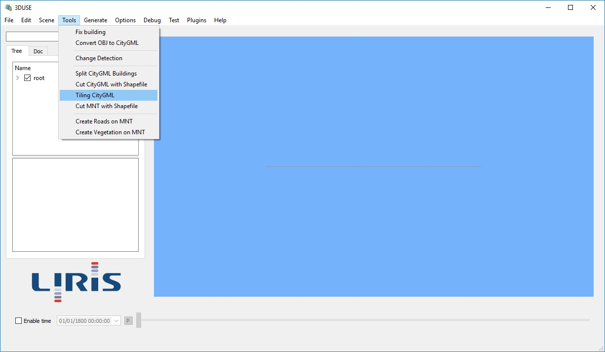

It’s opens this following window, it’s necessary to complete fields
being there::

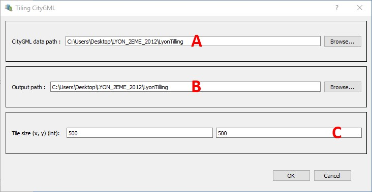

A - Path of the file containing files CityGML to. Watch out, all the
files being in this folder will be treated. That's why we separated,
only in a folder, the file which interests us with the aim to having a
light tile to modify.

NB : No matter the number of files in the selected folder, or the type
of the objects which are there, there will be only a single file CityGML
by tile. For example, if a file containing only buildings and another
file containing water and TIN is in this file, a tile will be consisted
in any event of a single file CityGML, which could contain these three
types of objects.

B – Path of the file of exit. This is in this folder that will be saving
files CityGML of tile. These files CityGML in exit will have for name:
X\_Y.gml with X and Y coordinates of the left bottom corner of the tile
divided by the tile’s size following the corresponding axe. (ex: if the
corner is in {5 000 000, 1 000 000) with tiles in 500x500, the file will
name : 10000\_2000.gml). Each file is contain in a folder wearing the
same name (X\_Y).

C – Size of the tiles in X and Y

This process can take some time…

1.  *Import in 3D use
    and export in .obj*

In 3D use, click on on “ Load ” in the tab “File”.

Make the path to load the files .gml. In our example, the place
Bellecour is divided in 2 tiles, we need to load the first, and repeat
operation to load the second.

Now, we have a part of our place Bellecour.

In the hierarchy, select “ LayerCityGML”

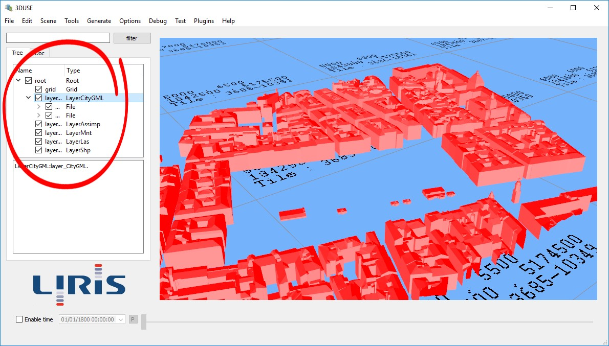

Then in the tab « File », click on « Export OBJ »

Then save your .obj when you want.

Here, we’ll name our file –Bellecour-.

1.  *Import in 3DS Max, modification, export in .obj*

Open the software 3Ds Max

In the main menu of 3ds max, click on the arrow near to « Import » and
select « Import - import non native file formats into 3ds max-  »

Then go find the .obj where you save it.

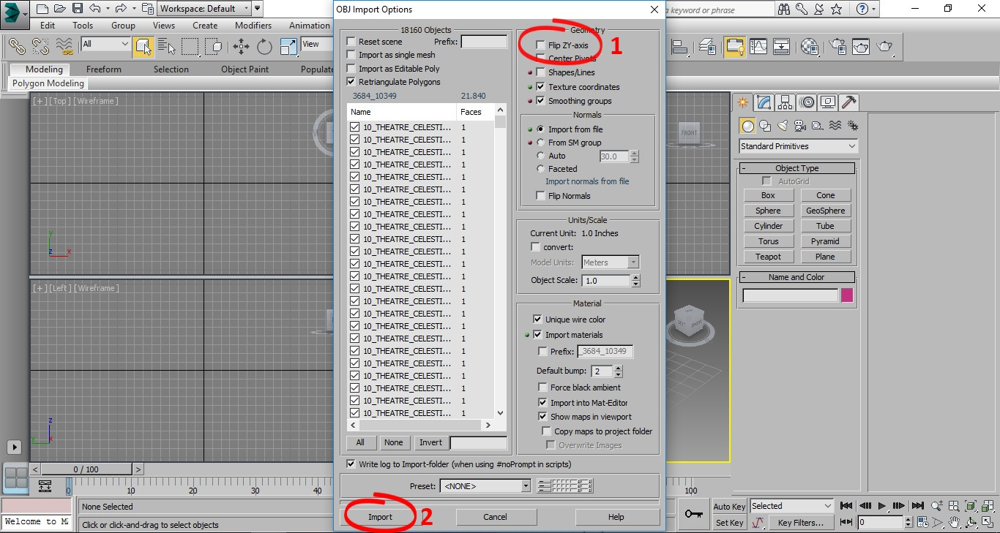

The import page opens

1 - deselected « flip ZY-axis »

2 - « Import »

Once your scene was opened, you can modify at your convenience.

IMPORTANT : Don’t move the emplacement of the buildings in the scene,
these coordinates are reused by CityGML.

For the example, we are going to put a tower in the middle of the place
Bellecour :

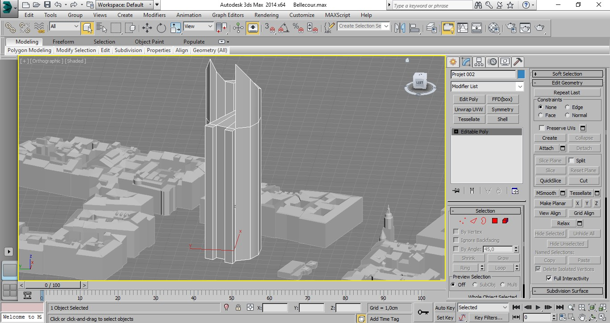

Sélectionnez la tour que vous venez de créer

Select the tower that you created.

Then, in the main menu of 3ds max, click on the arrow near to « 
Export » and select “ Export selected – export only selected object as
non-native file formats from the current 3ds scene- “

Save in .obj format where you want.

Here, we will name our file -Tour-Bellecour-.

> Don’t change parameters. Let « by default »
>
> « Export »

1.  *Convert .obj in .gml*

In 3D use, click on « Convert OBJ to CityGML » in the tab « Tools ».

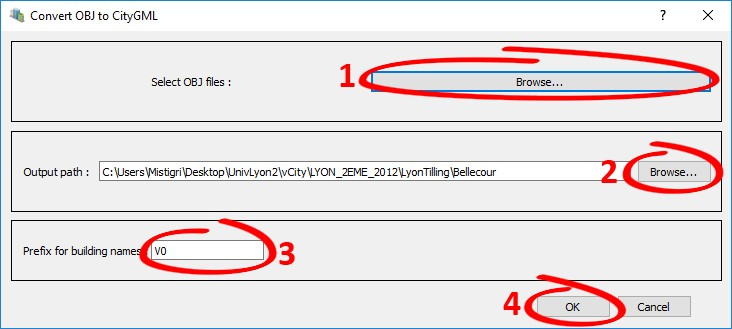

The conversion page opens,

1 - « Select OBJ files : » with « Browse … » go find .obj where you save
it.

2 - « Output path » with « Browse… » Indicate where you want save your
new .gml

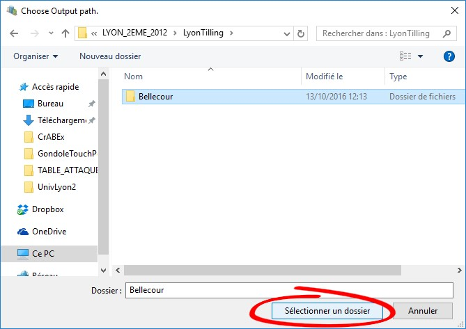

> Watch out : You need to select a folder and not to put the name of
> .gml that you want to create.
>
> You have to be on the folder and click on “ Selectionner un dossier”

3 - « Prefixe for building names » is especially useful when you save
several packs of buildings (several .obj) which will go to the same
scene 3D Use because they are going to be renamed according to the same
order but the prefix which you will put in them can differentiate them
(it can be a date, a name of district / arrondissement or even just a
figure)

(This prefix builds up itself inside the file, it will be visible only
during the use in 3Duse)

Here we are just going to put that it is the first version of our tower
of Bellecour:

V04 - « OK"

In the folder exit that you selected, there is now a file with the same
name than your .obj

1.  *Application
    of a date of construction and destruction*

In 3D use, we aregoing to prepare the timeline, it’s her which is going to allow us to
evolve in time.

Click on « Settings… » in the tab « Options »

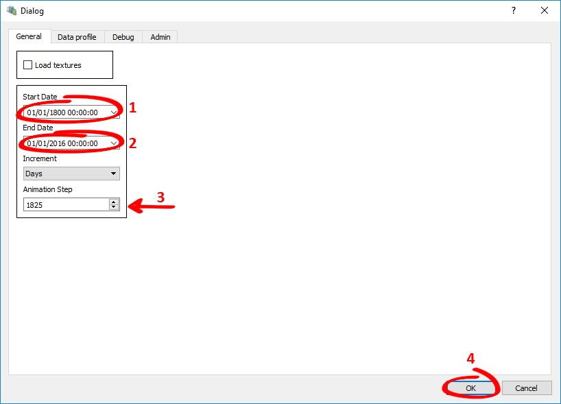

In the tab « General »

1 - « Start Date » 

2 - « End Date »

3 - « Animation Step » : To make our faster time go when he is
automatic, we are going to do a small calculation, the incrementation is
in Day and we would like to cross of 5 years to 5 years, we make: 5 x
365 = 1825

If you let him to 1, time will pass day to day.

4 – « OK »

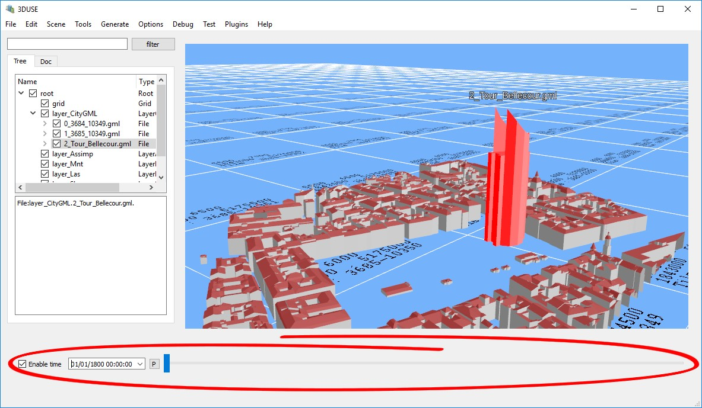

Above, the timeline. (check the box).

The put thetimeline in automactic reading, as we settled it, the timeline will pass
in 5 years to 5 years since 01/01/1800 to 01/01/2016

*DATE OF CONSTRUCTION :*

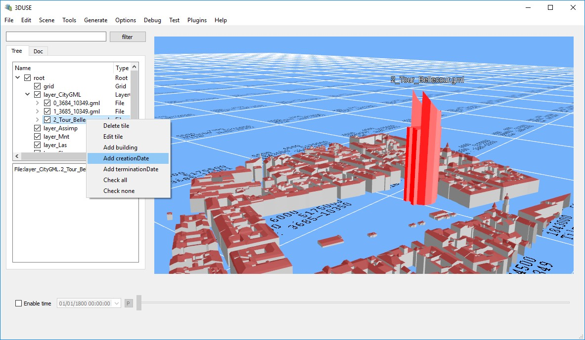

In the hierarchy, select element where you want to get a date.

Here, our -Tour\_Bellecour-

Right click on it and in a slider, select « Add creationDate »

> In this
> window, get « creationDate » and enter the date of creation of your
> choice.
>
> Then « OK »

*DATE OF DESTRUCTION :*

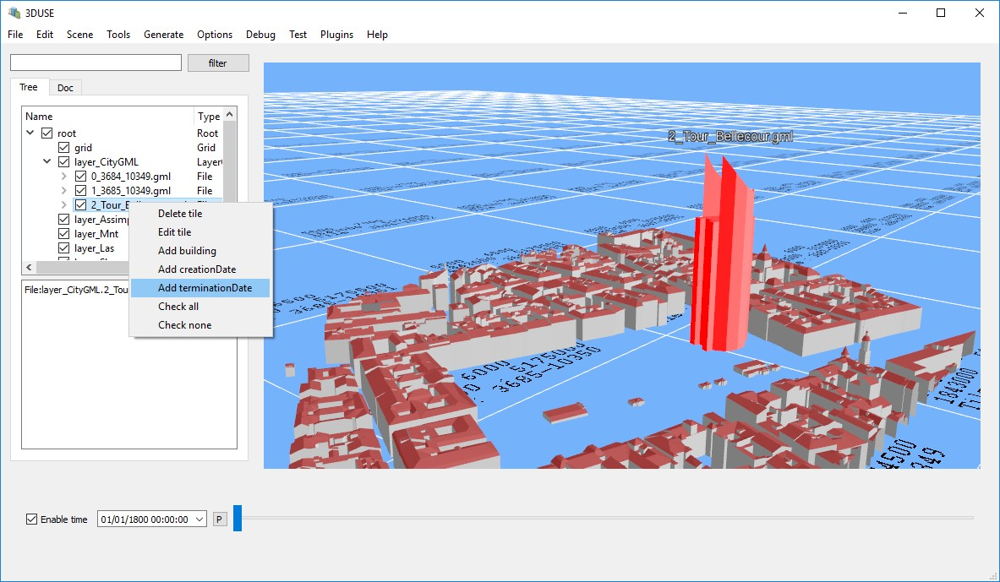

In the hierarchy, do the same manipulation than before, but select « 
Add terminationDate »

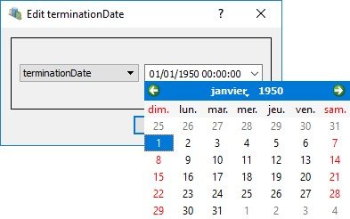

> In this window, get « terminationDate » and enter the date of
> destruction of your choice
>
> Then « OK »

When you activate the timeline, the building appears to the date of
chosen construction, and disappears to the date of chosen destruction.

In the hierarchy, we applied dates to our folder -Tout\_Bellecour-, but
by developing the file, there are buildings inside, it’s possible to put
dates to each building or put same dates to the totality.

> 
>
> We can see date’s details when we are on the building.

1.  *Saving en
    .gml*

In the hierarchy, select «  LayerCityGML »

Then, in the tab « File » click on « Export citygml »
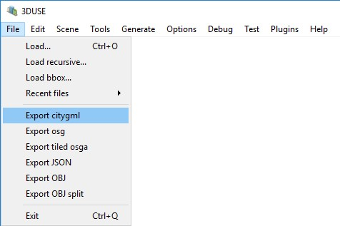

Then, save your .gml where you want.

In the file .gml are saved all batiments of your selection, with their
dates of creation and destruction, if they exist.
