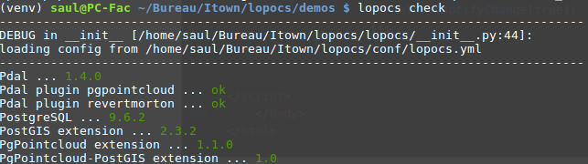
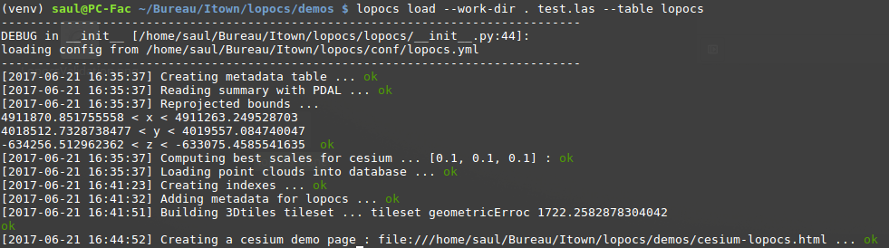
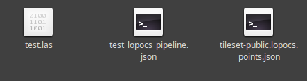

## Display a file .Las in iTowns with lopocs

  This diagram shows how the communication between iTowns and lopocs works:
  
  

  In a first step we put our file (.las here) on the lopocs's server, then lopocs gives us a tileset, the tileset is used by iTowns's server, and both servers communicate when iTowns needs files.

  
  
### [Lopocs](https://github.com/Oslandia/lopocs#installation)

  When you install Lopocs ([here](https://github.com/Oslandia/lopocs#installation)) you have to install PDAL, take the branch lopocs [here](https://github.com/pblottiere/PDAL/tree/lopocs) (download and cmake, make, sudo make install).

  You should have this when you write ````lopocs check````
  
   
    
### file .las in tileset

  You have lopocs installed, so now take your .las (if you don't have take it [here](https://oslandia.github.io/lopocs/)).
  
  ````cd demos```` 
  
  ````lopocs load --work-dir . nameFile.las --table lopocs````
  
   
  
 

### Display on iTowns

  Now you have 3 files: your .las, the .json pipeline and the .json:
  
   
  
  Put the tileset-public.lopocs.points.json on your server of iTowns, for me the path 3d-tiles-samples/tilesets ... 
  
  Now in this [example](https://github.com/iTowns/itowns2/blob/master/examples/3dtiles.html) replace the url with the name of your tileset.
  
  And it's done, you can view your .las in Itown.
 
  Example: 
   
  
### Optimisation 

  Right now we can't read multiple .las in the same time just one by one, we expect PDAL to optimize that.
  
  For iTowns when you have a lot of point, there is some lag, we can optimize that too.
  
### References

 * The git [lopocs](https://github.com/Oslandia/lopocs#installation)  
  
  
  
