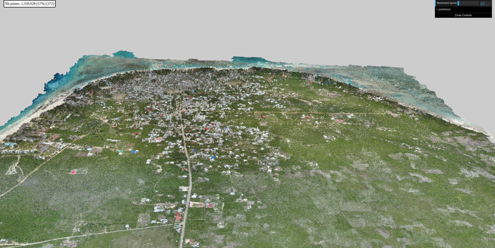
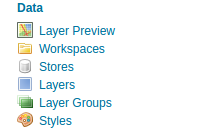
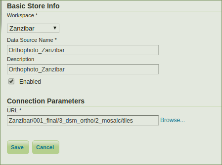
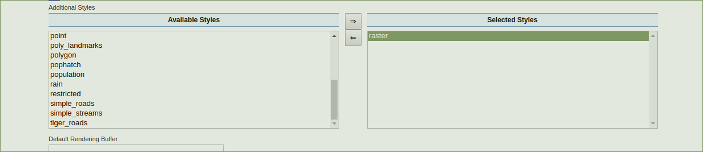
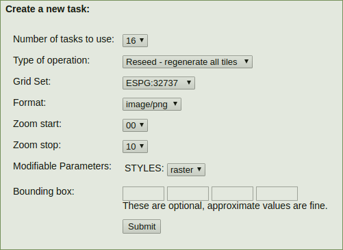

## Install iTowns
 
After you install [iTowns](https://github.com/iTowns/itowns) go on this [fork and branch](https://github.com/NikoSaul/itowns2/tree/dataZanzibar)

for start the server, run with this command (for iTowns)

```` npm start ```` ==> ```` npm start -- --port 7070````

## How to import data in iTowns

We take an example the island of Zanzibar, data from a drone.
you can download this [here](www.google.com)
Thank to the ZMI project (Zanzibar Mapping Initiative) 

We have 3 types of data 
 - Points Cloud: multiple [.las](http://desktop.arcgis.com/en/arcmap/10.3/manage-data/las-dataset/what-is-a-las-dataset-.htm) 
 - Orthophoto: multiple image in .tif with .tfw for information
 - Elevation: multiple image in .tif with .tfw for information
 

### Points Cloud 

  You have to install [Potree Converter](https://github.com/potree/PotreeConverter), when you have this 
create a new folder, put the folder point_cloud from Zanzibar file (*.las) .

Write this in the new folder in your console:
```` PotreeConverter Zanzibar/Las/* -o Zanzibar/ --material RGB ````
(It can take time like ~2 3 min)

Now in your folder you should have that: (the format potree) 


Copy the folder **data temp cloud.js and sources.json** in 3d-tiles-sample/tileset/Zanzibar/

In iTowns: 

Open the pointcloud.html, change the url [here](https://github.com/iTowns/itowns/blob/master/examples/pointcloud.html#L105)
with
````http://localhost:8003/tilesets/Zanzibar/cloud.js ````

Now you should have that: 



### Orthophoto and Elevation

#### Geoserver 

[install geoserver](http://docs.geoserver.org/stable/en/user/installation/linux.html) 

If it's not working try with this command:

````GEOSERVER_HOME=/usr/share/geoserver````
 
After that, go on this file /usr/share/geoserver/geoserver-2.11.2/webapps/geoserver/WEB-INF/
you should have web.xml, open this and uncomment this: 
````
<!-- Uncomment following filter to enable CORS -->
<filter>
  <filter-name>cross-origin</filter-name>
     <filter-class>org.eclipse.jetty.servlets.CrossOriginFilter</filter-class>
  </filter>
````

and

````
<!-- Uncomment following filter to enable CORS -->
<filter-mapping>
    <filter-name>cross-origin</filter-name>
    <url-pattern>/*</url-pattern>
</filter-mapping>
````
 
Download [this](http://repo1.maven.org/maven2/org/eclipse/jetty/jetty-servlets/9.2.13.v20150730/jetty-servlets-9.2.13.v20150730.jar)
and put it on this folder: /usr/share/geoserver/geoserver-2.11.2/webapps/geoserver/WEB-INF/lib/

Now go [**Geoserver**](http://localhost:8080/geoserver).

Check the [documentation](http://docs.geoserver.org/) if you want to understand each menu.



To begin, add a new workspace
Put Zanzibar for name and the URI : http://opengeo.org/Zanzibar
And submit... then click on Zanzibar and check the checkbox for WMS and WMTS

Go on Disk Quota on your left and complet like that:


And go on Gridsets just above Disk quota,
Create a new gridset...


Then click on Caching Defaults just above gridsets,
like this: 


Don't forget to add the gridset EPSG:32737 on the bottom.

Now add new Store, 
take the imageMosaic, and do this:



And save.

Now you should have the page 'Edit Layer'
Change the name and the title check the Native SRS is correct.

If you have other data you have to change that [here](https://github.com/NikoSaul/itowns2/blob/dataZanzibar/examples/pointcloud.js#L20) in iTowns, pointsCloud.js file,
the EPSG: and the [values](https://github.com/NikoSaul/itowns2/blob/dataZanzibar/examples/pointcloud.js#L26) with the native bounding box, you can see it on the geoserver 

[here](https://github.com/NikoSaul/itowns2/blob/dataZanzibar/examples/pointcloud.js#L113) you have to change the name with the name of your layer same for the projection: [EPSG](https://github.com/NikoSaul/itowns2/blob/dataZanzibar/examples/pointcloud.js#L114). 

Click on Publishing on the top.
Add Raster like that : 



Then click on the top **Tile Caching**
and add your grid subset on the bottom of this page
- - - - - - -
You should have in the **Tile Layers**, Zanzibar:Zanzibar_Layer.

Click on seed/Truncate: 



and submit.

It can take quite some time...
