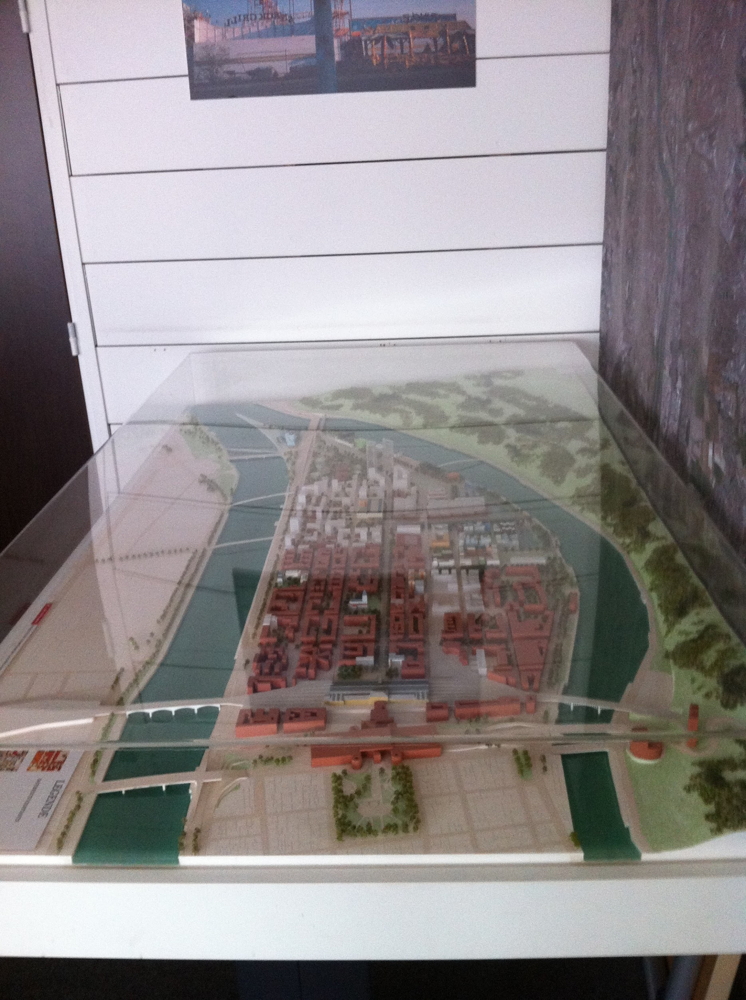
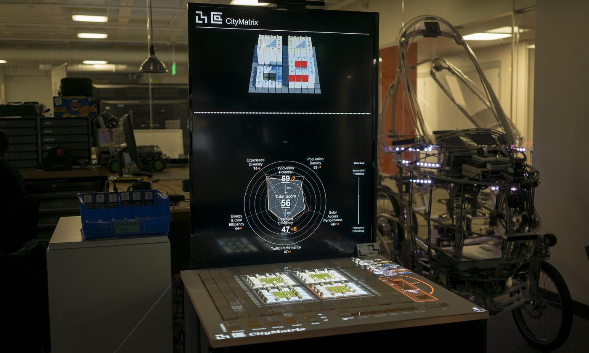

# MAM Erasme project description
 - [General description of the project](#general-description-of-the-project)
 - [Introduction](#Introduction)
 - [Partners](#Partners)
 - [State of the art projects](#state-of-the-art-projects)

## General description of the project
[Lyon Métropole](https://www.grandlyon.com/) is developing an ambitious open data policy based on the acquisition and organization of open territorial data. This centralization allows the animation and co-creation of services for the benefit of public uses and the smart city of tomorrow. The objective of this project is to set up a 4D model (3D + Time) favoring the use of data and their appropriation by users. Numerous use cases are possible and can range from supporting change from a changing neighborhood to help decision-making or risk awareness, for example.

In order to initialize this collaborative project (refer below for a [complete list of partners](#Partners), between the Grand Lyon Métropole (with [Erasme Living Lab](http://www.polepixel.fr/residents/erasme/), DINSI, …) and LabEx IMU (ELICO, EVS and LIRIS Lab), this approach requires the installation of an expanded model of the territory. The goal is nevertheless to think at the same time the creation of opportunities for use through a team of computer scientists, object designers, mediation specialists, content gamification specialists. The necessary skills around the student are multiple. Erasme will bring his expertise in product design, content ludification and animate the phases of ideation around the chosen uses. Their expertise in designing and constructing physical devices will be of real added value.

The skills in data science of LIRIS will allow to better apprehend the data in collaboration with Grand Lyon Metrople (DINSI) and their representations, but also to bring all the necessary expertise to the construction of spatio-temporal models.
Elico and EVS Research lab will provide expertise on mediation, collaboration and crowdsourcing. The aim is to define two or three use cases that will allow, alongside designers and mediation specialists, to prefigure the model, the possible interactions and the scenario to be put in place.

SPL Confluence is providing data, a mock-up and participate to the creation of possible use-cases.

## Introduction
The goal of the MAM project is to build an AugMented Model (MAM) of a neighborhood of the [Lyon Métropole](https://www.grandlyon.com/). This augmented physical model will be augmented through the overlaying of statistical and dynamical data coming from [Lyon Open Data](https://data.grandlyon.com/) together with data sourced within various research labs. Along this project different types of models will co-exist
 - a classical physical model (3D printed) 
 - a 3D numerical model, with various different types of data, that will be projected on the physical model
 - a virtual 3D model that can be visualized through [augmented reality](https://en.wikipedia.org/wiki/Augmented_reality)

The 3D numerical model will be based on the [iTowns](http://www.itowns-project.org/) technology together with the [UDV](https://github.com/MEPP-team/UDV) add-on.

Once the above described models are available, some use case scenarios must be produced in order to elaborate on the ergonomy of interaction.

## Partners
* [IMU Labex](http://imu.universite-lyon.fr/), [Université de Lyon](https://www.universite-lyon.fr/)
   - [Laboratoire Liris](https://liris.cnrs.fr/en)
   - [ELICO](http://www.elico-recherche.eu/?lang=en)
   - [EVS](http://umr5600.cnrs.fr/en/homepage/)
* [Lyon Métropole](https://www.grandlyon.com/)
   - [Erasme Living Lab](http://www.polepixel.fr/residents/erasme/)
   - DINSI (Direction Innovation Numérique et Systèmes d'information), Data Grand Lyon
* [SPL Lyon Confluence](http://www.lyon-confluence.fr/en/urban-project/project-manager.html)
* Formations
   - [Gamagora](https://gamagora.univ-lyon2.fr/) (formations jeux vidéo), [Université de Lyon](https://www.universite-lyon.fr/)
   - [MUSE master](http://offreformation.univ-lyon2.fr/cdm/fr/fiche/objectifs/FRUAI0691775EPRME236/FRUAI0691775EPRPR889) (Médiations urbaines, savoirs et expertises), [Université de Lyon](https://www.universite-lyon.fr/)
   - Master Geonum (Géographie Numérique), [Université de Lyon](https://www.universite-lyon.fr/)
   
 ## State of the art projects
 
 ### CityScope
The projects of [CityScope MIT lab](https://www.media.mit.edu/projects/cityscope/overview/) (dedicated to solving spatial design and urban planning challenges) usually follow a dual city representation framework that uses both 
   * a physical model of the city map, based on a regular grid decomposition, enabling the detection of various modules (representing building units possibly made in Lego blocks) that users can freely move around the city map
   * a digital (simulation) model that recieves the current layout of the city modules  and that computes various indicators that are in turn projected (through LED projectors) back on the physical model.
   
The technical constraints are as follows
  - an interactive map model where the removable city modules (blocks) must be identifiable through optical capture (e.g. a webcam analyzing bar-codes or QR-codes)
  - a software is required for scanning the resulting capture (e.g. [Rhinoceros 3D](https://en.wikipedia.org/wiki/Rhinoceros_3D)) and producing its input to the simulation engine
  - a simulation engine using e.g. [Unity (game Engine)](https://en.wikipedia.org/wiki/Unity_(game_engine)) or the [Gama platform](https://github.com/gama-platform)) or possibly [Grasshopper](https://www.grasshopper3d.com/) (together with Rhino) 
   
### CityMatrix  
[CityMatrix](https://www.media.mit.edu/publications/citymatrix/) is an interactive model designed to facilitate decision making for urban planing at the neighborhood scale. The goal is to allow a non urban specialist to gain knowledge on a given neighborhood situation and to build solutions improving such a situation. CityMatrix offers an interactive physical model together with a screen presenting indicators summarizing and evaluation of the current situation.

