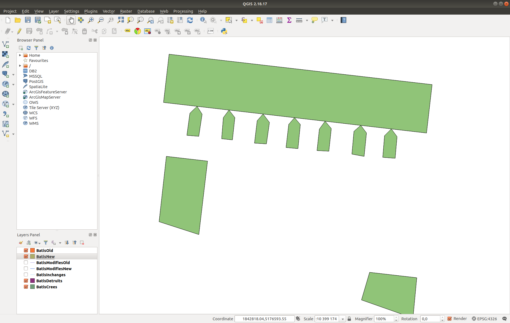
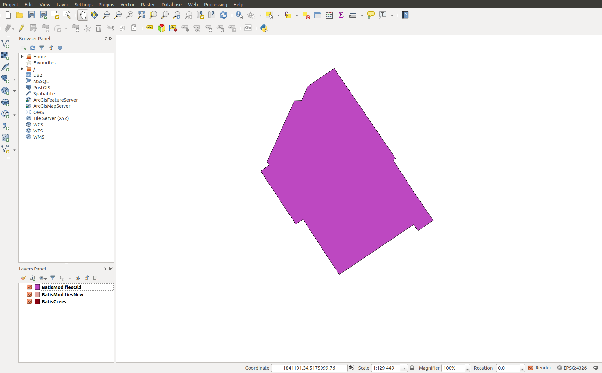
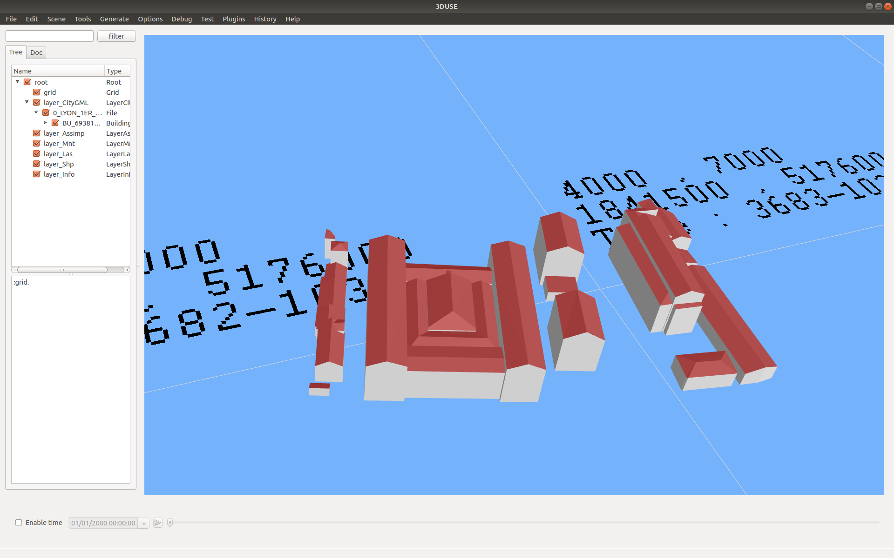
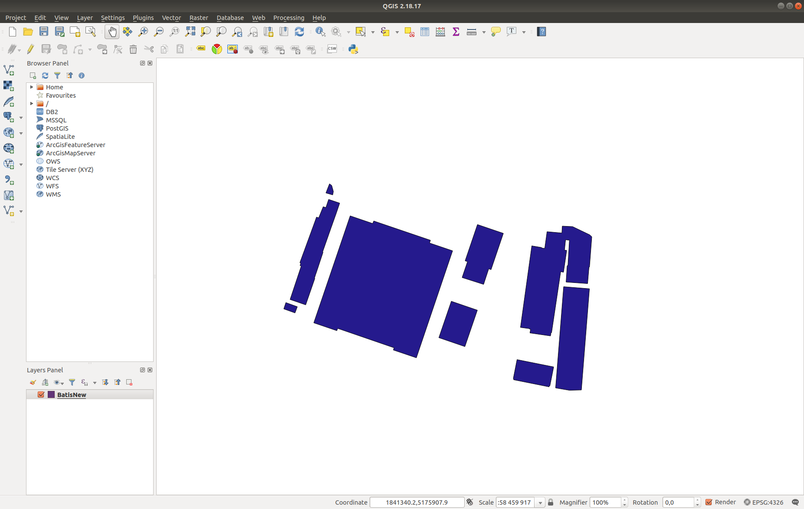
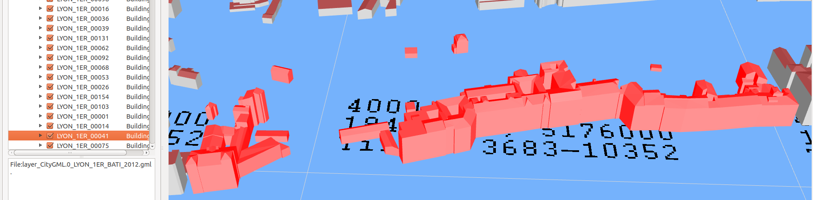
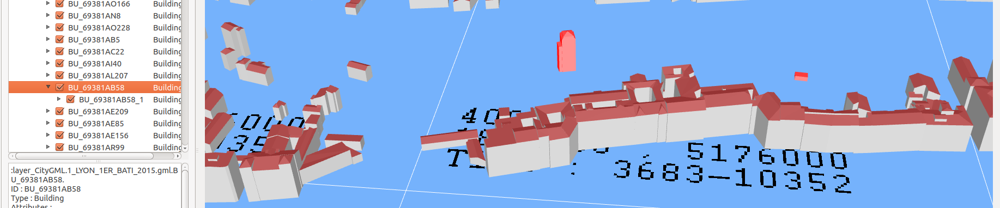

## Working with [Lyon Métropole's](https://data.beta.grandlyon.com/en/accueil) CityGML data

## Single vintage difficulties

### Data with some format error
The following glitches might block your algorithms at parsing time
(which is fine) but might also confuse any geometrical post-treatment
(which might be harder to detect) :
 * A few `<gml:MultiSurface srsDimension="3">` entries, used to decribe the geometry
   of the respective parts of a building, are empty. This is the case for 
    - building `<bldg:Building gml:id="LYON_8_00166">` (starting on line 1202763 and ending at line 1202789) and
      and building `<bldg:Building gml:id="LYON_8_00177">` (that prior to the above previous block deletion, is
      starting on line 1202791 and ending at line 1202817) within the file `LYON_8EME_2009/LYON_8EME_BATI_2009.gml` of
      [LYON_1ER_2009.zip](https://download.data.grandlyon.com/files/grandlyon/localisation/bati3d/LYON_1ER_2009.zip)
    - 2012 intall: autre type
 * Also note that when importing similar CityGML data with the [3DCityDB importer](https://github.com/3dcitydb/importer-exporter) into a database, the importer complains with quite a few `Linear ring not closed` warning messages.

### Undocummented additional data (?)
Some information, provided in the form a generic attribute (`<gen:stringAttribute ... >`, `<gen:intAttribute ...>`,
`<gen:doubleAttribute ...>`) i.e. extending the CityGML model, is not always documented. For example [this CityGML file](MultipleEnveloppeExample_1-LYON_1ER_BATI_2015.gml) (extracted from [LYON_1ER_2015.zip](https://download.data.grandlyon.com/files/grandlyon/localisation/bati3d/LYON_1ER_2015.zip)) presents the 
following tags: "BUILDINGID", "MILLESIME", "ZMIN", "ADRESSE", "NOMCOMMUNE", "NOMOFFICIE", "CODE_INSEE","CODE_DGI",
"SURFTOIT, "ADMINISTRA", "CULTE", "DEPLACEMEN", "ENSEIGNEME", "SANTE", "SPORT","URGENCE", "NBMAIS", "NIVMAIS",
"MAISDATMIN", "NBAPP", "NIVAPP", "APPDATMIN", "APPDATMAX", "NBCOMIN", "NIVCOMIN", "COMIDATMIN", "COMIDATMAX",
"NBDEP", "NIVDEP", "DEPDATMIN", "DEPDATMAX", "ZMINTOIT", "ZMAXTOIT" and "ZMOYTOIT". Additionnaly quite a few of those 
attributes have no associated value (or have a dummy one). 

### Some geometrical imprecision ? (1)
The geometry of the following building (refer to [this CityGML file](MultipleEnveloppeExample_2_pathologic/MultipleEnveloppeExample_2_pathologic-LYON_1ER_BATI_2015.gml) as extracted from
[LYON_1ER_2015.zip](https://download.data.grandlyon.com/files/grandlyon/localisation/bati3d/LYON_1ER_2015.zip)) 

is hard to interpret (probably due to the complexity of the description of the rooftops ?).
Indeed if we try to observe its footprint (with QGIS) by projecting its ``</bldg:RoofSurface>` on the natural
terrain then we get the following picture:

### Some geometrical imprecision ? (2)
In the 2012 data set, the following building (refer to [this CityGML file](MultipleEnveloppeExample_5_pathologic_leaning_tower/Splited_ChangeDetection_multiple_enveloppe-2_LYON_1ER_BATI_2012_Splited.gml) (extracted from [LYON_1ER_2012.zip](https://download.data.grandlyon.com/files/grandlyon/localisation/bati3d/LYON_1ER_2012.zip)) is provided in a single "block"

and has the following footprint (which is fine)

.

In the 2015 data set this "block" is splitted in two buildings (which is still fine) (refer to [this CityGML file](MultipleEnveloppeExample_5_pathologic_leaning_tower/Splited_ChangeDetection_multiple_enveloppe-2__LYON_1ER_BATI_2015.gml) as extracted from [LYON_1ER_2015.zip](https://download.data.grandlyon.com/files/grandlyon/localisation/bati3d/LYON_1ER_2015.zip)).
The geometrical difficulty seems to arise in some overlay appearing between the two respective footprints (look at the north east facade) as illustated by the following picture:

 - 2015: limite Vcity de split-building entre 2012 CityGML1 et 2015 CityGML2

### Multiple enveloppe: what is the semantic behind building regroupment ?
It is hard to understand what is the logic that governs the regroupement of the geometries
of independent physical buildings (that is buildings that are geometrically distinct i.e.
separated by a spatial gap) within a single CityGML "logical" building. Note that this is made
possible by the CityGML model that offers to provide e.g. as many `</bldg:WallSurface>` and/or
`</bldg:RoofSurface>` (possibly defined as `<gml:MultiSurface>`) are desired.
For example the following CityGML building (with a single gml identifier) is constituted
of many different sub-buildings (refer to [this CityGML file](MultipleEnveloppeExample_1-LYON_1ER_BATI_2015.gml)
extracted from [LYON_1ER_2015.zip](https://download.data.grandlyon.com/files/grandlyon/localisation/bati3d/LYON_1ER_2015.zip)):

Although in the above case, the regroupement of sub-buildings (that all belong to the so
called ["subsistances"](https://en.wikipedia.org/wiki/Les_Subsistances) probably follows to administrative logic,
what about the following case where a single CityGML logical buildings gathers close to 50 independent buildings
(highlighted in red):

**Possible improvement of the data**: **choose a single regroupement logic** (while providing the associated semantics) and **apply that logic homogeneously across the city data**.

 * as illustrated below (refer to the inter-vintages comparison difficulties) probably that the best practice would be to have
   a single CityGML building for a single geometrical building.

## Inter vintage hindrances
A difficulty, in understanding the dynamic evolution of the geometry
of city, can arise when the identifier (labeling) of a singular city
object changes across vintages.
For example consider the changes in the labeling of the same physical
buildings (more generaly any city object) between year 2012 and 2015:

VintagesIDRenumbering 2012

VintagesIDRenumbering 2015

Understanding the changes requires, or is greatly complicated by a lack
of, identifiers that remain valid accross vintages.

Because buildings are regrouped we need to split

Weird split

Tiny changes in the geometry    
    
 - PB: changes in the building (city object) identifiers (labeling) for
     a singular city object (across vintages)
 - PB: changes in the data semantic structuration (il faudrait une cohérence
    de structuraiton)
     2015 decoupe selon le cadastre
     2019-2012: criteres indetermines (mais differents)
   - Monster: multiple envelopes (leaning tower)
 - PB: les formats sont differents (chaque année il faudrait les reconvertir
   les années précédentes)
 - PB: changes in the logic used to separate BATI from BATI_REMARQUABLE
   across vintages: the remarquble buildings are not the same in 2019, 2012
   and 2015. Solution: if a separation is needed, keep the same criteria
   (and provide it). Otherwise place this information inside the CiotyGML file
   (use Generic Attribute)
 - leaning tower: multiple envelope sans plan B car imprecision geometrique

## Demandes
 - Dispose t'on the acquisition process in order to evaluate the induced
   acquisition error ?

