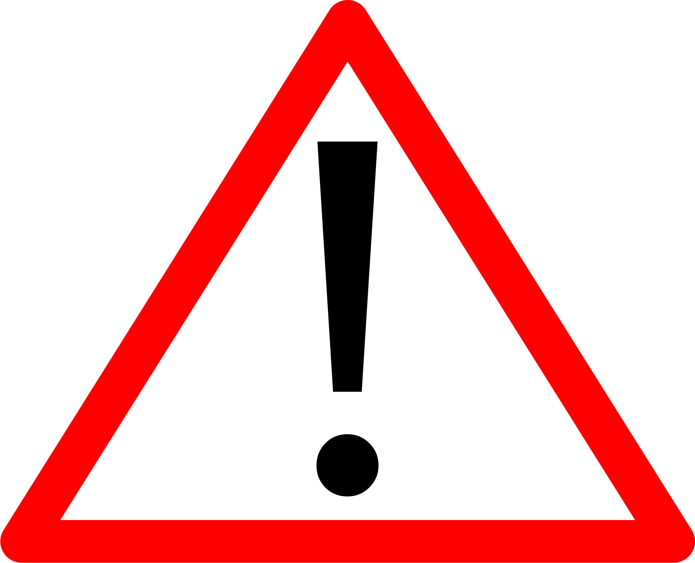
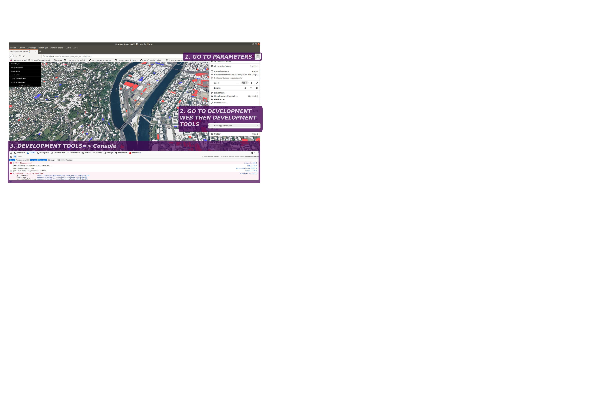
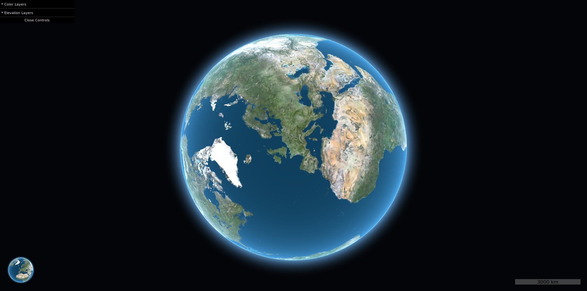
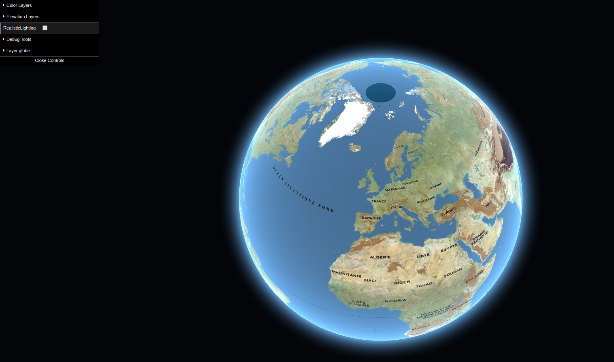
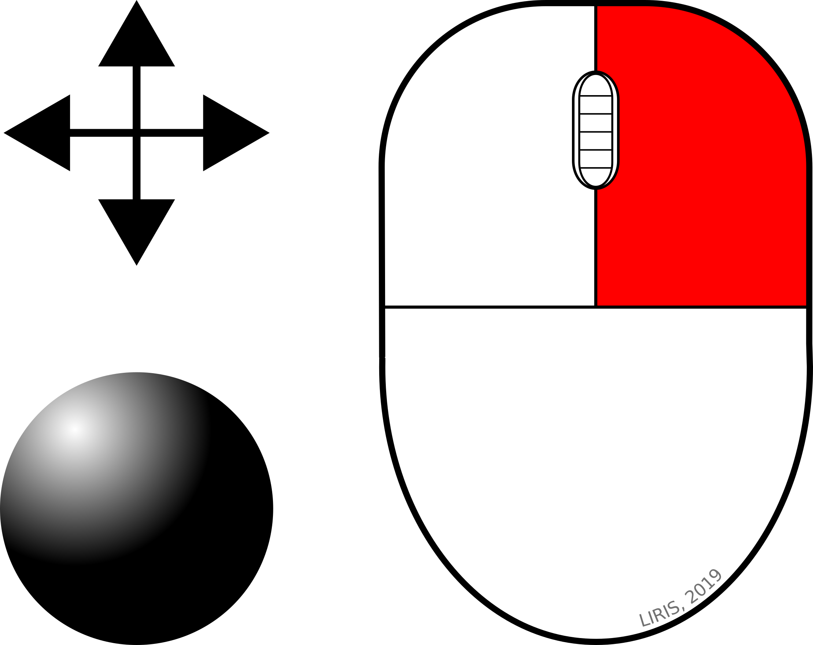
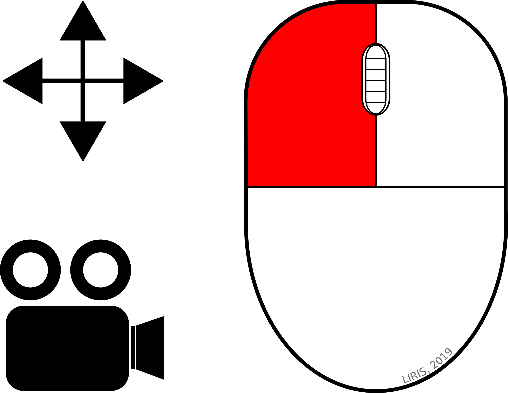
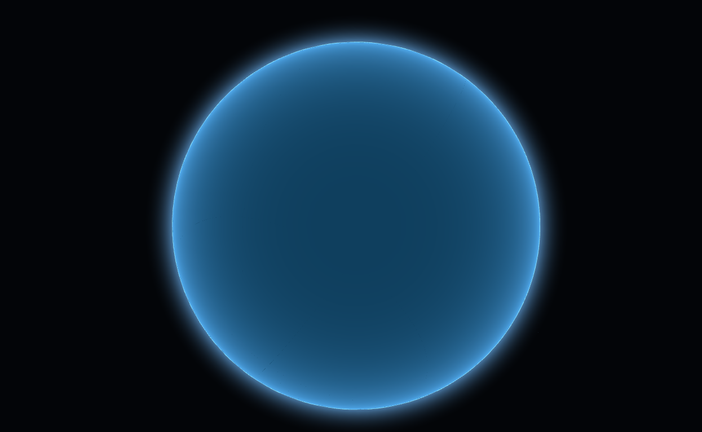
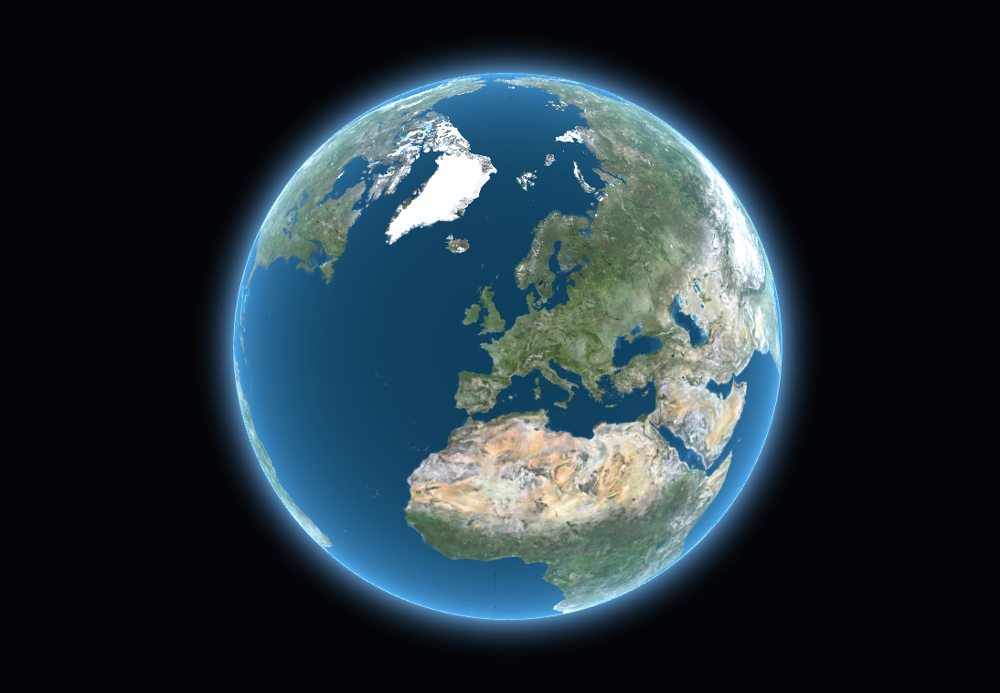

# iTowns tutorial

> ** Tutorial UNDER CONSTRUCTION with *iTowns v2.9.0***

<figure>
  
  <figcaption><i>iTowns examples. Source: <a href="http://www.itowns-project.org/">iTowns website</a> </i></figcaption>
</figure>

## Table of content

<!-- TOC depthFrom:1 depthTo:6 withLinks:1 updateOnSave:1 orderedList:0 -->

- [iTowns tutorial](#itowns-tutorial)
	- [Table of content](#table-of-content)
	- [Preamble](#preamble)
		- [iTowns](#itowns)
			- [Presentation](#presentation)
			- [Layers](#layers)
			- [Tutorial goals](#tutorial-goals)
		- [Web services](#web-services)
	- [Quickstart](#quickstart)
		- [Installation](#installation)
			- [Node and npm](#node-and-npm)
				- [Linux](#linux)
				- [Windows](#windows)
				- [Mac OS](#mac-os)
			- [iTowns](#itowns)
		- [iTowns Controls](#itowns-controls)
		- [Hello world](#hello-world)
	- [Develop your own application](#develop-your-own-application)
		- [Separated files for a better management](#separated-files-for-a-better-management)
			- [HTML](#html)
			- [CSS](#css)
			- [JS](#js)
			- [JSON](#json)
		- [Add Tiles layers](#add-tiles-layers)
		- [Add vector Color layer from GeoJSON](#add-vector-color-layer-from-geojson)
		- [Add 3D layer (*WMTS*)](#add-3d-layer-wmts)
		- [Cool stuffs (split example)](#cool-stuffs-split-example)

<!-- /TOC -->

>Through this tutorial you will learn how to get your own running iTowns application. It is based on iTowns [tutorials](http://www.itowns-project.org/itowns/docs/#tutorials/Create-a-simple-globe) and [examples](http://www.itowns-project.org/itowns/examples/index.html).

## Development advices

* Don't forget to use the development tools and console of your browser to monitor your developement and track the possible bugs/errors. To use these tools, in Mozilla Firefox browser for example, go to the ***Parameters*** then ***Web development*** then ***Development tools*** (*see figure below*)


* Remember that there is an ```examples``` directory in the ```itowns``` directory. You can study the examples to learn how to develop specific applications.

## Preamble

### iTowns

#### Presentation

[iTowns](http://www.itowns-project.org/) is a [Three.JS](https://threejs.org/)-Based JS/WWEBGL framework for 3D GeoSpatial data visualization.

#### Layers

iTowns *layers* are data layers that can be added to a *view*.
iTowns can handle:
* 3D Tiles
* DEM
* OGC standards
* Point clouds
* GeoJSON, GPX and KML
* 3D formats (*Collada, GLTF, OBJ, ...*)

#### Tutorial goals

In this tutorial you are going to learn how to:
* install and set up iTowns
* run your first *Hello World* application
* set a clear environment (*set of files: HTML, JS, CSS, JSON*) for the development of your future iTowns apps.
* Read and add as layers some data:
  * tiles
  * GeoJSON
  * [Web Feature Service](https://en.wikipedia.org/wiki/Web_Feature_Service) (*WFS*)

### Web services

A web service is a software component with interface allowing communication with others computers on the network.

This communication goes mostly through standardised URLs ([REST](https://en.wikipedia.org/wiki/Representational_state_transfer), [WMS](https://en.wikipedia.org/wiki/Web_Map_Service), [WFS](https://en.wikipedia.org/wiki/Web_Feature_Service), ...).  

In this tutorial, we are going to use some of these services to get spatial data (*3D buildings of the city of Lyon in France, for example*) using some of the [OGC](http://www.opengeospatial.org/) standards:
  * [WMTS](https://fr.wikipedia.org/wiki/Web_Map_Tile_Service):
    * Spatial tiles (*images*)
    * Tiles are generated on a server. It is fast to get and render these tiles because these are images. This means that modifications are very limited on client side.
  * [WFS]((https://en.wikipedia.org/wiki/Web_Feature_Service)):
    * Spatial data to web client
    * Modifications are possible (*more flexible than WMTS*)
    * Transactional WFS allows user to add and modify data on the server

## Quickstart

> First of all, you need to check if your browser does support WebGL. Click on the folowing link: http://www.itowns-project.org/itowns/examples/globe.html
> Below is the expected result you should get on your browser:
> 
> If not, try to update your browser and update your graphics board. If there is still a problem, see http://get.webgl.org/

### Installation

#### Node and npm

##### Linux

> **Tested on *Ubuntu 18.04 LTS***

* Open a terminal
    * Install ```nodeJS``` and ```npm```:

    ```bash
    sudo apt-get install nodejs
    sudo apt-get install npm
    sudo npm install -g n
    sudo n latest
    ```

##### Windows

* Download and install the [latest LTS version](https://nodejs.org/en/download/)

##### Mac OS

* Download and install the [latest LTS version](https://nodejs.org/en/download/)

#### iTowns

* Open a terminal and go to the directory where you want to install iTowns
* Git clone the iTowns repository: ```git clone https://github.com/iTowns/itowns.git```
* Check [here](https://github.com/iTowns/itowns/releases/latest) the latest release to get the right tag: *example: v2.9.0*
* Go to your iTowns local repository, *ex*: ```cd ./documents/itowns```
* Checkout the right tag, *ex*: ```git checkout tags/v2.9.0```
* Then do an installation: ```npm install```
* You will have something like this in your terminal:

  ```bash
  > puppeteer@1.12.2 install /home/thomas/Documents/outils/3D_test/itowns/node_modules/puppeteer
  > node install.js

  Downloading Chromium r624492 - 107.6 Mb [====================] 100% 0.0s
  Chromium downloaded to /home/thomas/Documents/outils/3D_test/itowns/node_modules/puppeteer/.local-chromium/linux-624492

  > itowns@2.9.0 prepare /home/thomas/Documents/outils/3D_test/itowns
  > node ./config/prepare.js && node ./config/replace.config.js

  Warning PUPPETEER_SKIP_CHROMIUM_DOWNLOAD is undefined,
  the installation'll be longer because Puppeteer'll download Chromium,
  only needed for testing. Read CODING.md for more information.

  Node.js version : 11.13.0
  Npm version : 6.7.0
  ```
* Then you can run iTowns with ```npm start```
* You should have something like this in your terminal:

  ```bash
  > itowns@2.9.0 start /home/thomas/Documents/outils/3D_test/itowns
  > cross-env NODE_ENV=development webpack-dev-server -d --inline --hot

  ℹ ｢wds｣: Project is running at http://localhost:8080/
  ℹ ｢wds｣: webpack output is served from /dist/
  ℹ ｢wdm｣: Hash: 2d8266d5c91a0ba51931
  Version: webpack 4.29.6
  Time: 13781ms
  Built at: 2019-04-04 11:15:51

  Asset      Size  Chunks             Chunk Names
  debug.js  9.45 MiB   debug  [emitted]  debug
  itowns.js  9.73 MiB  itowns  [emitted]  itowns
  Entrypoint itowns = itowns.js
  Entrypoint debug = itowns.js debug.js
  [0] multi (webpack)-dev-server/client?http://localhost:8080 (webpack)/hot/dev-server.js @babel/polyfill url-polyfill whatwg-fetch ./src/MainBundle.js 88 bytes {itowns} [built]
  [3] multi (webpack)-dev-server/client?http://localhost:8080 (webpack)/hot/dev-server.js ./utils/debug/Main.js 52 bytes {debug} [built]
  [./node_modules/@babel/polyfill/lib/index.js] 893 bytes {itowns} [built]
  [./node_modules/core-js/es6/index.js] 5.74 KiB {itowns} [built]
  [./node_modules/core-js/fn/array/includes.js] 109 bytes {itowns} [built]
  [./node_modules/core-js/fn/object/entries.js] 109 bytes {itowns} [built]
  [./node_modules/core-js/fn/object/get-own-property-descriptors.js] 148 bytes {itowns} [built]
  [./node_modules/core-js/fn/object/values.js] 107 bytes {itowns} [built]
  [./node_modules/core-js/fn/promise/finally.js] 166 bytes {itowns} [built]
  [./node_modules/url-polyfill/url-polyfill.js] 13.2 KiB {itowns} [built]
  [./node_modules/webpack-dev-server/client/index.js?http://localhost:8080] (webpack)-dev-server/client?http://localhost:8080 8.1 KiB {itowns} {debug} [built]
  [./node_modules/webpack/hot/dev-server.js] (webpack)/hot/dev-server.js 1.61 KiB {itowns} {debug} [built]
  [./node_modules/whatwg-fetch/fetch.js] 13 KiB {itowns} [built]
  [./src/MainBundle.js] 118 bytes {itowns} [built]
  [./utils/debug/Main.js] 293 bytes {debug} [built]
  + 764 hidden modules
  ℹ ｢wdm｣: Compiled successfully.
  ```
* Then you can go to http://localhost:8080/ to check if you can see something like this in your browser:


* You can stop the server with ```Ctrl+C``` in the terminal

### iTowns Controls

<table style="width:100%">
 <tr>
   <th>What</th>
   <th>How</th>
 </tr>
 <tr>
   <td><i><b>Translation: globe</i></b></td>
   <td></td>
 </tr>
 <tr>
   <td><i><b>Translation: camera</i></b></td>
   <td></td>
 </tr>
 <tr>
   <td><i><b>Rotation: camera</i></b></td>
   <td></td>
 </tr>
 <tr>
   <td><i><b>Zoom</i></b></td>
   <td></td>
 </tr>
</table>

### Hello world

Here we are going to develop a short app and get it running quickly. Our explanations are based on this [iTowns tutorial](http://www.itowns-project.org/itowns/docs/#tutorials/Create-a-simple-globe).

1. Create a new directory inside the iTowns directory, name it ```globe_viewer``` for example.
2. Create a new HTML document. Name it ```index.html```
3. Open ```index.html``` with your favorite text editor. If you don't have any, you can try the open source text editor [Atom](https://atom.io/).
4. Copy & paste this base webpage HTML code:

  ```html
  <!doctype html>
      <html>
      <head>
          <title>Urban Viewer</title>
          <meta charset="UTF-8">
          <meta name="viewport" content="width=device-width, initial-scale=1.0">
          <style type="text/css">
                html {
                    height: 100%;
                }

                body {
                    margin: 0;
                    overflow: hidden;
                    height: 100%;
                }

                div {
                    margin : auto auto;
                    width: 100%;
                    padding: 0;
                    height: 100%
                }
          </style>
      </head>
      <body>
          <script src="../dist/itowns.js"></script>
          <div id="viewerDiv"></div>
          <script type="text/javascript">
              // JS CODE HERE
          </script>
      </body>
      </html>
  ```
5. Create a *view*:

    * A *view* element is required to display anything with iTowns.
    * This *view* needs to be attached to an element of the page so we need to indicate it in the *Javascript* section
    * The camera requires parameters in order to be set. Parameters take place in  a *position* object with [WGS84](https://en.wikipedia.org/wiki/World_Geodetic_System#WGS84) (EPSG:4326) coordinates:
      * longitude
      * latitude
      * altitude
    * Copy and paste the JS code below to replace ```// JS CODE HERE```

    ```javascript
    var viewerDiv = document.getElementById('viewerDiv');
    var position = new itowns.Coordinates('WGS84', 2.35, 48.8, 25e6);
    var view = new itowns.GlobeView(viewerDiv, position);
    ```
6. You should obtain this:

  ```html
  <!doctype html>
      <html>
      <head>
          <title>Urban Viewer</title>
          <meta charset="UTF-8">
          <meta name="viewport" content="width=device-width, initial-scale=1.0">
          <style type="text/css">
                html {
                    height: 100%;
                }

                body {
                    margin: 0;
                    overflow: hidden;
                    height: 100%;
                }

                div {
                    margin : auto auto;
                    width: 100%;
                    padding: 0;
                    height: 100%
                }
          </style>
      </head>
      <body>
          <script src="../dist/itowns.js"></script>
          <div id="viewerDiv"></div>
          <script type="text/javascript">
              var viewerDiv = document.getElementById('viewerDiv');
              var position = new itowns.Coordinates('WGS84', 2.35, 48.8, 25e6);
              var view = new itowns.GlobeView(viewerDiv, position);  
          </script>
      </body>
      </html>
  ```

7. Save your HTML file and open a terminal in your app directory (*where your ```index.html``` is*) and write ```npm start``` (*to run your local server*)
8. Go to http://localhost:8080/globe_viewer/index.html (*it runs on your local server on the 8080 port*)
9. You should see something like this (*if not, remember you can see errors and warnings using the web development tools of your browser*)

10. Now we will add a basic layer composed of aerial photo as *iTowns ColorLayer*:
  * we choose images from a WMTS server, so we need to use *[WMTSSource](http://www.itowns-project.org/itowns/docs/#api/Source/WMTSSource)* and set three elements:
    * ```url```: describes the path to the WMTS service
    * ```name``` and ```tileMatrixSet```: build the URL for each image

  ```javascript
    var orthoSource = new itowns.WMTSSource({
      url: 'http://wxs.ign.fr/3ht7xcw6f7nciopo16etuqp2/geoportail/wmts',
      name: 'ORTHOIMAGERY.ORTHOPHOTOS',
      tileMatrixSet: 'PM',
      format: 'image/jpeg',
    });

    var orthoLayer = new itowns.ColorLayer('Ortho', {
        source: orthoSource,
    });

    view.addLayer(orthoLayer);
  ```

11. Add this piece of code inside the JS section, save your file and refresh the browser page and you should obtain this:

12. To finish this quickstart tutorial we will add an elevation layer by adding this in the JS section:

  ```javascript
    var elevationSource = new itowns.WMTSSource({
        url: 'http://wxs.ign.fr/3ht7xcw6f7nciopo16etuqp2/geoportail/wmts',
        name: 'ELEVATION.ELEVATIONGRIDCOVERAGE',
        tileMatrixSet: 'WGS84G',
        format: 'image/x-bil;bits=32'
    });

    var elevationLayer = new itowns.ElevationLayer('MNT_WORLD', {
        source: elevationSource,
    });

    view.addLayer(elevationLayer);
  ```

13. Edit your HTML file, save it, reload browser page, zoom in the Alps for example, play with iTows controls (*pan globe and camera, rotate camera*) and you should see something like this:


So you have a local server running a simple iTowns globe with ortho photos and elevation. Find below the complete code.

  ```html
  <!doctype html>
      <html>
      <head>
          <title>Urban Viewer</title>
          <meta charset="UTF-8">
          <meta name="viewport" content="width=device-width, initial-scale=1.0">
          <style type="text/css">
              html {
                  height: 100%;
              }

              body {
                  margin: 0;
                  overflow: hidden;
                  height: 100%;
              }

              div {
                  margin : auto auto;
                  width: 100%;
                  padding: 0;
                  height: 100%
              }
      </style>
      </head>
      <body>
          <script src="../dist/itowns.js"></script>
          <div id="viewerDiv"></div>
          <script type="text/javascript">
            var viewerDiv = document.getElementById('viewerDiv');
             var position = new itowns.Coordinates('WGS84', 2.35, 48.8, 25e6);
             var view = new itowns.GlobeView(viewerDiv, position);
             var orthoSource = new itowns.WMTSSource({
                    url: 'http://wxs.ign.fr/3ht7xcw6f7nciopo16etuqp2/geoportail/wmts',
                    name: 'ORTHOIMAGERY.ORTHOPHOTOS',
                    tileMatrixSet: 'PM',
                    format: 'image/jpeg',
                });

              var orthoLayer = new itowns.ColorLayer('Ortho', {
                  source: orthoSource,
              });

              view.addLayer(orthoLayer);

              var elevationSource = new itowns.WMTSSource({
                    url: 'http://wxs.ign.fr/3ht7xcw6f7nciopo16etuqp2/geoportail/wmts',
                    name: 'ELEVATION.ELEVATIONGRIDCOVERAGE',
                    tileMatrixSet: 'WGS84G',
                    format: 'image/x-bil;bits=32'
                });

              var elevationLayer = new itowns.ElevationLayer('MNT_WORLD', {
                    source: elevationSource,
              });

    view.addLayer(elevationLayer);
          </script>
      </body>
      </html>
  ```

It was simple and everything was on a unique HTML file. But if you need to develop your own application, you will probably need a lot if layers and functions, so it is time to learn how to add others data sources but also how to get a cleaner organisation and code.

## Develop your own application

We will learn here how to:
* get a clean development environment
* set and add tile layer in a proper way
* set and add GeoJSON
* set and add 3D layer (*WMTS*)
* go further with [iTowns example](http://www.itowns-project.org/itowns/examples/index.html) and try cool stuffs

### Separated files for a better management

In order to manage, change and update your code, it is simpler and better for you to have a file for each programming language and layer definition.

#### HTML

* Create a new directory for your new application on the root of the iTowns directory. Name it, for example, ```my_app```.
* Create a new HTML file and copy/paste this, then save it in the root of your ```my_app``` directory:

  ```html
  <!doctype html>
  <html>
    <head>
        <title>Test Globe</title>
        <meta charset="UTF-8">
        <meta name="viewport" content="width=device-width, initial-scale=1.0">
        <link rel="stylesheet" type="text/css" href="../examples/css/example.css">
        <link rel="stylesheet" type="text/css" href="./CSS/custom.css">
        <script type="text/javascript" src="http://maps.stamen.com/js/tile.stamen.js?v1.3.0"></script>
        <script src="../examples/js/GUI/dat.gui/dat.gui.min.js"></script>
    </head>
    <body>
        <div id="viewerDiv" class="viewer">
            <span id="tooltipDiv" class="tooltip"></span>
        </div>
        <script src="../examples/js/GUI/GuiTools.js"></script>
        <script src="../dist/itowns.js"></script>
        <script src="../examples/js/FeatureToolTip.js"></script>
        <script src="./JS/config.js"></script>
    </body>
  </html>
  ```

* Some explanations:
  * In the ```head``` section we indicate links to 2 CSS file (*on from iTowns directory and one that will be created*) to get style elements in separated files:

    ```html
      <link rel="stylesheet" type="text/css" href="../examples/css/example.css">
      <link rel="stylesheet" type="text/css" href="./CSS/custom.css">
    ```

  * There is also a link to JS elements (*a local file and an online one*) to manage some tile layers and iTowns tools:

    ```html
      <script type="text/javascript" src="http://maps.stamen.com/js/tile.stamen.js?v1.3.0"></script>
      <script src="../examples/js/GUI/dat.gui/dat.gui.min.js"></script>
    ```

  * In ```body``` section, we find a ```div``` that will contain the ```view``` and some ```tooltips``` to get popup when hovering on some layers. We also find links to iTowns JS scripts to create and manage iTowns elements and tools:

    ```html
      <div id="viewerDiv" class="viewer">
          <span id="tooltipDiv" class="tooltip"></span>
      </div>
      <script src="../examples/js/GUI/GuiTools.js"></script>
      <script src="../dist/itowns.js"></script>
      <script src="../examples/js/FeatureToolTip.js"></script>
    ```

  * At least, there is a link to a JS script that will be created:

    ```html
      <script src="./JS/config.js"></script>
    ```

#### CSS

* On the root of your directory, create a directory named ```CSS```
* Inside, create a new file named ```custom.css```:

  ```css
  .tooltip {
      display: none;
      background-image: linear-gradient(rgba(80, 80, 80,0.95), rgba(60, 60, 60,0.95));
      box-shadow: -1px 2px 5px 1px rgba(0, 0, 0, 0.5);
      margin-top: 20px;
      margin-left: 20px;
      padding: 10px;
      position: absolute;
      z-index: 1000;
      color: #CECECE;
      font-family: 'Open Sans', sans-serif;
      font-size: 14px;
      line-height: 18px;
      text-align: left;
  }
  .coord {
      font-size: 12px;
      padding-left:20px;
      color: #93B7C0;
      text-shadow: 0px 1px 0px rgba(200,200,200,.3), 0px -1px 0px rgba(30,30,30,.7);
  }
  ```

* This CSS code is based on [iTowns globe example](http://www.itowns-project.org/itowns/examples/globe_vector.html) and completes the iTowns CSS to get tooltips working and make edition easier.

#### JS

* Now we can do the same for JS files. On the root of your directory, create a directory named ```JS```
* Inside, create a new file named ```config.js```.
* We want to be able to:
  * set variables (*some of them need to be global*)
  * put some layers (*Tiles, GeoJSON; ...*) in list and wait until globe view is initialized to get chosen layers on top. This is required because Javascript is asynchronous.  
* So first, init globe and menu and some variables in the ```config.js``` file (*creation of 2 lists for promises - we will explain that later - and layers variables*).

```javascript
// Globe view
var viewerDiv = document.getElementById('viewerDiv');
var position = new itowns.Coordinates('WGS84', 2.35, 48.8, 25e6);
var view = new itowns.GlobeView(viewerDiv, position);
var menuGlobe = new GuiTools('menuDiv', view);

var promises = [];
var promises2 = [];
var tileLayer1;
var tileLayer2;
var ariegeLayer;
var moreThanOne;
```

#### JSON

In order to have a clean code and be able to manage it, you may use JSON files to define the tiles layers.

* Create a new directory on the root of your application: ```JSON_layers```
* Create 2 new JSON files:
  * ```OSM_stamen_terrain.json```:

      ```json
      {
        "id":"STAMEN TERRAIN",
        "source":{
          "format": "image/jpg",
          "url": "https://stamen-tiles.a.ssl.fastly.net/terrain/${z}/${x}/${y}.jpg",
          "attribution": {
            "name": "OpenStreetMap",
            "url": "http://www.openstreetmap.org/"
          },
          "tileMatrixSet": "PM"
        }
      }  
      ```

  * ```OSM_cartodb_dark.json```:

    ```json
    {
      "id":"CARTODB DARK",
      "source":{
        "isInverted": true,
        "format": "image/png",
        "url": "https://cartodb-basemaps-a.global.ssl.fastly.net/dark_all/${z}/${x}/${y}.png",
        "attribution": {
            "name": "Map tiles by Carto, under CC BY 3.0. Data by OpenStreetMap, under ODbL.",
            "url": "http://carto.com/basemaps"
        },
        "tileMatrixSet": "PM"
      }
    }
    ```

### Add Tiles layers

The 2 JSON files you have just created will be used to add layer on the ```view```:
* Add this to the ```config.js``` file:

  ```javascript
  // Add two imagery layers to the scene
  // This layer is defined in a json file but it could be defined as a plain js
  // object. See Layer* for more info.
  function addColorLayerFromConfig(config) {
      var layer = new itowns.ColorLayer(config.id, config)
      if (moreThanOne > 0){layer.visible = false;}
      else {layer.visible = true;};
      moreThanOne++;

      return view.addLayer(layer).then(function _() {
                      menuGlobe.addLayerGUI.bind(menuGlobe);
                      itowns.ColorLayersOrdering.moveLayerToIndex(view, config.id, 0);
                  });
  };
  promises.push(itowns.Fetcher.json('./JSON_layers/OSM_stamen_terrain.json')
      .then(function _(c) {
          c.source = new itowns.TMSSource(c.source);
          return c;
      })
      .then(addColorLayerFromConfig)
      .then(function _(l) { tileLayer1 = l; }));

  promises.push(itowns.Fetcher.json('./JSON_layers/OSM_cartodb_dark.json')
      .then(function _(c) {
          c.source = new itowns.TMSSource(c.source);
          return c;
      })
      .then(addColorLayerFromConfig)
      .then(function _(l) { tileLayer2 = l; }));
  ```

* The ```addColorLayerFromConfig``` function add new ```itowns.ColorLayer``` to the ```view```. The 2 tiles layers are added to the ```promise``` array in order to manage them in an asynchronous system. We check if there is already a layer on the ```view``` and if it's the case, the new layer visibility is set to false (*but can be set to true via the application menu*)
* Your JS file should look like this:

  ```javascript
  // Globe view
  var viewerDiv = document.getElementById('viewerDiv');
  var position = new itowns.Coordinates('WGS84', 2.35, 48.8, 25e6);
  var view = new itowns.GlobeView(viewerDiv, position);
  var menuGlobe = new GuiTools('menuDiv', view);

  var promises = [];
  var promises2 = [];
  var tileLayer1;
  var tileLayer2;
  var moreThanOne = 0

  // Add two imagery layers to the scene
  // This layer is defined in a json file but it could be defined as a plain js
  // object. See Layer* for more info.
  function addColorLayerFromConfig(config) {
      var layer = new itowns.ColorLayer(config.id, config)
      if (moreThanOne > 0){layer.visible = false;}
      else {layer.visible = true;};
      moreThanOne++;

      return view.addLayer(layer).then(function _() {
                      menuGlobe.addLayerGUI.bind(menuGlobe);
                      itowns.ColorLayersOrdering.moveLayerToIndex(view, config.id, 0);
                  });
  };
  promises.push(itowns.Fetcher.json('./JSON_layers/OSM_stamen_terrain.json')
      .then(function _(c) {
          c.source = new itowns.TMSSource(c.source);
          return c;
      })
      .then(addColorLayerFromConfig)
      .then(function _(l) { tileLayer1 = l; }));

  promises.push(itowns.Fetcher.json('./JSON_layers/OSM_cartodb_dark.json')
      .then(function _(c) {
          c.source = new itowns.TMSSource(c.source);
          return c;
      })
      .then(addColorLayerFromConfig)
      .then(function _(l) { tileLayer2 = l; }));
  ```

### Add Elevation layers

  ```javascript
  // Add two elevation layers.
  // These will deform iTowns globe geometry to represent terrain elevation.
  function addElevationLayerFromConfig(config) {
      config.source = new itowns.WMTSSource(config.source);
      var layer = new itowns.ElevationLayer(config.id, config);
      view.addLayer(layer).then(menuGlobe.addLayerGUI.bind(menuGlobe));
  }
  itowns.Fetcher.json('../examples/layers/JSONLayers/WORLD_DTM.json').then(addElevationLayerFromConfig);
  itowns.Fetcher.json('../examples/layers/JSONLayers/IGN_MNT_HIGHRES.json').then(addElevationLayerFromConfig);
  ```

* Refresh your local server and you should get this on your browser:


* You can show and hide the layers via the menu and set opacity

### Add vector ColorLayer from GeoJSON

We can now add a ```ColorLayer``` as vector layer from GeoJSON data.

* In the JS file, add this:

  ```javascript
  promises2.push(itowns.Fetcher.json('https://raw.githubusercontent.com/gregoiredavid/france-geojson/master/departements/09-ariege/departement-09-ariege.geojson')
        .then(function _(geojson) {
            return itowns.GeoJsonParser.parse(geojson, {
                buildExtent: true,
                crsIn: 'EPSG:4326',
                crsOut: view.tileLayer.extent.crs,
                mergeFeatures: true,
                withNormal: false,
                withAltitude: false,
            });
        }).then(function _(parsedData) {
            var ariegeSource = new itowns.FileSource({
                parsedData,
            });

            ariegeLayer = new itowns.ColorLayer('Ariege', {
                name: 'ariege',
                transparent: true,
                style: {
                    fill: 'orange',
                    fillOpacity: 0.5,
                    stroke: 'white',
                },
                source: ariegeSource,
            });
            // return ariegeLayer;
            return view.addLayer(ariegeLayer)
                        .then(function _() {
                            menuGlobe.addLayerGUI.bind(menuGlobe);
                            itowns.ColorLayersOrdering.moveLayerToIndex(view, ariegeLayer.id, 2);
                        })
                        .then(function _(l) { ariegeLayer = l; });
        })
      );
  ```

* We push to a second list of promises a GeoJSON that is fetched with the ```itowns.Fetcher```:

  ```javascript
  promises2.push(itowns.Fetcher.json('https://raw.githubusercontent.com/gregoiredavid/france-geojson/master/departements/09-ariege/departement-09-ariege.geojson')
  ```

* The fetched file is parsed with the ```itowns.GeoJsonParser``` (*with settings like ```crsIn```*):

  ```javascript
  .then(function _(geojson) {
      return itowns.GeoJsonParser.parse(geojson, {
          buildExtent: true,
          crsIn: 'EPSG:4326',
          crsOut: view.tileLayer.extent.crs,
          mergeFeatures: true,
          withNormal: false,
          withAltitude: false,
      });
  })
  ```
* Then add parsed data as an ```itowns.FileSource``` and create a new source and set a new ```itowns.ColorLayer``` with this new source and return this layer added to the ```view``` and to to ```menu``` and move it to the top (*GeoJSON layer must be on top of tiles layers*):

  ```javascript
  .then(function _(parsedData) {
      var ariegeSource = new itowns.FileSource({
          parsedData,
      });

      ariegeLayer = new itowns.ColorLayer('Ariege', {
          name: 'ariege',
          transparent: true,
          style: {
              fill: 'orange',
              fillOpacity: 0.5,
              stroke: 'white',
          },
          source: ariegeSource,
      });
      // return ariegeLayer;
      return view.addLayer(ariegeLayer)
                  .then(function _() {
                      menuGlobe.addLayerGUI.bind(menuGlobe);
                      itowns.ColorLayersOrdering.moveLayerToIndex(view, ariegeLayer.id, 2);
                  })
                  .then(function _(l) { ariegeLayer = l; });
  })
  ```
* Finally we check the promises (*GeoJSON layer must render after tiles layers*) because JS is asynchronous:

  ```javascript
  // Listen for globe full initialisation event
  view.addEventListener(itowns.VIEW_EVENTS.LAYERS_INITIALIZED, function _() {
        Promise.all(promises)
        .then(Promise.all(promises2))
        .then(new ToolTip(view,
          document.getElementById('viewerDiv'),
          document.getElementById('tooltipDiv')))
  });
  ```

* Your entire JS file should be:

  ```javascript
  // Globe view
  var viewerDiv = document.getElementById('viewerDiv');
  var position = new itowns.Coordinates('WGS84', 2.35, 48.8, 25e6);
  var view = new itowns.GlobeView(viewerDiv, position);
  var menuGlobe = new GuiTools('menuDiv', view);

  var promises = [];
  var promises2 = [];
  var tileLayer1;
  var tileLayer2;
  var ariegeLayer;
  var moreThanOne = 0

  // Add two imagery layers to the scene
  // This layer is defined in a json file but it could be defined as a plain js
  // object. See Layer* for more info.
  function addColorLayerFromConfig(config) {
      var layer = new itowns.ColorLayer(config.id, config)
      if (moreThanOne > 0){layer.visible = false;}
      else {layer.visible = true;};
      moreThanOne++;

      return view.addLayer(layer).then(function _() {
                      menuGlobe.addLayerGUI.bind(menuGlobe);
                      itowns.ColorLayersOrdering.moveLayerToIndex(view, config.id, 0);
                  });
  };
  promises.push(itowns.Fetcher.json('./JSON_layers/OSM_stamen_terrain.json')
      .then(function _(c) {
          c.source = new itowns.TMSSource(c.source);
          return c;
      })
      .then(addColorLayerFromConfig)
      .then(function _(l) { tileLayer1 = l; }));

  promises.push(itowns.Fetcher.json('./JSON_layers/OSM_cartodb_dark.json')
      .then(function _(c) {
          c.source = new itowns.TMSSource(c.source);
          return c;
      })
      .then(addColorLayerFromConfig)
      .then(function _(l) { tileLayer2 = l; }));

  promises2.push(itowns.Fetcher.json('https://raw.githubusercontent.com/gregoiredavid/france-geojson/master/departements/09-ariege/departement-09-ariege.geojson')
        .then(function _(geojson) {
            return itowns.GeoJsonParser.parse(geojson, {
                buildExtent: true,
                crsIn: 'EPSG:4326',
                crsOut: view.tileLayer.extent.crs,
                mergeFeatures: true,
                withNormal: false,
                withAltitude: false,
            });
        }).then(function _(parsedData) {
            var ariegeSource = new itowns.FileSource({
                parsedData,
            });

            ariegeLayer = new itowns.ColorLayer('Ariege', {
                name: 'ariege',
                transparent: true,
                style: {
                    fill: 'orange',
                    fillOpacity: 0.5,
                    stroke: 'white',
                },
                source: ariegeSource,
            });
            // return ariegeLayer;
            return view.addLayer(ariegeLayer)
                        .then(function _() {
                            menuGlobe.addLayerGUI.bind(menuGlobe);
                            itowns.ColorLayersOrdering.moveLayerToIndex(view, ariegeLayer.id, 2);
                        })
                        .then(function _(l) { ariegeLayer = l; });
        })
      );

  // Add two elevation layers.
  // These will deform iTowns globe geometry to represent terrain elevation.
  function addElevationLayerFromConfig(config) {
      config.source = new itowns.WMTSSource(config.source);
      var layer = new itowns.ElevationLayer(config.id, config);
      view.addLayer(layer).then(menuGlobe.addLayerGUI.bind(menuGlobe));
  }
  itowns.Fetcher.json('../examples/layers/JSONLayers/WORLD_DTM.json').then(addElevationLayerFromConfig);
  itowns.Fetcher.json('../examples/layers/JSONLayers/IGN_MNT_HIGHRES.json').then(addElevationLayerFromConfig);

  // Listen for globe full initialisation event
  view.addEventListener(itowns.VIEW_EVENTS.LAYERS_INITIALIZED, function _() {
        Promise.all(promises)
        .then(Promise.all(promises2))
        .then(new ToolTip(view,
          document.getElementById('viewerDiv'),
          document.getElementById('tooltipDiv')))
  });
  ```
* Refresh http://localhost:8080/my_app/index.html, zoom to the *Ariege* departement and you should see something like this (*with a popup when hovering*):


### Add 3D layer (*WMS*)

> Our example is based on [iTowns example](http://www.itowns-project.org/itowns/examples/globe_wfs_color.html) (*you can find the ```html``` file in the ```examples``` directory within the ```itowns``` directory on your computer*)

* Create a new directory inside the ```itowns``` directory
* Create an ```index.html```:

  ```html
  <html>
    <head>
        <title>Itowns - Globe + WFS</title>

        <meta charset="UTF-8">
        <meta name="viewport" content="width=device-width, initial-scale=1.0">
        <link rel="stylesheet" type="text/css" href="../examples/css/example.css">
        <script src="../examples/js/GUI/dat.gui/dat.gui.min.js"></script>
    </head>
    <body>
        <div id="viewerDiv"></div>
        <script src="../examples/js/GUI/GuiTools.js"></script>
        <script src="../dist/itowns.js"></script>
        <script src="../examples/js/loading_screen.js"></script>
        <script src="../examples/js/proj4defs/3946.js"></script>
        <script src="../dist/debug.js"></script>
        <div class="help">
            <p><b>Building Information</b></p>
            <ul id="info">
            </ul>
        </div>
        <script src="./functions.js"></script>
        <script src="./config.js"></script>
    </body>
</html>
  ```
* Create a ```function.js``` javascript file. In order to get readable code, we are going to put the functions in this file and not in ```config.js```. That's why we imported it before ```config.js``` in the ```HTML body``` with:

  ```javascript
  <script src="./functions.js"></script>
  ```

* Here are the functions:

  ```javascript
  function addElevationLayerFromConfig(config) {
    config.source = new itowns.WMTSSource(config.source);
    var layer = new itowns.ElevationLayer(config.id, config);
    view.addLayer(layer).then(menuGlobe.addLayerGUI.bind(menuGlobe));
  }

  function picking(event) {
      if(view.controls.isPaused()) {
          var htmlInfo = document.getElementById('info');
          var intersects = view.pickObjectsAt(event, 3, 'WFS Building');
          var properties;
          var info;
          var batchId;

          htmlInfo.innerHTML = ' ';

          if (intersects.length) {
              batchId = intersects[0].object.geometry.attributes.batchId.array[intersects[0].face.a];
              properties = intersects[0].object.feature.geometry[batchId].properties;

              Object.keys(properties).map(function (objectKey) {
                  var value = properties[objectKey];
                  var key = objectKey.toString();
                  if (key[0] !== '_' && key !== 'geometry_name') {
                      info = value.toString();
                      htmlInfo.innerHTML +='<li><b>' + key + ': </b>' + info + '</li>';
                  }
              });
          }
      }
  }


  function colorBuildings(properties) {
      if (properties.id.indexOf('bati_remarquable') === 0) {
          return color.set(0x5555ff);
      } else if (properties.id.indexOf('bati_industriel') === 0) {
          return color.set(0xff5555);
      }
      return color.set(0xeeeeee);
  }

  function altitudeBuildings(properties) {
      return properties.z_min - properties.hauteur;
  }

  function extrudeBuildings(properties) {
      return properties.hauteur;
  }

  function acceptFeature(properties) {
      return !!properties.hauteur;
  }

  function altitudeLine(properties, contour) {
      var result;
      var z = 0;
      if (contour) {
          result = itowns.DEMUtils.getElevationValueAt(view.tileLayer, contour, 0, tile);
          if (!result) {
              result = itowns.DEMUtils.getElevationValueAt(view.tileLayer, contour, 0);
          }
          tile = [result.tile];
          if (result) {
              z = result.z;
          }
          return z + 5;
      }
  }

  function colorLine(properties) {
      if (properties) {
          var rgb = properties.couleur.split(' ');
          return color.setRGB(rgb[0] / 255, rgb[1] / 255, rgb[2] / 255);
      }
  }

  function acceptFeatureBus(properties) {
      var line = properties.ligne + properties.sens;
      if (linesBus.indexOf(line) === -1) {
          linesBus.push(line);
          return true;
      }
      return false;
  }

  scaler = function update(/* dt */) {
      var i;
      var mesh;
      if (meshes.length) {
          view.notifyChange(view.camera.camera3D, true);
      }
      for (i = 0; i < meshes.length; i++) {
          mesh = meshes[i];
          if (mesh) {
              mesh.scale.z = Math.min(
                  1.0, mesh.scale.z + 0.1);
              mesh.updateMatrixWorld(true);
          }
      }
      meshes = meshes.filter(function filter(m) { return m.scale.z < 1; });
  };
  ```

* Create a ```config.js``` javascript file
* First set some global variables (*color, position, lists, ...*) to get things done:

  ```javascript
  // Set global variables
  var color = new itowns.THREE.Color();
  var tile;
  var meshes = [];
  var linesBus = [];
  var scaler;
  ////////////////////////
  ```

* Then set initial itowns parameters:

  ```javascript
  // Set initial parameters
  //// Define initial camera position
  var positionOnGlobe = { longitude: 4.818, latitude: 45.7354, altitude: 3000 };

  //// `viewerDiv` will contain iTowns' rendering area (`<canvas>`)
  var viewerDiv = document.getElementById('viewerDiv');

  //// Instanciate iTowns GlobeView*
  var view = new itowns.GlobeView(viewerDiv, positionOnGlobe);
  setupLoadingScreen(viewerDiv, view);

  var menuGlobe = new GuiTools('menuDiv', view);
  ////////////////////////
  ```

* Add imagery and elevation layers to the scene (*definitions in JSON files*):

  ```javascript
  // Add one imagery layer to the scene
  // This layer is defined in a json file but it could be defined as a plain js
  // object. See Layer* for more info.
  itowns.Fetcher.json('../examples/layers/JSONLayers/Ortho.json').then(function _(config) {
      config.source = new itowns.WMTSSource(config.source);
      var layer = new itowns.ColorLayer('Ortho', config);
      view.addLayer(layer).then(menuGlobe.addLayerGUI.bind(menuGlobe));
  });

  // Add two elevation layers.
  // These will deform iTowns globe geometry to represent terrain elevation.
  itowns.Fetcher.json('../examples/layers/JSONLayers/WORLD_DTM.json').then(addElevationLayerFromConfig);
  itowns.Fetcher.json('../examples/layers/JSONLayers/IGN_MNT_HIGHRES.json').then(addElevationLayerFromConfig);
  ```

* Set Lyon Bus Lines WFS Source and add it as new ```GeometryLayer```:

  ```javascript
  // Add WFS Lyon Bus Lines
  var lyonTclBusSource = new itowns.WFSSource({
      protocol: 'wfs',
      url: 'https://download.data.grandlyon.com/wfs/rdata?',
      version: '2.0.0',
      typeName: 'tcl_sytral.tcllignebus',
      projection: 'EPSG:3946',
      extent: {
          west: 1822174.60,
          east: 1868247.07,
          south: 5138876.75,
          north: 5205890.19,
      },
      zoom: { min: 9, max: 9 },
      format: 'geojson',
  });

  var lyonTclBusLayer = new itowns.GeometryLayer('WFS Bus lines', new itowns.THREE.Group(), {
      name: 'lyon_tcl_bus',
      update: itowns.FeatureProcessing.update,
      convert: itowns.Feature2Mesh.convert({
          color: colorLine,
          altitude: altitudeLine }),
      linewidth: 5,
      filter: acceptFeatureBus,
      source: lyonTclBusSource
  });
  view.addLayer(lyonTclBusLayer);
  ```

* Call the function to update meshes before rendering:

```javascript
view.addFrameRequester(itowns.MAIN_LOOP_EVENTS.BEFORE_RENDER, scaler);
```

* Add Building WFS source and add it as a new ```GeometryLayer```:

  ```javascript
  var wfsBuildingSource = new itowns.WFSSource({
      url: 'https://wxs.ign.fr/choisirgeoportail/geoportail/wfs?',
      version: '2.0.0',
      typeName: 'BDTOPO_BDD_WLD_WGS84G:bati_remarquable,BDTOPO_BDD_WLD_WGS84G:bati_indifferencie,BDTOPO_BDD_WLD_WGS84G:bati_industriel',
      projection: 'EPSG:4326',
      ipr: 'IGN',
      format: 'application/json',
      zoom: { min: 14, max: 14 },
      extent: {
          west: 4.568,
          east: 5.18,
          south: 45.437,
          north: 46.03,
      },
  });

  var wfsBuildingLayer = new itowns.GeometryLayer('WFS Building', new itowns.THREE.Group(), {
      update: itowns.FeatureProcessing.update,
      convert: itowns.Feature2Mesh.convert({
          color: colorBuildings,
          batchId: function (property, featureId) { return featureId; },
          altitude: altitudeBuildings,
          extrude: extrudeBuildings }),
      onMeshCreated: function scaleZ(mesh) {
          mesh.scale.z = 0.01;
          meshes.push(mesh);
      },
      filter: acceptFeature,
      overrideAltitudeInToZero: true,
      source: wfsBuildingSource
  });
  view.addLayer(wfsBuildingLayer);
  ```

* Finally add some GUI (*Graphical User Interface*):

  ```javascript
  // Listen for globe full initialisation event
  view.addEventListener(itowns.GLOBE_VIEW_EVENTS.GLOBE_INITIALIZED, function () {
      // eslint-disable-next-line no-console
      console.info('Globe initialized');
      view.controls.setTilt(45);
  });
  var d = new debug.Debug(view, menuGlobe.gui);
  debug.createTileDebugUI(menuGlobe.gui, view, view.tileLayer, d);

  // Add GUI
  for (var layer of view.getLayers()) {
      if (layer.id === 'WFS Bus lines') {
          layer.whenReady.then( function _(layer) {
              var gui = debug.GeometryDebug.createGeometryDebugUI(menuGlobe.gui, view, layer);
              debug.GeometryDebug.addMaterialLineWidth(gui, view, layer, 1, 10);
          });
      }
      if (layer.id === 'WFS Building') {
          layer.whenReady.then( function _(layer) {
              var gui = debug.GeometryDebug.createGeometryDebugUI(menuGlobe.gui, view, layer);
              debug.GeometryDebug.addWireFrameCheckbox(gui, view, layer);
              window.addEventListener('mousemove', picking, false);
          });
      }
      if (layer.id === 'WFS Route points') {
          layer.whenReady.then( function _(layer) {
              var gui = debug.GeometryDebug.createGeometryDebugUI(menuGlobe.gui, view, layer);
              debug.GeometryDebug.addMaterialSize(gui, view, layer, 1, 200);
          });
      }
  }
  ```

  * Go to http://localhost:8080/[NEW_DIRECTORY]/index.html and you should see this:

  

### To go further
#### Useful links
##### Colors palettes

* [ColorBrewer](http://colorbrewer2.org/#type=sequential&scheme=BuGn&n=3) to find the *best* palette
* [Why you should use viridis or similar palettes](https://cran.r-project.org/web/packages/viridis/vignettes/intro-to-viridis.html) (*because they are blindness color proof*)

##### Data Visualisation
* [Case studies](https://medium.com/@kennelliott/39-studies-about-human-perception-in-30-minutes-4728f9e31a73)

#### Layers management
##### JSON layers

#### Cool examples

##### Split Layers


This example is based on the [itowns split rendering example](http://www.itowns-project.org/itowns/examples/split.html).

You will find below all the required codes.

###### CSS

```css
/* From http://www.itowns-project.org/itowns/examples/globe_vector.html */

.tooltip {
   display: none;
   background-image: linear-gradient(rgba(80, 80, 80,0.95), rgba(60, 60, 60,0.95));
   box-shadow: -1px 2px 5px 1px rgba(0, 0, 0, 0.5);
   margin-top: 20px;
   margin-left: 20px;
   padding: 10px;
   position: absolute;
   z-index: 1000;
   color: #CECECE;
   font-family: 'Open Sans', sans-serif;
   font-size: 14px;
   line-height: 18px;
   text-align: left;
}
.coord {
   font-size: 12px;
   padding-left:20px;
   color: #93B7C0;
   text-shadow: 0px 1px 0px rgba(200,200,200,.3), 0px -1px 0px rgba(30,30,30,.7);
}

#splitSlider {
   position: absolute;
   left: 50%;
   top: 0px;
   width: 4px;
   height: 100%;
   background-color: #666666;
}

#splitSlider:hover {
   cursor: ew-resize;
}
```

###### JS

```javascript
// Globe view
var viewerDiv = document.getElementById('viewerDiv');
var position = new itowns.Coordinates('WGS84', 2.35, 48.8, 25e6);
var view = new itowns.GlobeView(viewerDiv, position);
var menuGlobe = new GuiTools('menuDiv', view);

// Add two imagery layers to the scene
// This layer is defined in a json file but it could be defined as a plain js
// object. See Layer* for more info.
function addColorLayerFromConfig(config) {
    var layer = new itowns.ColorLayer(config.id, config);
    return view.addLayer(layer);
}

var promises = [];
var promisesUp = [];

var tileLayer1;
var tileLayer2;
var ariegeLayer;
var splitSlider;
var splitPosition;
var xD;

// Add two imagery layers to the scene
// This layer is defined in a json file but it could be defined as a plain js
// object. See Layer* for more info.
function addColorLayerFromConfig(config) {
    var layer = new itowns.ColorLayer(config.id, config);

    return view.addLayer(layer);
}
promises.push(itowns.Fetcher.json('./JSON_layers/OSM_stamen_terrain.json')
    .then(function _(c) {
        c.source = new itowns.TMSSource(c.source);
        return c;
    })
    .then(addColorLayerFromConfig)
    .then(function _(l) { tileLayer1 = l; }));

promises.push(itowns.Fetcher.json('./JSON_layers/OSM_cartodb_dark.json')
    .then(function _(c) {
        c.source = new itowns.TMSSource(c.source);
        return c;
    })
    .then(addColorLayerFromConfig)
    .then(function _(l) { tileLayer2 = l; }));

promises.push(
  itowns.Fetcher.json('https://raw.githubusercontent.com/gregoiredavid/france-geojson/master/departements/09-ariege/departement-09-ariege.geojson')
      .then(function _(geojson) {
          return itowns.GeoJsonParser.parse(geojson, {
              buildExtent: true,
              crsIn: 'EPSG:4326',
              crsOut: view.tileLayer.extent.crs,
              mergeFeatures: true,
              withNormal: false,
              withAltitude: false,
          });
      }).then(function _(parsedData) {
          var ariegeSource = new itowns.FileSource({
              parsedData,
          });

          myLayer = new itowns.ColorLayer('Ariege', {
              name: 'ariege',
              transparent: true,
              style: {
                  fill: 'orange',
                  fillOpacity: 0.5,
                  stroke: 'white',
              },
              source: ariegeSource,
          });
          return view.addLayer(myLayer);
      })
    .then(function _(l) { ariegeLayer = l; })
);

// Add two elevation layers.
// These will deform iTowns globe geometry to represent terrain elevation.
function addElevationLayerFromConfig(config) {
    config.source = new itowns.WMTSSource(config.source);
    var layer = new itowns.ElevationLayer(config.id, config);
    view.addLayer(layer).then(menuGlobe.addLayerGUI.bind(menuGlobe));
}
itowns.Fetcher.json('../examples/layers/JSONLayers/WORLD_DTM.json').then(addElevationLayerFromConfig);
itowns.Fetcher.json('../examples/layers/JSONLayers/IGN_MNT_HIGHRES.json').then(addElevationLayerFromConfig);

// Add atmoshpere layer
const atmosphere = view.getLayerById('atmosphere');
menuGlobe.addGUI('RealisticLighting', false, function (v) {
    atmosphere.setRealisticOn(v);
    view.notifyChange(atmosphere);
});

// Listen for globe full initialisation event
view.addEventListener(itowns.VIEW_EVENTS.LAYERS_INITIALIZED, function _() {
    Promise.all(promises).then(new ToolTip(view,
        document.getElementById('viewerDiv'),
        document.getElementById('tooltipDiv')));
});

// SLIDE MANAGEMENT
// Slide handling
splitPosition = 0.5 * window.innerWidth;
xD = 0;
function splitSliderMove(evt) {
    var s = (evt.clientX - xD) / splitSlider.parentElement.offsetWidth;
    splitSlider.style.left = (100.0 * s) + '%';
    splitPosition = s * window.innerWidth;
    view.notifyChange();
}

function mouseDown(evt) {
    xD = evt.clientX - splitSlider.offsetLeft;
    window.addEventListener('mousemove', splitSliderMove, true);
}

function mouseUp() {
    window.removeEventListener('mousemove', splitSliderMove, true);
}

function changeLayerVisibility(tileLayer1Visible, tileLayer2Visible, layerVisible) {
    view.scene.traverse(function _(obj) {
        if (obj.material && obj.material.visible && obj.material.getLayer) {
            var layer1 = obj.material.getLayer(tileLayer1.id);
            var layer2 = obj.material.getLayer(tileLayer2.id);
            if (layer1) layer1.visible = tileLayer1Visible;
            if (layer2) layer2.visible = tileLayer2Visible
        }
    });
}
splitSlider = document.getElementById('splitSlider');
document.getElementById('splitSlider').addEventListener('mousedown', mouseDown, false);
window.addEventListener('mouseup', mouseUp, false);

// Rendering code
function splitRendering() {
    var g = view.mainLoop.gfxEngine;
    var r = g.renderer;

    r.setScissorTest(true);

    // render ortho layer on the left
    changeLayerVisibility(true, false);

    r.setScissor(0, 0, splitPosition + 2, window.innerHeight);
    g.renderView(view);

    // render osm layer on the right
    changeLayerVisibility(false, true);

    r.setScissor(splitPosition + 2, 0, window.innerWidth - splitPosition - 2, window.innerHeight);
    g.renderView(view);
}


// Override default rendering method when color layers are ready
Promise.all(promises).then(
    function _() { view.render = splitRendering; }).catch(console.error);
```

###### HTML  

```html
<!doctype html>
<html>
<head>
    <title>Test Globe</title>
    <meta charset="UTF-8">
    <meta name="viewport" content="width=device-width, initial-scale=1.0">
    <link rel="stylesheet" type="text/css" href="../examples/css/example.css">
    <link rel="stylesheet" type="text/css" href="../examples/css/loading_screen.css">
    <link rel="stylesheet" type="text/css" href="./CSS/custom.css">
    <script type="text/javascript" src="http://maps.stamen.com/js/tile.stamen.js?v1.3.0"></script>
    <script src="../examples/js/GUI/dat.gui/dat.gui.min.js"></script>
</head>
<body>
    <div id="viewerDiv" class="viewer">
        <span id="tooltipDiv" class="tooltip"></span>
    </div>
    <div id="splitSlider"></div>
    <script src="../examples/js/GUI/GuiTools.js"></script>
    <script src="../dist/itowns.js"></script>
    <script src="../examples/js/loading_screen.js"></script>
    <script src="../examples/js/FeatureToolTip.js"></script>
    <script src="./JS/config.js"></script>
</body>
</html>
```

###### JSON

```JSON
{
  "id":"STAMEN TERRAIN",
  "source":{
    "format": "image/jpg",
    "url": "https://stamen-tiles.a.ssl.fastly.net/terrain/${z}/${x}/${y}.jpg",
    "attribution": {
      "name": "OpenStreetMap",
      "url": "http://www.openstreetmap.org/"
    },
    "tileMatrixSet": "PM"
  }
}
```

```JSON
{
  "id":"CARTODB DARK",
  "source":{
    "isInverted": true,
    "format": "image/png",
    "url": "https://cartodb-basemaps-a.global.ssl.fastly.net/dark_all/${z}/${x}/${y}.png",
    "attribution": {
        "name": "Map tiles by Carto, under CC BY 3.0. Data by OpenStreetMap, under ODbL.",
        "url": "http://carto.com/basemaps"
    },
    "tileMatrixSet": "PM"
  }
}
```
