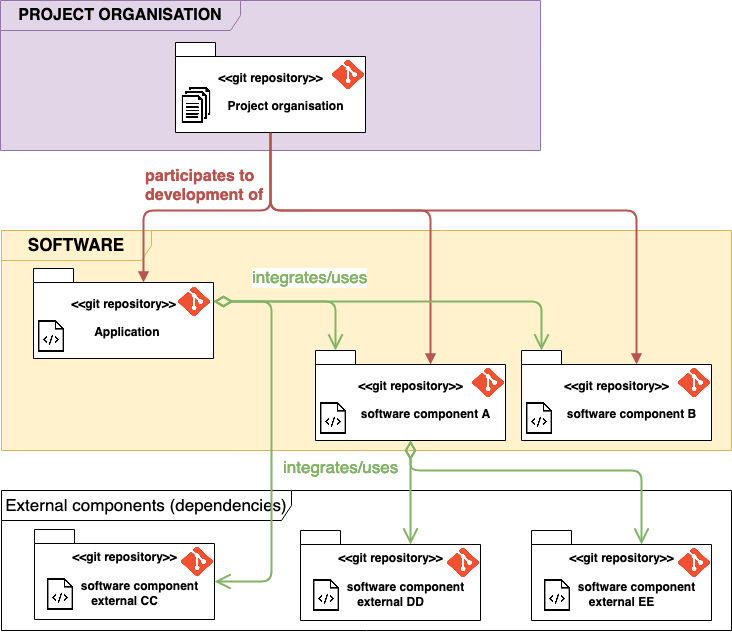

# Organizational logic of git repositories
The [VCityTeam organisation](https://github.com/VCityTeam) together with its partners
 * manages a [list of projects](https://github.com/VCityTeam/VCity/tree/master/Projects) which 
   requires the handling of information,
 * produces [software components](https://github.com/VCityTeam/UD-SV/tree/master/SoftwareComponents),
 * and handles all the above information (project artifacts and software) with git.

## Driving organizational principles
The good practices applied for the break down of the organisation information into git repositories is as follows
 * [separate concerns](https://en.wikipedia.org/wiki/Separation_of_concerns): 
    - keep project (managerial) information separated from software
    - keep confidential information (private) separated from public information
    - keep partners respective [IP](https://en.wikipedia.org/wiki/Intellectual_property) ownerships separated
 * Specifically for software components, 
    - promote [reusability](https://en.wikipedia.org/wiki/Reusability) 
      (among which [modularity](https://en.wikipedia.org/wiki/Modular_programming))
    - ownership (as [IP](https://en.wikipedia.org/wiki/Intellectual_property) notion) concerns 
      have precedence over modularity concerns. In other terms no matter what the modularity 
      concerns might be, each repository should have a single owner. And yes this might prove
      to have a heavy impact on software engineering costs...

## Breaking down into repositories
Independently from public/private seraparation concerns, the application of the above driving 
principles yields the following good practices for git repositories:
 * Create a repository for every project (managerial) information e.g. [this UD-SV project](/Readme.md)
   (in application of the [separation of concerns](https://en.wikipedia.org/wiki/Separation_of_concerns) managerial vs software)
 * **For every owner** (precedence of ownership over software engineering)
   - create a repository for every [(software) library](https://en.wikipedia.org/wiki/Library_(computing)) (e.g. [py3dtiles](https://github.com/VCityTeam/py3dtiles) which is a python library) or [(software) package] (e.g. [UD-Viz](https://github.com/VCityTeam/UD-Viz) is a JS package)...
   - create a repository for every [(software) application](https://en.wikipedia.org/wiki/Application_software) e.g. [UD-Viz-demo](https://github.com/VCityTeam/UD-Viz-demo) is an application demo based on UD-Viz
   - create a repository for every docker component e.g. [UD-Viz-demo-docker](https://github.com/VCityTeam/UD-Viz-demo-docker) (note that although `docker build` CAN use an URL of a git repository to designate a docker context but it can __NOT use the url of a sub-directory__ of git repository)
   - but a demo can be a **directory** (within a repository) usually holding a [docker-compose ](https://docs.docker.com/compose/) or an [helm chart](https://github.com/helm/helm)(located e.g. in [UD-Reproducibility/Demos](https://github.com/VCityTeam/UD-Reproducibility/tree/master/Demos) 

The above practices are summarized by the following illustration



## Relationships between project/software repositories
Project repositories and software repositories are in a [many-to-many](https://en.wikipedia.org/wiki/Cardinality_(data_modeling)#Application_program_modeling_approaches) (cardinality) relationship i.e.
 - a (software) component repository can be the results of one or many projects
 - a project repository uses one or many component repositories (library, application, demo)

This [many-to-many](https://en.wikipedia.org/wiki/Cardinality_(data_modeling)#Application_program_modeling_approaches) is illustrated by the following diagram


**Note**: in the above diagram software component `B` is co-developped by two projects that 
both share the same (legal) owner (respect precedence of ownership criteria of software 
modularity). Co-development here means single owner multiple project repository sharing (
co-developement). Shared ownership is hellish to handle (specially in the context of french
academia) and must be banned (at all costs).  

## Separation of public from private information
The organisation also applies the [separation of concerns](https://en.wikipedia.org/wiki/Separation_of_concerns) to the public vs private criteria.
This directly translates to the fact that private information (be it project or component) is held in private (git) repositories whereas public information (project or component) is kept in ...  public (git) repositories. For example
 - the [VCity project repository](https://github.com/VCityTeam/VCity/wiki/Projects) is private whereas the [UD-SV project repository](https://github.com/VCityTeam/UD-SV) is its public counterpart
 - [GMAOBIM software](https://github.com/VCityTeam/GMAOBIM) is a private software repository whereas [py3dTilers software repository](https://github.com/VCityTeam/py3dtilers) is a public repository

This can be summarized by the following illustration


## Concerning demos
**Definition**: A demo is an application dedicated to the illustration of a feature or a set of features. 
In general a demo
 - integrates one or many [software components](https://github.com/VCityTeam/UD-SV/tree/master/SoftwareComponents),
 - can provide some specific (to the demo) components
 - integrates demo specific data
 - various configuration elements (a scene description, position of the camera, pre-selected objects...)
 - uses external (to the project) services (e.g. accessing public data through well known web services)
 - deployment material (at least some documentation on how to deploy)

Each demo should have its own repository whose name is of the form 
`UD-Demo-<project_name>[-<illustrated_feature_name>][-<territory_name>]`
that should reflect the purpose and dependencies of that demo. 
For example 
 - the repository [UD-Demo-vcity-lods-lyon](https://github.com/VCityTeam/UD-Demo-vcity-lods-lyon) collects
   all the elements required for a demo realised by the `vcity` project, illustrating
   `lods` (Level Of Detail) related functionnality and using data related to the
   city (territory) of Lyon
 - a repository named `UD-Demo-DatAgora-PartDieu` (where the `<illustrated_feature_name>` was omitted) would
   collects all the elements required for a demo realised within the `DatAgora` project, illustrating
   some undocummented functionnality (since the `<illustrated_feature_name>` was omitted) and using data
   related to the `PartDieu` disctrict (territory) of Lyon

The general layout of a demo repository is of the form 
```
UD-Demo-MyProject-NiceFeature-SomeTerritory
    ├── Component1            # E.g. UD-Viz
    │   ├── DockerContext
    │   │   ├── Dockerfile    # Pulling SHA1 designated versions of UD-Viz
    │   │   ├── Patches
    │   │   ├── SomeSpecificConfiguration.html
    │   │   └── ...
    │   ├── Docs
    │   └── docker-build.sh   # Or ansible scripts...
    ├── Component2
    │   ├── DockerContext     # E.g. 3d-tiles-samples server
    │   ├── Data
    │   │   ├── pull-tileset-one.sh   # Pull from e.g. Zenodo
    │   │   └── recompute-tileset-two.sh
    │   └── docker-build.sh   # might call Data/pull-tileset-*.sh
    ├── DockerCompose.yml
    ├── HelmChart             # For a Kubernetes deployment
    │   └───  ...
    └── install.sh            # Might call Component[1|2]/docker-build.sh  
```
