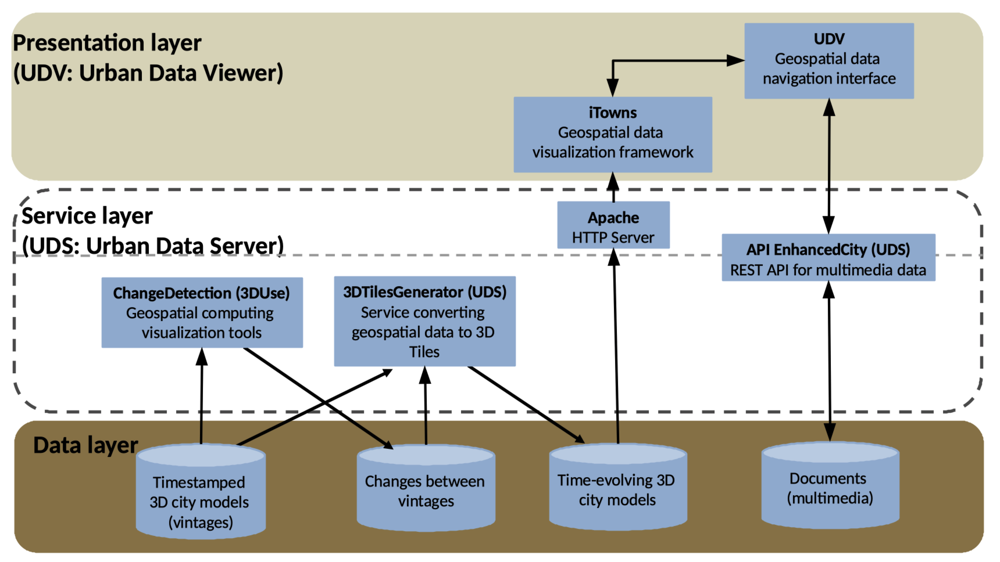

## Installation notes for Unix users

## For the impatient
Links to components installation notes
 * [(Frontend) UDV web client install notes ](#frontend-udv-web-client-install-notes)
 * [(Backend) 3DCityDB install notes](#backend-3dcitydb-install-notes)
 * [(Backend) UDV-server/API_Enhanced_City install notes](#backend-udv-serverapi_enhanced_city-install-notes)
 * [(Backend) CityTiler install notes](#backend-py3dtiles-install-notes)
 * [(Backend) 3dtiles web server: DESKTOP developing context](#backend-3dtiles-web-server-desktop-developing-context)
 * [(Backend) 3dtiles web server: OPERATIONS (stable server) context](#backend-3dtiles-web-server-operations-stable-server-context)
 
Links to Demos (using the above components)
 * [How to compute 3DTiles tileset and web visualize it](#how-to-compute-3dtiles-tileset-and-web-visualize-it)
 * [How to compute 3DTiles TEMPORAL tileset and web visualize it](#how-to-compute-3dtiles-temporal-tileset-and-web-visualize-it)
  
## General description
RICT offers a [set of web based online demos](http://rict.liris.cnrs.fr/UDVDemo-2/UDV/UDV-Core/) that illustrate various visualizations/applications on top city related data. Each such demo is achieved by quickly integrating some of the [free and open available software components](Doc/Devel/Architecture#components-names) (front or backend sides). The general architectural diagram goes (refer to the [architecture section](Doc/Devel/Architecture) for further details)

In order to install the [web based online demos](http://rict.liris.cnrs.fr/index.html) you will need to install some of the following software components

    - [UDV-server (install)](#install-udv-server): a set of city data treatments 
    - [py3dtiles (install)](#install-py3dtiles): the python wrapping of [3DTiles](https://github.com/AnalyticalGraphicsInc/3d-tiles) the tiled interchange format for geographical data 
    - [a 3dtiles web server (install)](#install-a-3dtiles-web-server): a web server of city data

The following documentation explains how to install and configure each of the respective components (or points to existing documentation). It also indicates how to assemble/integrate them in order to obtain the demos.
Depending on the demo you are trying to replicate (that you can then extend and customize to suit your needs) **you shall only need a subset of such components**.

The following demo specific docs illustrate how to install the required components corresponding to two use use-cases:
 * [3D urban data visualisation](#usecase-with-3d-data) use case,
 * [3D + time urban data visualisation](#usecase-with-3dtime-data) use case.

## Component quick description

### (Frontend) UDV web client install notes 
Urban Data Viewer (UDV) is a [WebGL](https://en.wikipedia.org/wiki/WebGL)/[iTowns](http://www.itowns-project.org/) based javascript web framework specialized for Uban Data (with a 3D geospatial description) visualisation. The installation of the [UDV web client](https://github.com/MEPP-team/UDV) and [its associated demos](http://rict.liris.cnrs.fr/UDVDemo-2/UDV/UDV-Core/) are [fully described UDV repository level](https://github.com/MEPP-team/UDV/blob/master/install.md).

### (Backend) 3DCityDB install notes
[3DCityDB](https://www.3dcitydb.org/3dcitydb/) (provided by [TUM](https://www.gis.bgu.tum.de/)) is a geographical database based on the CityGML conceptual model. The quick installation notes of a 3DCityDB database are [provided here](Install/Install3DCityDB.md).

### (Backend) UDV-server/API_Enhanced_City install notes
[API_Enhanced_City](https://github.com/MEPP-team/UDV-server/blob/master/API_Enhanced_City/INSTALL.md) is an [UDV-server](https://github.com/MEPP-team/UDV-server) sub-componennt that offers backend support to attach arbitrary types of documents to urban data. When needed proceed with [these API_Enhanced_City install notes](https://github.com/MEPP-team/UDV-server/blob/master/API_Enhanced_City/INSTALL.md).

### (Backend) CityTiler install notes
[Oslandia's Py3Dtiles](https://github.com/Oslandia/py3dtiles) component is a [Python](https://en.wikipedia.org/wiki/Python_(programming_language)) implementation of the [3DTiles data model](https://github.com/AnalyticalGraphicsInc/3d-tiles) the tiled interchange format for city geometrical data. You should use [RICT's fork of py3dtiles](https://github.com/MEPP-team/py3dtiles) and its [3dtiles-temporal-v2](https://github.com/MEPP-team/py3dtiles/blob/3dtiles-temporal-v2) that offers alternative/additionnal "Tilers" (treatments that build [3DTiles tilesets](https://github.com/AnalyticalGraphicsInc/3d-tiles) out of CityGML files or a 3DCityDB database.
The general [install notes](https://github.com/MEPP-team/py3dtiles/blob/3dtiles-temporal-v2/README.rst) should make it but you can also follow 
**Install**: make sure to follow [these detailed install note version](https://github.com/MEPP-team/py3dtiles/blob/Tiler/Tilers/CityTiler/Install.md) as opposed to the [default install notes](https://github.com/MEPP-team/py3dtiles/blob/3dtiles-temporal-v2/README.rst).
      
### (Backend) 3dtiles web server: DESKTOP developing context
In the context of development and if you need to handle over [3DTiles tilesets](https://github.com/AnalyticalGraphicsInc/3d-tiles) for your client to display then you can deploy a local (on your desktop computer) web server (the [node.js](https://nodejs.org/en/) based [3d-tiles-samples](https://github.com/AnalyticalGraphicsInc/3d-tiles-samples)): follow [these install notes](Install/Install3dTilesNodeBasedWebServer.md).

### (Backend) 3dtiles web server: OPERATIONS (stable server) context
In case you want to run a remote and stable web server (as opposed to the above described desktop deployment option) in order to handle over your [3DTiles tilesets](https://github.com/AnalyticalGraphicsInc/3d-tiles) you can use an [Apache](https://en.wikipedia.org/wiki/Apache_HTTP_Server) or an [Nginx](https://nginx.org/en/) http server.

In the [RICT](..) context, you can [quickly deploy an Apache web server on Debian](InstallDebianApacheServer.md).

## Demos based on above components

### How to compute 3DTiles tileset and web visualize it
Refer to the [installation notes](Install/InstallDemo3dTilesLyonViewer.md)

### How to compute 3DTiles TEMPORAL tileset and web visualize it
Refer to the [installation notes](Install/InstallDemo3dTilesTemporalLyonViewer.md) 
