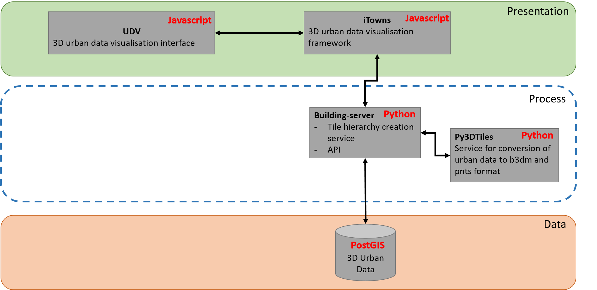

## Installation notes for Unix users

## For the impatient: links to components installation notes
 * [(Frontend) UDV web client install notes ](#frontend-udv-web-client-install-notes)
 * [(Backend) 3DCityDB install notes](#backend-3dcitydb-install-notes)
 * [(Backend) UDV-server/API_Enhanced_City install notes](#backend-udv-serverapi_enhanced_city-install-notes)
 * [(Backend) py3dtiles install notes](#backend-py3dtiles-install-notes)
 * [(Backend) 3dtiles DESKTOP web server install notes](Install/Install3dTilesNodeBasedWebServer.md)
 * [(Backend) 3dtiles web server install notes](#backend-3dtiles-web-server-install-notes)
  
## Introduction
RICT offers a [set of web based online demos](http://rict.liris.cnrs.fr/index.html) that illustrate various visualizations/applications on top city related data. Each such demo is achieved by quickly integrating some of the [free and open available software components](Doc/Devel/Architecture#components-names) (front or backend sides). The general architectural diagram goes (refer to the [architecture section](Doc/Devel/Architecture) for further details)



In order to install the [web based online demos](http://rict.liris.cnrs.fr/index.html) you will need to install some of the following software components
  - [Web client (install)](#client-install): a WebGL/[iTowns](http://www.itowns-project.org/) based javascript web framework for 3D geospatial data visualisation
  - Backend-side components
    - [3DCityDB (install)](#install-3dcitydb): a CityGML based geographical database
    - [UDV-server (install)](#install-udv-server): a set of city data treatments 
    - [py3dtiles (install)](#install-py3dtiles): the python wrapping of [3DTiles](https://github.com/AnalyticalGraphicsInc/3d-tiles) the tiled interchange format for geographical data 
    - [a 3dtiles web server (install)](#install-a-3dtiles-web-server): a web server of city data

The following documentation explains how to install and configure each of the respective components (or points to existing documentation). It also indicates how to assemble/integrate them in order to obtain the demos.
Depending on the demo you are trying to replicate (that you can then extend and customize to suit your needs) **you shall only need a subset of such components**.

The following demo specific docs illustrate how to install the required components corresponding to two use use-cases:
 * [3D urban data visualisation](#usecase-with-3d-data) use case,
 * [3D + time urban data visualisation](#usecase-with-3dtime-data) use case.

## Component quick description

### (Frontend) UDV web client install notes 
The installation of the [UDV web client](https://github.com/MEPP-team/UDV) and its associated demos (using the [iTowns](http://www.itowns-project.org/) is [fully described within the UDV repository](https://github.com/MEPP-team/UDV/blob/master/install.md).

### (Backend) 3DCityDB install notes
The installation notes of a 3DCityDB database are [provided here](Install/Install3DCityDB.md).

### (Backend) UDV-server/API_Enhanced_City install notes
[API_Enhanced_City](https://github.com/MEPP-team/UDV-server/blob/master/API_Enhanced_City/INSTALL.md) is an [UDV-server](https://github.com/MEPP-team/UDV-server) sub-componennt that offers backend support to attach arbitrary types of documents to urban data. When needed proceed with [these API_Enhanced_City install notes](https://github.com/MEPP-team/UDV-server/blob/master/API_Enhanced_City/INSTALL.md).

### (Backend) py3dtiles install notes
[Oslandia's Py3Dtiles](https://github.com/Oslandia/py3dtiles)) are the Python wrappings of [3DTiles](https://github.com/AnalyticalGraphicsInc/3d-tiles) the tiled interchange format for city geometrical data. You should use [RICT's fork of py3dtiles](https://github.com/MEPP-team/py3dtiles) and its [3dtiles-temporal-v2](https://github.com/MEPP-team/py3dtiles/blob/3dtiles-temporal-v2) that offers alternative/additionnal "Tilers" (treatments that build [3DTiles tilesets](https://github.com/AnalyticalGraphicsInc/3d-tiles) out of CityGML files or a 3DCityDB database.
The general [install notes](https://github.com/MEPP-team/py3dtiles/blob/3dtiles-temporal-v2/README.rst) should make it but you can also follow [these detailed install note version](InstallPy3dTiles-MeppTeamFork-Tilers.md).
      
### (Backend) 3dtiles DESKTOP web server
In the context of development and if you need to handle over [3DTiles tilesets](https://github.com/AnalyticalGraphicsInc/3d-tiles) for your client to display then you can deploy a local (on your desktop computer) web server (the ([node.js](https://nodejs.org/en/) based) [3d-tiles-samples](https://github.com/AnalyticalGraphicsInc/3d-tiles-samples)): follow [these install notes](Install/Install3dTilesNodeBasedWebServer.md).

### (Backend) 3dtiles web server install notes
In case you want to run a remote and stable web server (as opposed to the above described desktop deployment option) in order to handle over your [3DTiles tilesets](https://github.com/AnalyticalGraphicsInc/3d-tiles) you can use an [Apache](https://en.wikipedia.org/wiki/Apache_HTTP_Server) or an [Nginx](https://nginx.org/en/) http server.

In the [RICT](..) context, you can [quickly deploy an Apache web server on Debian](InstallDebianApacheServer.md).

## Using the above installed client/server

Now that you are done with all necessary installation, you can use these components with 3D or 3D+time data.

### Usecase with 3D data

##### Populate the database

If you followed the install step of 3DCityDB you already have 3D data uploaded into your database. If not, please refer to the end of [these install notes](Install/Install3DCityDB.md).

##### Create a materialized view of your data

In this step you will run `ExtractCityData` tool of `UDV-server`.

`cd UDV-server` and then follow [these instructions](https://github.com/MEPP-team/UDV-server#use).

*Note: run it without the -t option for this usecase*

##### Generate a 3d-tiles tileset

This steps allows to run `export_tileset` tool of py3dtiles component in order to generate a 3d-tiles tileset from the materialized view we just created.
`cd py3dtiles` and edit the `tools/export_tileset_conf.yml` to match your database configuration.

Activate venv and run `export_tileset` tool:
````
    . venv/bin/activate
    python tools/export_tileset -D tools/export_tileset_conf.yml
````

##### Launch a 3d-tiles-samples server for accessing your 3d-tiles tileset

Copy the tileset generated by py3dtiles into 3d-tiles-samples and run the server:
````
    cd path/to/3d-tiles-samples/tilesets
    mkdir 3DTileset
    cd path/to/py3dtiles/
    cp -a tiles/ tileset.json path/to/3d-tiles-samples/tilesets/3DTileset
    cd path/to/3d-tiles-samples/tilesets
    npm start
````

*Note: if you want your node server to be publicly accessible, you need to install install and run an Apache server as explained above.*

Check that your tileset is accessible by opening http://localhost:8003/tilesets/3DTileset/tileset.json in your web browser.

##### Launch UDV client

````
    cd UDV
````

(Optional section)
If you want to use UDV with your local tileset, then edit UDV building-server query: open `UDV/UDV-Core/examples/Demo.js` with your favorite editor and change the line `buildingServerRequest` to be http://localhost:8003/tilesets/3DTileset/tileset.json
(end of optional section)

````
    cd UDV-Core
    npm start
````

Launch your web browser and open http://localhost:8080/examples/Demo.html.

### Usecase with 3D+time data

##### Populate database

Insert 3D+time data to your 3DCityDB database. More information in
[these install notes](Install/Install3DCityDB.md).

##### Create a materialized view of your data

Run `ExtractCityData` tool of UDV-server with -t option:

`cd UDV-server` and then follow [these instructions](https://github.com/MEPP-team/UDV-server#use).

##### Generate a 3d-tiles tileset

This steps allows to run `export_tileset` tool of py3dtiles component in order to generate a 3d-tiles tileset extended for time data from the materialized view we just created.

`cd py3dtiles` and edit the `tools/export_tileset_conf.yml` to match your database configuration.

Activate venv and run `export_tileset` tool
````
    . venv/bin/activate
    python tools/export_tileset -D tools/export_tileset_conf.yml -t
````

##### Launch a 3d-tiles-samples server for accessing your 3d-tiles tileset

Copy the tileset generated by py3dtiles into 3d-tiles-samples and run the server:
````
    cd <path/to/3d-tiles-samples>/tilesets
    mkdir 4DTileset
    cd <path/to/py3dtiles/>
    cp -a tiles tileset.json <path/to/3d-tiles-samples>/tilesets/4DTileset
    cd <path/to/3d-tiles-samples>
    npm start
````

*Note: if you want your node server to be publicly accessible, you need to install install and run an Apache server as explained above.*

Check that your tileset is accessible by opening http://localhost:8003/tilesets/4DTileset/tileset.json in your web browser.

##### Launch UDV client

````
    cd UDV
````

(Optionnal) If you want to use UDV with your local tileset, then edit UDV building-server query:

open `UDV/UDV-Core/examples/Demo.js` with your favorite editor and change the
line `buildingServerRequest` to http://localhost:8003/tilesets/4DTileset/tileset.json

(end optionnal)

````
    cd UDV-Core
    npm start
````

Launch a web browser and open http://localhost:8080/examples/Demo.html .
