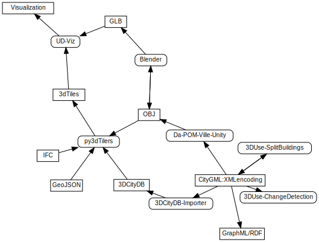

# Urban Data Services and Visualization (UD-SV) project

**Quick links**

* [Online demos](https://projet.liris.cnrs.fr/vcity/demos/)
* [Architecture](Architecture/Readme.md)
* [Developers' gateway](/ImplementationKnowHow/DevelopersCentral.md)

---

## Objective of the UD-SV project

UD-SV (Urban Data Services and Visualization) is a set of software components
dedicated to the **experimentation, exchange and sharing of both knowledge
and tools for the concrete handling of urban/city data** (that are based on
the [CityGML](https://en.wikipedia.org/wiki/CityGML) data model).

The UD-SV project adopts a practical approach and focuses on technical
specificities of the full city data flow starting from database integration
of raw data and ending in advanced visualizations of their downstream numerical
treatments. UD-SV adopts an open approach and favors:

* the adoption of mainstream standards of the urban modeling field
* the re-use (and possible improvement/evolution) of existing open source software components

In particular UD-SV focuses on the design and realization of

* a [backend](#aimed-backend-features):
  * an infrastructure enabling the storage of city related data,
  * an infrastructure for hosting and executing computational models (using the local backend data as well as online open data).  
* a [frontend](#aimed-frontend-features):
  * a simple interactive visualizer of the backend data
  * a computational model treatment handler (configure, trigger, explore results of a treatment)

A list of available/used components is [described in the Component section](https://github.com/VCityTeam/UD-SV/blob/master/SoftwareComponents/Readme.md).

### Technical manifesto

We believe that in order to succeed with data usage one must not separate data concerns (information models, database infrastructure) from the offered tools, treatment process and the associated methodology. Questions like how to migrate a database when the information model changes (e.g. from CityGML version 2 to version 3), how to deal with information model modularity and extensions, what are the interactions between data and their treatment or how does one handle data storage and computation scale up, must be dealt at first. UD-SV will try to propose good practices for doing so.

## Seeked backend/frontend features

### Aimed backend features

The aimed backend features could be:

* offer some [ETL tools](https://en.wikipedia.org/wiki/Extract,_transform,_load) starting from standard (or de facto standards used by mainstream crowd sourcing site like [OpenStreetMap](https://en.wikipedia.org/wiki/OpenStreetMap)) of City related data
* distributed logical data (?)
* abstract level data access (i.e. use accessor API that are directly derived out of [UML](https://en.wikipedia.org/wiki/Unified_Modeling_Language) expressed [information models](https://en.wikipedia.org/wiki/Information_model)  
* computational model execution engine

### Aimed frontend features

 The aimed frontend features could be:

* 3D visualization of a territory
* Use the [iTowns](http://www.itowns-project.org/) JS/WEBGL component (?)

---

### Alternative illustrations

Data formats and tools activity as a graph

Comp

