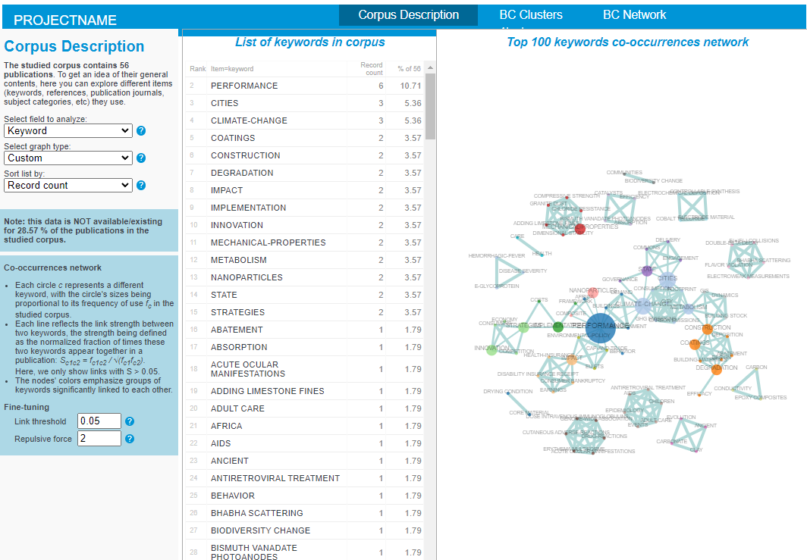
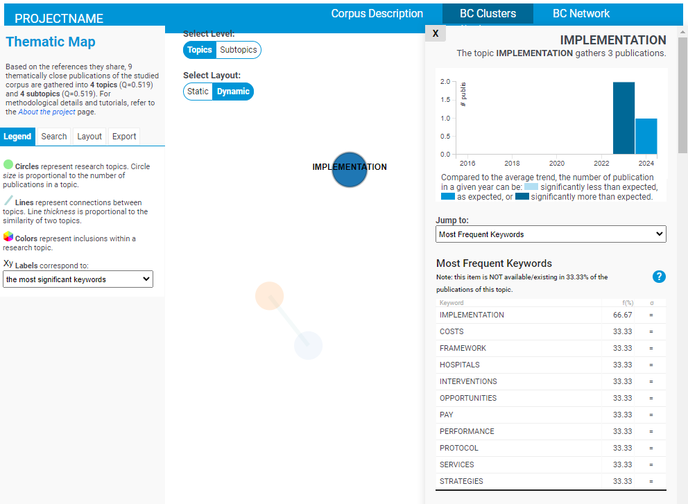

# BiblioTools / BiblioMaps notes <!-- omit in toc -->

[BiblioTools](https://www.sebastian-grauwin.com/bibliomaps/index.html) is a freely available set of scripts developed to create maps of science based on bibliographic data.

## Table of contents
- [Table of contents](#table-of-contents)
- [General notes](#general-notes)
- [Requirements](#requirements)
- [Technical limitations](#technical-limitations)
- [Installation notes](#installation-notes)
- [Visualization notes](#visualization-notes)
  - [Corpus description](#corpus-description)
  - [BC (Bibliographic Coupling) Clusters](#bc-bibliographic-coupling-clusters)
  - [BC Network](#bc-network)


> [!NOTE]
> - **BiblioTools** refers to a pythonic command line scripts for creating maps of bibliographic data
> - **BiblioMaps** is a web interface for BiblioTools


## General notes
- no license? But the following is mentioned
  > - Download the software and use it on your data.
  > - Download the software and edit / improve / expand the code as you see fit, if you are a motivated developper.
- BiblioMaps does not yet have a citation but BiblioTools does: https://link.springer.com/article/10.1007/s11192-011-0482-y
- No longer under development? No major updates since March 2018 according to main website
- Visualizations are done with d3.js
  - Graphs allow for dynamic and static positioning of nodes
  - Pie/bar charts and plots all have mousover tooltips
  - A repeatable structure is attempted for all types of data visualizations
    - This would maximise reuse of code and homogenize the user experience
    - This may not be applicable for every data visualization use-case

## Requirements
- Requires [WebOfScience](https://www.webofscience.com/wos/) (WoS) and/or [Scopus](https://www.scopus.com/home.uri) access which are available through **UCBL (SESAME) credentials**
  - See [this tutorial](https://www.sebastian-grauwin.com/bibliomaps/tutorials.html#EXT) for general instructions on data exportation
  - This tutorial may be slightly out of date. E.g., in the WoS instruction reference to "Output records" which is now labled "Export".
- No binary installer or executable, requires Python and command line to run
  - Installation instructions are available [here](https://www.sebastian-grauwin.com/bibliomaps/download.html)
- Minimal management of script input/output and local/public server hosting is also required for BiblioMaps data visualization

## Technical limitations
- [WebOfScience](https://www.webofscience.com/wos/) and [Scopus](https://www.scopus.com/home.uri) data is exported/imported manually

## Installation notes
- Results are stored under the [./BiblioTools](./BiblioTools) folder following the instructions mentioned in the [requirements section](#requirements)
  - BiblioTools3.2 is installed in [./BibioTools3.2](./BiblioTools3.2/) for the purposes of this documentation.
  - An initial [WoS export](./BiblioTools/rawdata/WoS_export.txt) (56 results) is used for this using this WoS query: `ALL=(City) AND ALL=(Durable) AND ALL=(Building) AND (ALL=(Innovative) OR ALL=(Innovation))`
- BiblioTools rejects "inadequate" records (e.g., missing publication year) by default
- BiblioMaps server files are stored in [./BiblioTools/server/](./BiblioTools/server/) following the tutorial linked in the BiblioMaps documentation.

Using a terminal with the same working directory as this document the following commands are run:
```bash
python BiblioTools3.2/all_in_one.py -i BiblioTools/rawdata -o BiblioTools/
# For this test answer 'y' to user input and '1' for cluster sizes when prompted
# Once the json/gephi files are extracted at the publication level input 'n' to end the script 
python BiblioTools3.2/biblio_coupling.py -i bibliotools -v
mkdir BiblioTools/server
cp -r BiblioTools3.2/BIBLIOMAPS_myprojectname/* BiblioTools/server
cp -r BiblioTools/freqs BiblioTools/server/data
cp -r BiblioTools/jsonfiles/* BiblioTools/server/data
```

To run a localhost server with python:
```bash
python -m http.server -d BiblioTools/server/
```

Navigate to [localhost:8000](http://localhost:8000) to see the visualization

> [!WARNING]
> After initial setup BC pages sometimes error with the following message:
> ```
> Uncaught ReferenceError: Awesomplete is not defined at bibliomap_BCclusters.js:28:19
> ```
> **Reloading the page** after a few seconds sometimes fixes this issue.
> This seems to be because the `awesomplete.js` file is loaded asyncronously (see line 11 of the [BCpublis.html](data\bibliotools\server\BCpublis.html) file).

> [!IMPORTANT]
> To have access to Bibliographic Coupling at the publication level, uncomment line 14 of the [headermenu.html](./BiblioTools/server/headermenu.html) file.
> This page will be accessible from [localhost:8000/BCpublis.html](http://localhost:8000/BCpublis.html)
> Also, a syntax error was found in the file [network_all_defaultVAR.json](./BiblioTools/server/data/network_all_defaultVAR.json).
> The `"DefinedPos"` value should be corrected to a 2D array using the following structure: 
> ```json
> "DefinedPos":[[0,20.00,10.00], [1,15.40,18.41], [25,19.91,8.68], [28,0.37,12.71], [13,19.07,14.20], [24,14.24,0.94], [46,5.68,19.02], [35,0.96,5.72], [41,0.13,8.41]]
> ```
> (Note that the 2D array values may be different when recalculated)

## Visualization notes

Three main pages are provided:
1. [Corpus description](#Corpus-description)
2. [BC (Bibliographic Coupling) Clusters](#bc-bibliographic-coupling-clusters)
3. [BC Network](#BC-Network)

### Corpus description

Displays general data visualizations of the corpus data.

All visualizations display some specialized data visualization on the right, and a table with the raw data in the middle of the interface.
This table can always be sorted by `Record count` or alphabetically by `Item` (record name)



**Proposed Visualizations by corpus data field**

|              Field |    Bar chart and Plot    | Pie chart | Word cloud |      Map       |    Graph     |
| -----------------: | :----------------------: | :-------: | :--------: | :------------: | :----------: |
|             Author |       :bar_chart:        |           |  :cloud:   |                |              |
|  Country/territory |       :bar_chart:        |           |            | :earth_africa: |              |
|      Document type | :bar_chart: (only plot)  |   :pie:   |            |                |              |
|        Institution |       :bar_chart:        |           |  :cloud:   |                |              |
|            Keyword |       :bar_chart:        |           |            |                | :spider_web: |
|           Language | :bar_chart:  (only plot) |   :pie:   |            |                |              |
| Publication source | :bar_chart:  (only plot) |           |  :cloud:   |                |              |
|   Publication year |       :bar_chart:        |           |            |                |              |
|          Reference |       :bar_chart:        |           |            |                | :spider_web: |
|   Reference source |       :bar_chart:        |           |            |                | :spider_web: |
|   Subject category |       :bar_chart:        |           |            |                | :spider_web: |

### BC (Bibliographic Coupling) Clusters

Groups records into topics (clusters) and subtopicsbased on the shared references between records, then provides basic statistical analysis of each topic.
- Topics are visualized through a Graph :spider_web:
  - Node size represents the number of records in the topic
  - Link thickness represents the similarity between two topics 
- The following topic data are visualized through tables:
  - most frequent keywords
  - most subject subject categories
  - most frequent journal sources
  - most frequent countries
  - most frequent references
  - most frequent references' sources
  - most representative papers
  - most cited authors
- The following topic data are visualized through a bar chart
  - number of publications per year and if a year had above or below the average number of publications



### BC Network

Similar to [BC Clusters](#bc-bibliographic-coupling-clusters) but for individual records/publications without clusterization.
Little statistical analysis is displayed besides visualizing which records have attributes in common.
Records with common attribues are linked.
The following data are display for each record:
- authors
- keywords
- subject(s)
- journal
- type (article, conference proceedings, etc.)
- publication year
- country
- references


