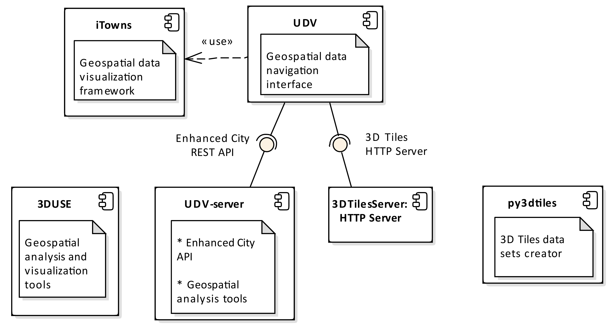

## Tools (software components) brief description
### Client side
[Urban Data Vizualisation (UD-Viz)](https://github.com/MEPP-team/UD-Viz) is a repository gathering [WebGL](https://en.wikipedia.org/wiki/WebGL), [iTowns](https://github.com/iTowns/itowns), javascript components dedicated to Uban Data (respecting the city specific [_CityGML_](http://www.citygml.org/) data model and as such with a 3D geospatial description) visualisation. The UD-Viz sub-components are regrouped in [UD-Viz/UD-Viz-Core](https://github.com/MEPP-team/UD-Viz/tree/master/UD-Viz-Core) and include
 - [UD-Viz/Guided Tour](https://github.com/MEPP-team/UD-Viz/tree/master/UD-Viz-Core/src/Modules/GuidedTour)
 - [UD-Viz/Temporal](https://github.com/MEPP-team/UD-Viz/tree/master/UD-Viz-Core/src/Modules/Temporal)
 - [UD-Viz/Documents](https://github.com/MEPP-team/UD-Viz/tree/master/UD-Viz-Core/src/Modules/Documents), [UD-Viz/DocumentComments](https://github.com/MEPP-team/UD-Viz/tree/master/UD-Viz-Core/src/Extensions/DocumentComments), [UD-Viz/DocumentValidation](https://github.com/MEPP-team/UD-Viz/tree/master/UD-Viz-Core/src/Extensions/DocumentValidation)
 - [UD-Viz/Crontibute](https://github.com/MEPP-team/UD-Viz/tree/master/UD-Viz-Core/src/Extensions/Contribute)
 - [UD-Viz/Authentication](https://github.com/MEPP-team/UD-Viz/tree/master/UD-Viz-Core/src/Extensions/Authentication)
 - [UD-Viz/Links](https://github.com/MEPP-team/UD-Viz/tree/master/UD-Viz-Core/src/Modules/Links)
 - [UD-Viz/Geocoding](https://github.com/MEPP-team/UD-Viz/tree/master/UD-Viz-Core/src/Extensions/Geocoding)

Third party components: 
 - [iTowns](https://github.com/iTowns/itowns)
      
### Backend 
 - [Urban Data Service (UD-Serv)](https://github.com/MEPP-team/UD-Serv) is a repository gathering backend support features and utilities
   * [UD-Serv/API_Enhanced_City](https://github.com/MEPP-team/UD-Serv/tree/master/API_Enhanced_City): enables to attach/serve various types of documents to urban data e.g.
     - "Documents" (file and metadata), 
     - Guided tours (sequences of documents with additional texts),
     - User accounts and associated rights,
     - "Links" (between documents and some city objects)
   * [UD-Serv/CityGML2Stripper](https://github.com/MEPP-team/UD-Serv/tree/master/Utils/CityGML2Stripper): a utility that strips a CityGML 2.0 (XML) file from its appearences and generic attributes features
   * [UD-Serv/CityGMLBuildingBlender](https://github.com/MEPP-team/UD-Serv/tree/master/Utils/CityGMLBuildingBlender): a utility that merges a set of CityGML into a single CityGML resulting file
 - [City Tilers](https://github.com/MEPP-team/py3dtiles/tree/Tiler/Tilers/CityTiler): various algorithms computing [3dTiles tilesets](https://github.com/AnalyticalGraphicsInc/3d-tiles) (e.g. [City Temporal Tiler](https://github.com/MEPP-team/py3dtiles/blob/Tiler/Tilers/CityTiler/CityTemporalTiler.py))
 - LibCityProcess: a library [repackaging 3DUse filters](https://github.com/MEPP-team/3DUSE/issues/39) as a separate component
   * [SplitBuilding](https://github.com/EricBoix/3DUSE/blob/master/src/utils/cmdline/splitCityGMLBuildings.cxx)
   * [ChangeDetection](https://github.com/EricBoix/3DUSE/blob/master/src/utils/cmdline/extractBuildingsConstructionDemolitionDates.cxx)
      
Third party components: 

 - [py3dtiles](https://github.com/MEPP-Team/py3dtiles/) : a fork of [Oslandia's py3dtiles](https://github.com/Oslandia/py3dtiles/) that is a [Python](https://en.wikipedia.org/wiki/Python_(programming_language)) implementation of the [3DTiles data model](https://github.com/AnalyticalGraphicsInc/3d-tiles) the tiled interchange format for city geometrical data.
 - [3DCityDB](https://www.3dcitydb.org/3dcitydb/) (provided by [TUM](https://www.lrg.tum.de/gis/startseite/)): a geographical database based on the CityGML conceptual model
 - [3DTiles samples](https://github.com/AnalyticalGraphicsInc/3d-tiles-samples): a [node.js](https://nodejs.org/en/) based simple file server (by Analytical Graphics Inc) used to web deliver [3dTiles tilesets](https://github.com/AnalyticalGraphicsInc/3d-tiles) (developing context)
 - [Apache](https://en.wikipedia.org/wiki/Apache_HTTP_Server) or [nginx](https://nginx.org/en/) http servers: used to web deliver [3dTiles tilesers](https://github.com/AnalyticalGraphicsInc/3d-tiles) (demo context)
 
### Data servers
  -  [Lyon Metropole open data "ortho-photo" (2009)](https://data.beta.grandlyon.com/fr/jeux-de-donnees/orthophotographie-2009-metropole-lyon/donnees): [WMS](https://en.wikipedia.org/wiki/Web_Map_Service), serving e.g. [such request](https://download.data.grandlyon.com/wms/grandlyon?SERVICE=WMS&REQUEST=GetMap&LAYERS=Ortho2009_vue_ensemble_16cm_CC46&VERSION=1.3.0&STYLES=&FORMAT=image/jpeg&TRANSPARENT=false&BBOX=1841306.75,5174961.00,1843030.13,5176364.50&CRS=EPSG:3946&WIDTH=256&HEIGHT=256)
  -  [Lyon Metropole open data elevation (2012)](https://data.beta.grandlyon.com/fr/jeux-de-donnees/image-relief-2012-metropole-lyon/donnees): [WMS](https://en.wikipedia.org/wiki/Web_Map_Service), serving e.g. [such request](https://download.data.grandlyon.com/wms/grandlyon?SERVICE=WMS&REQUEST=GetMap&LAYERS=MNT2012_Altitude_10m_CC46&VERSION=1.3.0&STYLES=&FORMAT=image/jpeg&TRANSPARENT=false&BBOX=1843030.13,5176364.50,1844753.50,5177768.00&CRS=EPSG:3946&WIDTH=256&HEIGHT=256)
  -  UD-SV's 3DTiles samples server: serving e.g. [such request](http://rict.liris.cnrs.fr/DataStore/TileSet_LyonFull_Villeurbanne_Bron_2015/tileset.json)

       
## Historical notes
Here is a list of aging/deprecated components
### Client side
 - [UD-Viz/EarlyPrototype](https://github.com/MEPP-team/UD-Viz/tree/master/EarlyPrototype) holds the first prototype version
 - Vilo3D: refers to an ancient [UD-Viz release tag](https://github.com/MEPP-team/UD-Viz/releases/tag/Vilo3D-Demo-1.0) used in the context of [Vilo3D project](http://imu.universite-lyon.fr/projet/vilo-3d-la-fabrique-urbaine-des-processus-a-leurs-representations-3d/) )
### Backend      
 - [building-server](https://github.com/MEPP-team/building-server/): a fork of [Oslandia's building-server](https://github.com/Oslandia/building-server/) that can be seen as API delivering 3DTiles (build with [py3dtiles](https://github.com/MEPP-Team/py3dtiles/)) and using a pre-computed index.
