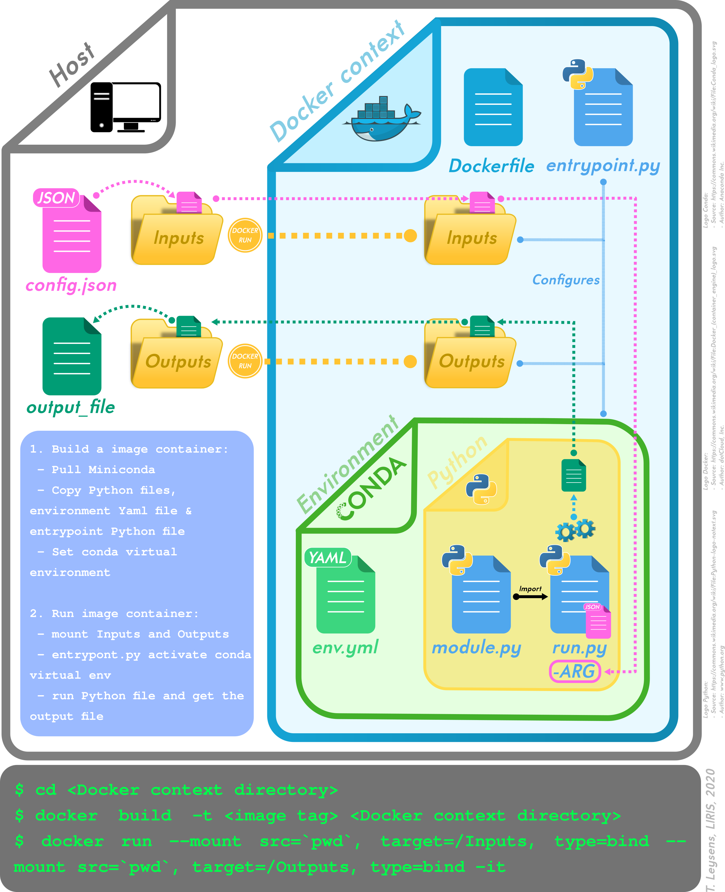

## Introduction
According to the 
[wikipedia introduction of Docker](https://en.wikipedia.org/wiki/Docker_(software))
```
   Docker is a set of platform as a service (PaaS) products that uses OS-level
virtualization to deliver software in packages called containers.
   Containers are isolated from one another and bundle their own software,
libraries and configuration files; they can communicate with each other
through well-defined channels. 
   All containers are run by a single operating system kernel and therefore
use fewer resources than virtual machines.
```
Note: Docker native OS is linux (on OSX you need a virtualization layer):


## Docker components 


* A **Docker image** is a file, comprised of multiple layers, that is used to execute code in a Docker container. An image is essentially built from the instructions for a complete and executable version of an application, which relies on the host OS kernel. When the Docker user runs an image, it can become one or multiple instances of that container. [Source](https://searchitoperations.techtarget.com/definition/Docker-image)

* **Registries** are images already created and available online (e.g. an image with python 3.6). 
  We can get these images with the docker daemon.

* **Containers** are executions of images.

## Building images
As stated in [Docker build command documentation](https://docs.docker.com/engine/reference/commandline/build/#extended-description):
```
The docker build command builds Docker images from a Dockerfile and a “context”. 
A build’s context is the set of files located in the specified PATH or URL.
The build process can refer to any of the files in the context.
```
Note: first thing to spot is the [Dockerfile](https://docs.docker.com/engine/reference/builder/)

Context examples:
 - Docker building context of [3DUse](https://github.com/EricBoix/3DUSE/tree/master/Docker) (provided within 3DUse sources hierarchy)
 - Docker building context of [Tum's 3dCityDB containerized version](https://github.com/tum-gis/3dcitydb-docker-postgis/tree/master/v4.0.2): and its [dockerfile](https://github.com/tum-gis/3dcitydb-docker-postgis/blob/master/v4.0.2/Dockerfile) (provided outside of [3DCityDB source hierarchy](https://github.com/3dcitydb/3dcitydb): hint, follow the [git clone](https://github.com/tum-gis/3dcitydb-docker-postgis/blob/master/v4.0.2/Dockerfile#L37))
 - Docker building context of [UD-geodecision](https://github.com/VCityTeam/UD-geodecision-docker/tree/master/FormatAndAnalyseRoofs/DockerContext) (and the associated [UD-geodecision)](https://github.com/VCityTeam/UD-geodecision) source)
  - [UD-Reproducitibility examples](https://github.com/VCityTeam/UD-Reproducibility/tree/master/Computations/3DTiles/LyonTemporal/Docker)
 
 **Docker volumes**:
 
 
 
 **Dockerfile's Entrypoint**: a place to "normalize"/document your API
 - An example of [entrypoint](https://github.com/VCityTeam/UD-geodecision-docker/blob/master/FormatAndAnalyseRoofs/DockerContext/Dockerfile#L44)
 - [entrypoint.py](https://github.com/VCityTeam/UD-geodecision-docker/blob/master/FormatAndAnalyseRoofs/DockerContext/entrypoint.py)
The following diagram tries to illustate the /Input, /Output good practice 
(don't forget the commands at the bottom)
 

## A command based walkthrough
* List images (in local repository): `docker images`
  - Delete all images: `docker rmi $(docker images -q)`
* List containers: `docker ps -a`
  - Stop all (running) containers: `docker stop $(docker ps -a -q)`
  - Remove all containers: `docker rm $(docker ps -a -q)`

**Run an interactive shell**
  - without entrypoint: `docker run -it <image> bash`
  - with entrypoint: `docker run -it --entrypoint /bin/bash <image>`
    [Watch out](https://medium.com/@oprearocks/how-to-properly-override-the-entrypoint-using-docker-run-2e081e5feb9d): the arguments get rejected at the end of the command `docker run --entrypoint "/bin/ls" debian -al /root`

**Space consumption**
 * `docker system df` : displays disk space used by docker 
 * `docker system prune`: removes dangling images, containers...
 * `docker images -f dangling=true` to list dangling images
    - `docker images purge` to remove dangling images
 * `docker volume ls -f dangling=true`: list dangling volumes
    - `docker volume prune`
 * `docker system prune && `
 
* Note: [Docker documentation](https://docs.docker.com/) is a good resource for more information.
 
 ## Missing things:
 Docker compose
   * Even when there is a single service, use a docker compose in order
     to save how you launch docker (that is leave traces for your docker
   run arguments)
