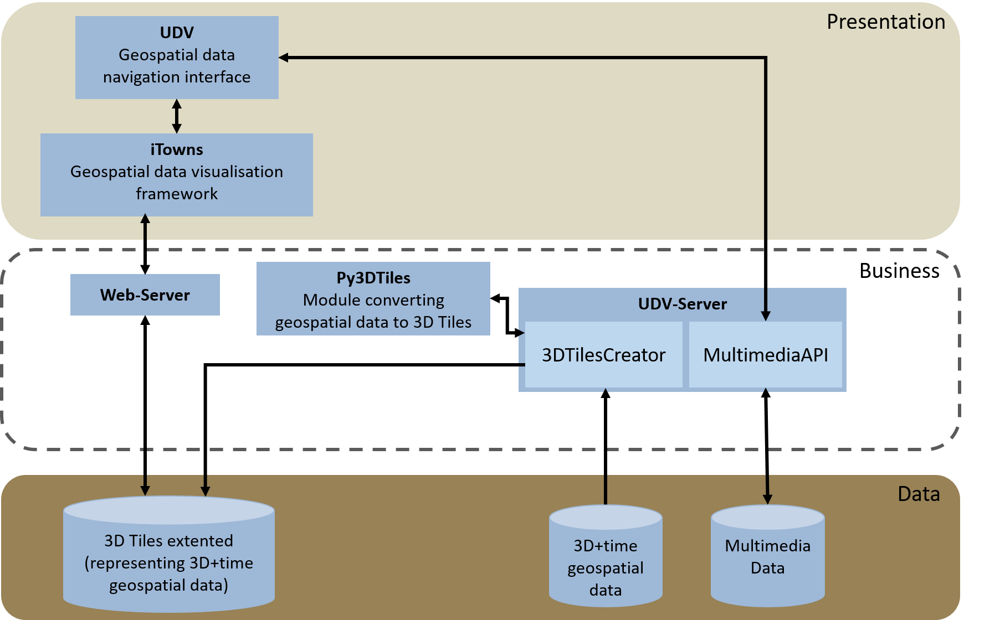

# Architecture of the application

Architecture and related diagrams regarding the whole application.

## Software architecture

### Software Architecture diagram (09/10/2018)

The following diagram present the current software architecture of our application, its component and associated technologies.

### Technical architecture diagram of Oslandia's developping context with iTowns (10/2017):

## Applicative architecture

### Applicative architecture (27/10/2017)

## Sequence diagrams

### Sequence diagram describing the current workflow when displaying a city using our application (without temporality)

The purpose of this sequence is to display a 3D urban area in a web client from a database containing georeferenced and standardized data.

### Sequence diagram of Application Setup and Navigation in a 3D representation of the city

This is an evolution of the previous diagram and is a short term target for our application. It is now separated in two parts : Application setup and  navigation in a 3D representation of the city. In comparison with the previous diagram, the 3d-tiles tileset and the b3dm tiles computations are done in a preprocess step. In addition, there is a new step at the beginning triggered by the signal buildView(viewAttributes). The Admin will now run a script to create a view on 3DCityDB. This view will contain each feature wanted in the dataset, its ids and any attribute related to the features that will be added in the b3dm files.

**Application Setup diagram:**[Puml source](Diagrams/ApplicationSetup.puml)

**Navigation in a City in 3D diagram:**[Puml source](Diagrams/3DNavigation.puml)

## Discussions

### Thick - Thin Client - server strategy

Our application uses a client / server strategy. We thus have to choose between different strategies: thick client - thin server (the client has a data model and most of the work is done client-side), medium client - medium server (the work is either done client-side or server-side depending on the application), thin client - thick server (most of the work is done server-side).

As we have different type of applications, data which has a complex structure (3DCityDB database based on CityGML standard) and because we don't want to either overload the client or the server, we choose a medium client - medium server strategy. This means that the work and the data are sometimes located client-side and sometimes located server-side. A rule to determine on which side  the work should be located is:
  * If it is an operation which is done on a regular basis (at every frame for example) or if it is something that influences the visualisation process, it is better to store the data associated client-side and to perform the operations client-side.
  * If it is an operation which is done only in some precise cases (e.g. display semantic data linked to building when picking them), it is better to
    * client-side: store the minimum of information allowing to retrieve all the information needed for running the operation and to run queries to the server when needed (with the same example, it is better to only send the id of the geometry of the database to the client and to run queries to get the semantic information when a building is picked by the user).
    * server-side: provide means (via an API) to retrieve the needed information from the database when asked by the client.

To sum up, view-independent computations are performed on the server-side and reused on the client-side while view-dependant computations are performed on the client-side.
