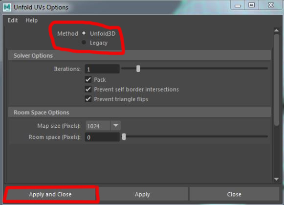
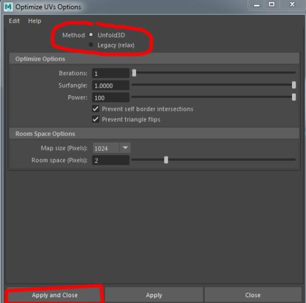

                                                       Maya Unwrapping
                                                     Step by step tutorial

**Objective**

In this tutorial we will go through the process of unwrapping in Maya 2017.

For this tutorial, we will go unwrap a dog.

  
           
                                              Final Preview

**Getting started**

Let’s get started. Go ahead and launch Maya if you do not already have it up and open your file. Inside you should see an unshaded dog.

                      *Figure 1*

**Setting Up a Checker Pattern**

A checker pattern? Why do we need a checker pattern? This checker pattern that we make will become a very important part of our 
unwrapping process. 
With the checker pattern we can visually see where stretching is occurring in our unwrap and easily fix the problem.

Go ahead and open the hypershade by going to “Windows" > Rendering Editor > Hypershade …” in the top menu of Maya. **(Figure 2)**

*Figure 2*

Once in the hypershade, right-click in the material slot, and "create > Materials > Lambert **(Figure 3)**

*Figure 3*

We want to make this pattern in the “Color” property. Click on the little square Color and on Checker. **(Figure 4)**

*Figure 4*

Now, you just have to click on your mesh and " Assign Existing Material " and the name of your material.
Don't forget to click on the button will show your material in the viewport. **(Figure 5)**

Looking at our model we can see that there is very bad stretching going on. **(Figure 5)**
We’re going to fix that.

*Figure 5*

***Unwrapping***

First and foremost we’re going to have to open our UV Editor. In the main menu of Maya on top, click on " UV > UV Editor".

This window contains all you UV information for your model. 
As you can see the UV layout is all over the place and it’s very hard to tell what is what. **(Figure 5)**

Trying to texture a layout like this will get you terrible results and bring lot of frustration. 
We’re going to be cleaning these up and setting them up in a way that you’ll be able to know exactly where everything 
is and make your texturing process a lot more simpler.

*Figure 5*

**Cut UV Edges**

We are going to create the seams directly on the dog, to cut the mesh, what will allow us to apply better the texture, 
and to render “Unfold 3D” easier and cleaner.

In Maya, it's very easy to create seams. You just have to select edges that you want like seams, and when you selected your edges,
in the UV Editor, click on "Cut UV Edges"
Tip: When you create your seams, the best way is to hide your seams where we see it least. For example, for the dog, we’ll create seams in the interior side of his body.

If you want to see your seams in the viewport, in the main menu in the top, click on "Display > Polygons > Texture Border Edges" and 
your seams will be in bold. **(Figure 6)**

    

*Figure 6*

When you ended your seams, you can pass in the Unfold3D mode.
In the UV Editor, click on Polygons and Unfold (click on the square to open parameters). **(Figure 7)**.

*Figure 7*

The method Maya uses to unfold UVs. Depending on the Method you select, different options display in the Unfold UVs Options window. 
Select from the following methods:

*Unfold3D*
(Default) Maya uses the Unfold3D algorithm. 
This method eliminates degeneracy and distortion, even at complex corners,in one unfold operation. 

*Legacy*
Maya uses the legacy unfold algorithm. A bias setting that determines the weighting between two unfold solver types: local and global.
When Weight Solver towards is set to 0, a local solver is used for the unfolding calculations.

For this tutorial, we'll use Unfold3D method.Don't change parameters and click on Apply and Close. **(Figure8)**.

*Figure 8"

Now, you can see on the UV Editor that your coordinates UVW changed.**(Figure 9)**
The result is almost perfect.
You just have to clean the mesh and reposition certain points to be able to texture more easily.

*Figure 9"

Like in 3ds max, you can relax or optimize your UV.
In the UV editor, click on "Polygons > Optimize" (on the square). **(Figure 10)**

*Figure 10"

As before, you can choose between 2 methods :  

  - Unfold 3D
  - Legacy (Relax)
  
Here, we'll use Unfold3D. Don't change parameters and click on Apply. Your UV's will change a little and relax the mesh.**(Figure12)**

  
  
  *Figure 12*
  

**Export UVW in Photoshop**

When you finished to clean/reposition the mesh, you can export your UV
Snapshot in Photoshop for texturing.

In the UV Editor, click on the tab “Polygons” and “UV Snapshot”. **(Figure 13)**

*Figure 13*

Now, you have the window “UV Snapshot” **(Figure 14)**
In this window, you can change the size of your image, or put a color on your edges.

*Figure 14*

You can save your file where you want. In jpg, png or tga.

You can import your photo in Photoshop and begin texturing.

