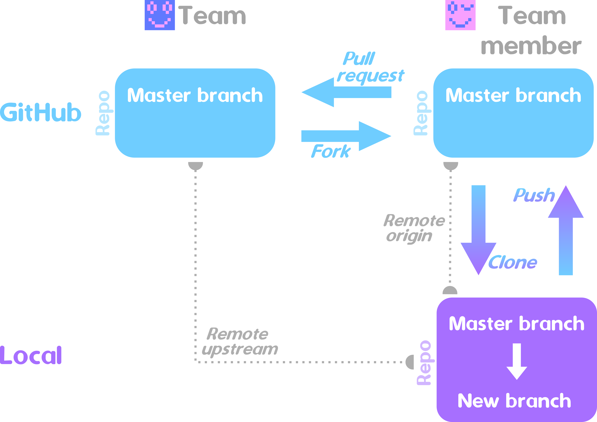

Note: [Schema svg source file SVG file](Image/DevelopersGithubCycleProcess.svg)

### Refrain from cloning the master: fork it instead
If you intend to contribute to any of the (Github) git repositories of the MUTS project (e.g. MEPP V2) it is **strongly advised to refrain from cloning the master**. [[Master is for integration, not development|http://www.kdgregory.com/index.php?page=scm.git]]. Instead, the recommended workflow goes like:
 1. start with a [`fork` of the concerned repository](https://help.github.com/articles/fork-a-repo/)
 1. work on your fork (by first cloning it and then pushing to it)
 1. [create a Pull Request](https://help.github.com/articles/creating-a-pull-request/) (PR)
 1. improve your branch until the associated [Travis CI](https://travis-ci.org/) tests (Linux gcc and clang) is OK (within the Pull Request tab,  assert that the colored dot on the right of your PR is green)
 1. ask the ["well known"](https://github.com/MEPP-team/MEPP2/wiki/Contributors) Windows (currently Vincent Vidal and Martial Tola) and Mac OSX (currently Martial Tola) testing persons to manually test your branch,
 1. kindly request a [benevolent](https://en.wikipedia.org/wiki/Benevolent_dictator_for_life) ["integration czar"](http://www.kdgregory.com/index.php?page=scm.git) to realize the merge with the master or request for changes

Note that the Windows test if often much more changeling than the OSX test but [your mileage may vary](https://en.wiktionary.org/wiki/your_mileage_may_vary).
Also note that volunteers for becoming a Windoze/OSX testing person are welcomed.

If you inadvertently forgot to fork and started with cloning the master (e.g. [MEPP V2](https://github.com/MEPP-team/MEPP2), you should:
 * isolate your wishful changes 
 * still realize the above described forking procedure
 * back port the changes you operated on your original master clone to your newly created fork

When not respecting the above workflow, the [benevolent](https://en.wikipedia.org/wiki/Benevolent_dictator_for_life) ["integration czar"](http://www.kdgregory.com/index.php?page=scm.git) will escalate the enforcement process: frowning upon, chastising, punishment, severe punishment, [cyanide](http://www.ctrl-c.liu.se/~ingvar/asr/lusers.html), banning (only for survivors of previous stage :-)

### Limit the [CI](https://en.wikipedia.org/wiki/Continuous_integration) rebuilds to _really_ useful repository updates
Because the git repository is hooked up with a [CI (Continuous Integration)](https://en.wikipedia.org/wiki/Continuous_integration) tool ([Travis](https://travis-ci.org/)) each commit triggers a rebuild. In order to avoid useless rebuilds (which will delay the useful ones), it is key to **inhibit Travis rebuilds when committing non functionnal changes** (e.g. doxygen or [mardown](https://en.wikipedia.org/wiki/Markdown) based documentation). This is even more important when commiting often...
In order [to do so, simply embed a](https://docs.travis-ci.com/user/customizing-the-build/#Skipping-a-build) `[ci skip]` string anywhere in you commit message.

### Submitting a Pull Request (PR)
When creating a PR, start the discussion with the following template:
```
 - [ ] Unit-test of your feature (ctest)
 - [ ] Doxygen documentation of the code completed (classes, methods, types, members...)
 - [ ] No build warnings raised (Travis, Appveyor)
 - [ ] All continuous integration tests pass (Travis, Appveyor)
 - [ ] Doxygen builds without new warnings
 - [ ] Coding Style(https://github.com/MEPP-team/VCity/wiki/Coding-Style) respected
 - [ ] Changes.md updated
```
Checkbox might have an `N/A` content (in addition to being empty or have an x).

Optionnal entries that you can add (nice to have):
 - [ ] User guide provided (Doxygen module page added or updated)
 - [ ] Design notes provided (as Doxygen module page?)
 - [ ] New entry in the ChangeLog.md added.

### Pull Request (PR) acceptance policy
A given Pull Request (PR) is handled over to a PR validator that will evaluate the submission which the following criteria:
 * all the items (**refer above**) of the PR submission template must be checked
 * the number of warnings (prior to the PR and after the PR) shall never increase (refer to list of [known and unavoidable](https://github.com/MEPP-team/VCity/wiki/CodingKnownWarnings))

The PR submitter/validator exchanges will be written on github's PR submission interface. It is nevertheless always encouraged, whenever if possible, to first exchange through informal conversations/discussions prior to leaving some written traces of the work to be done (in the form of short concrete items).

In order to avoid any [possible conflict of interest](https://en.wikipedia.org/wiki/Conflict_of_interest), and for a given PR, the submitter and the validator shall not be the same person.
