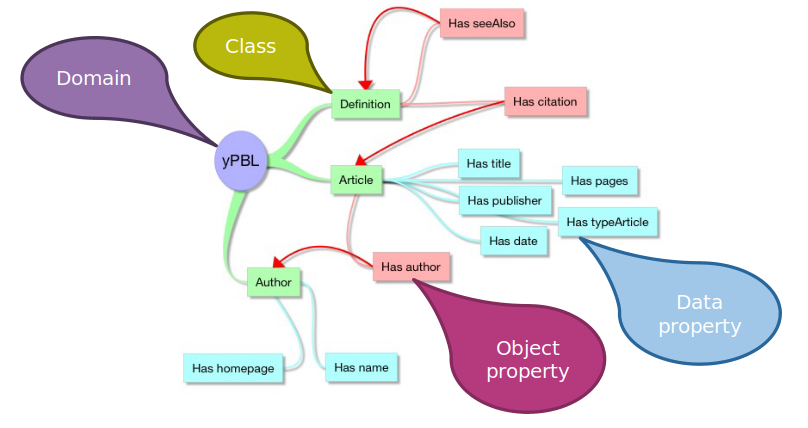
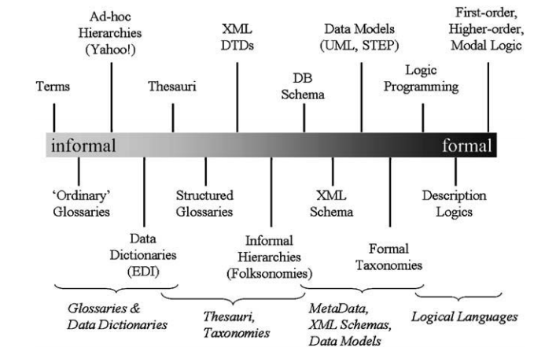
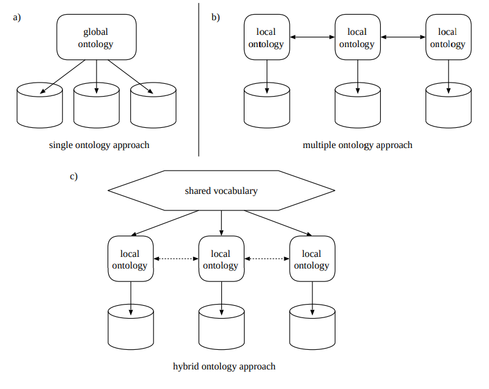
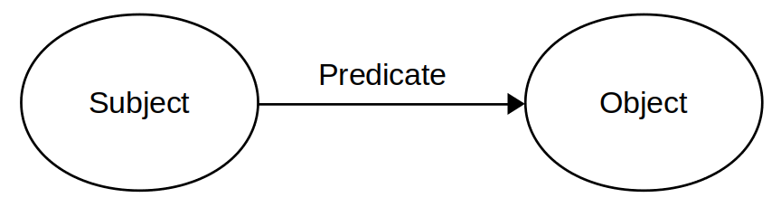

## Index
 * [Need](#Need)
 * [Requirement](#Requirement)
 ---

* [Ontology](#Ontology)
  * [Conceptualization](#Conceptualization)
  * [Formalization](#Formalization)
  * [Network of Ontologies](#Network-of-Ontologies)
  * [Ontology Matching](#Ontology-Matching)
    * [Alignment](#Alignment)
    * [Correspondence](#Correspondence)
* [The Semantic Web](#Semantic-Web)
  * [Linked Data](#Linked-Data)
  * [Semantic Web Stack](#Semantic-Web-Stack)
    * [Uniform Resource Identifier](#Uniform-Resource-Identifier)
    * [Uniform Resource Locator](#Uniform-Resource-Locator)
    * [Internationalized Resource Identifier](#Internationalized-Resource-Identifier)
    * [Resource Description Framework (RDF)](#Resource-Description-Framework)
    * [Triple](#Triple)
    * [Web Ontology Language (OWL)](#Web-Ontology-Language)
    * [SPARQL Queries](#SPARQL)
    * [SPARQL Endpoint](#SPARQL-Endpoint)
    * [Triple Store](#Triple-Store)
* [Description Logic](#Description-Logic)
  * [Axiom](#Axiom)
  * [ABox](#ABox)
  * [TBox](#TBox)
  * [Individual](#Individual)
  * [Decidability](#Decidability)
  * [Expressivity](#Expressivity)
  * [Reasoning](#Reasoning)
---

- [CMMS](#cmms--computerized-maintenance-management-system-or-software)/ [EAM](#eam)
    1. [Equipment](#equipment)
    2. [Urban Object](#urban-object)
    3. [Equipment park](#equipment-park--fleet--pool)  / pool / fleet 
    4. [Site](#site)
    5. [AEC](#aec)

- [Process](#process): 
    1. [BIM](#bim---building-information-modelling)
    2. [CIM](#cim---city-information-modelling)

- [Conceptual Framework](#conceptual-framework) :
    1. [GIS](#gis---geographic-information-system)

- [Standard](#standard) :
    1. [WFS / WMS](#wfs--wms)
    2. [3DTiles](#3dtiles)

- Other : 
   1. [Features](#features)
   2. [Representation](#representation)
   3. [Symbology](#symbology)
   4. [Semiology](#semiology--semiotics)
   5. [Context](#context)
   6. [Environment](#environment)
   7. [Symbole](#symbole)
   8. [Contextual View](#contextual-view)
   9. [Event](#event)
---

Projet - Charlie Bessot
[Tuile](#Tuile)
[Texture](#Texture)
[Mesh](#Mesh)
[UVs](#UVs)
[Vertex](#Vertex)
[Atlas de texture](Atlas-de-texture)

---
### Need
**Definition**: a **need** or [feature](http://pmblog.accompa.com/2009/07/13/features-vs-requirements-requirements-management-basics/) is a set of related requirements that allows the user to satisfy a "business" objective or need.

Needs are thus high level requirements that **target general audience like management or project leader** and abstracts the technical details. For example
 * Need 1: "We need to offer web based access to city visualisation."
 * Need 2: "The portal of the system should list all the available city datas."
 
#### When, why and how to write a need
A need arises when formalizing new product ideas informally expressed during a brainstorm, overheard at a conference/meeting, or mentioned during discussions with product users. The main reason for formalizing a need ("ideas" can come from many sources, but needs cannot be written by the general audience) is to provide a support for discussing and assessing (political decision) the product evolutions opportunities. 

The key purpose of a need is thus to untangle the initial idea, its implicit/explicit assumptions about the solution a new answering feature would solve. A need must thus clearly express what problem it addresses (even though they are possibly many features or approaches that could solve it) as well as specify means to assess when it is solved. In other terms the questions to answer when writing a need are:
 * What problem are we trying to solve? (Why should we be doing this? What is the pain?)
 * Who are we trying to solve this problem for? (Who's pain would be relieved?)
 * How will we know if we succeed? (what is hoped outcome?) 

The description of a need should have the following items:
 * **Identifier**: a string of the form `N<integer_need_number>` e.g. `N042`.
 * **User story**: a suggestive one liner description in the form "As a [role], I want to [do something] so that [reason/benefit]".
 * **Beneficiary role**: the role (researcher, developper, operations) that would directly benefit from the realisation of the need. 
 * **Impact**: choose among critical (project maker), major (would have heavy/significant benefits) or minor (nice to have).
 * **Maturity**: choose among immature, ongoing, mature, complete. (Note: this express the maturity of the need and not of the realization of the need).
 * **Cost evaluation**: some ball park estimation in man weeks or man months for its full realization (requirements, designs, implementation, tests, packaging, integration, documentation).
 * **Tags or keywords**: be them known (client, server, database) or not already mentioned (user experience...).
 * Once realization of the need started add **a link to the possibly ongoing issues** realizing part of/the whole concerned need. Within the concerned issue don't forget to **cross link the realization issue to the upstream need**.

---

### Requirement
**Definition**: a **[requirement](http://pmblog.accompa.com/2009/07/13/features-vs-requirements-requirements-management-basics/)** is a capability that a product must possess or something a product must do in order to ultimately satisfy a customer need.

A requirement **targets a technical audience** as its readers, like engineers, developers, project manager and testers. Requirements might be described with a bias of a particular implementation and must outline and detail exactly **what needs to be delivered** (as a componennt of the product). For example:
 * Requirement 1: "The system (i.e. delivered system or product) shall be able to register a customer item through the specification of the following attributes: an textual ID (20 characters long), comments (2000 characters long) and its retail price (currency)."
 * Requirement 2: "The system shall be able to visualize up to 1024 building (for the 3D mode)." 

---

## Ontology
"A formal model that allows knowledge to be represented for a specific domain. An ontology describes the types of things that exist (classes), the relationships between them (properties) and the logical ways those classes and properties can be used together ([axioms](#axiom))."
- [OGC: Linked Data Glossary](https://www.w3.org/TR/ld-glossary/#ontology)

According to [What is an ontology? [Guarnio 2009]](https://link.springer.com/chapter/10.1007/978-3-540-92673-3_0), ontologies (precisely **computational** ontologies) can be considered a :
> [formal](#formalization), explicit specification of a shared [conceptualization](#conceptualization).

Also,

> ..., the degree to which an ontology specifies a [conceptualization](#conceptualization) depends 
> (1) on the richness of the domain of discourse;
> (2) on the richness of the vocabulary chosen;
> (3) on the axiomatization. In turn, the axiomatization depends on language expressiveness issues 



One of the most widely used languages for expressing ontologies is [Web Ontology Language (OWL)](#web-ontology-language).
[Protégé](https://protege.stanford.edu/) is a powerful open-source tool for visualizing and editing ontologies.

### Conceptualization
A conceptualization is an abstraction of a real-world concept, expressed by a vocabulary. [What is an ontology? [Guarnio 2009]](https://link.springer.com/chapter/10.1007/978-3-540-92673-3_0)

### Formalization
Formal under the context of ontologies refers to the "rigour" and "specificity" used to express [conceptualizations](#conceptualization)

Different languages approach formalization differently. Ontologies use very formal descriptions (like [description logics](#Description-Logic))



Source: [What is an ontology? [Guarnio 2009]](https://link.springer.com/chapter/10.1007/978-3-540-92673-3_0)

Formal languages are generally more [expressive](#expressivity) than informal languages.

### Network of Ontologies
Otherwise refered to as an _ontology network_. This is a collection of interlinked ontologies. This is often implemented in systems which require supporting knowledge from different domains of information.

The creation of links between ontologies is the definition of relationships (properties) between concepts (or classes) in each ontology. [Ontology matching](#ontology-matching) approachs can be used for defining and verifying these links.

There are 3 main types of ontology networks:
1. Single ontology - A monolithic global ontology is created to describe several domains of knowledge
2. Multiple ontology - Multiple local ontologies are created and linked to one another
3. Hybrid ontology - Similar to the multiple ontology approach but a common vocabulary is defined to interlink each local ontology. An [upper ontology](#upper-ontology) can be used as a common vocabulary for this purpose



Source: _Ontology-Based Integration of Information - A Survey of Existing Approaches_ by H. Wache, T. Vogele, U. Visser, H. Stuckenschmidt, G. Schuster, H. Neumann and S. Hubner

### Ontology Matching
The process of linking two ontologies by finding an [alignment](#alignment) between them. Read [J. Euzenat, Networks of ontologies and alignments](https://citeseerx.ist.psu.edu/viewdoc/download?doi=10.1.1.188.7281&rep=rep1&type=pdf) for a great introduction into ontology matching.

#### Alignment
A set of [correspondences](#Correspondence) between two ontologies.

#### Correspondence
A relationship (or property in OWL) between two entities (or classes in OWL) of two distinct ontologies. There are three main types of correspondences:
1. Equivalence, often denoted by `=` or `owl:equivalentClass` in OWL
2. Disjointness, often denoted by `⊥` or `owl:subClassOf` in OWL
3. Less general, often denoted by `≤` or `owl:subClassOf` in OWL

A correspondences can be described by [description logics](#description-logic) and [triples](#triple) in an ontology. 

## Semantic Web
A machine-processable web of data (or data web) built on the [semantic web stack](#semantic-web-stack) (or semantic web technologies) and [Linked Data](#linked-data). Coined by Tim Berners-Lee in 1999. Sometimes this is referred to as an extension of the World Wide Web.

### Linked Data
"A pattern for hyperlinking machine-readable data sets to each other using Semantic Web techniques, especially via the use of RDF and URIs... Linked Data is intended for access by both humans and machines. Linked Data uses the RDF family of standards for data interchange (e.g., RDF/XML, RDFa, Turtle) and query (SPARQL). If Linked Data is published on the public Web, it is generally called Linked Open Data"
- [OGC: Linked Data Glossary](https://www.w3.org/TR/ld-glossary/#linked-data)

The largest publicly available dataset of linked data is the [Linked Open Data Cloud](https://www.lod-cloud.net/). Other large LOD datasets include:
* [DBPedia](https://www.dbpedia.org/about/)
* [Wikidata](https://www.wikidata.org/wiki/Wikidata:Main_Page) - Wikipedia as LOD
* [GeoNames](https://www.geonames.org/) - Geographical data as LOD

Based on 3 principles:
1. All data should be identified by [Uniform Resource Identifiers (URIs)](#Uniform-Resource-Identifier)
2. Use HTTP URIs so that people can look up those identifiers.
3. Looking up an HTTP URI name should return useful data about a subject in a standard format
4. Any other subject which has a relationship with this subject should also be given a HTTP URI which can also be looked up

Achieving high LOD "quality" steps:
1. open data in any format
2. open data in a structured format (e.g. a Microsoft Excel file format .xsl)
3. open data in a non-proprietary format (e.g. comma-separated values .csv)
4. open data in [semantic web stack](#semantic-web-stack) formats 
5. All other steps and data is linked with other LOD sources
- [Tim Berners-Lee: Design Issues/Linked Data](https://www.w3.org/DesignIssues/LinkedData.html)

### Semantic Web Stack
The architecture of the [Semantic Web](#semantic-web) and [Linked Data](#linked-data) based on the international standards of the World Wide Web Consortium (W3C). 


The stack layers:
* Hypertext Web technologies:
  * [Internationalized Resource Identifier (IRI)](#Internationalized-Resource-Identifier), generalization of [Uniform Resource Identifiers (URI)](#Uniform-Resource-Identifier) for uniquely identifying semantic web resources
  * Unicode - International standard for encoding text in many international languages
  * XML - a markup language for creating documents composed of semi-structured data
* Standard Semantic Web technologies:
  * [Resource Description Framework (RDF)](#Resource-Description-Framework)
  * RDF Schema (RDFS) provides a basic vocabulary for RDF. Using RDFS enables the creation of hierarchies of classes and properties
  * [Web Ontology Language (OWL)](#Web-Ontology-Language) extends RDFS by adding [description logic](#description-logic) and more advanced constructs to describe the semantics of RDF statements (for example declaring constraints such as cardinality) in order to create [ontologies](#ontology)
  * Rule Interchange Format (RIF) used for describing relations that cannot be directly described using OWL's description logic
* [SPARQL Protocol and RDF Query Language (SPARQL)](#SPARQL)

#### Uniform-Resource-Identifier
"A global identifier standardized by joint action of the World Wide Web Consortium and Internet Engineering Task Force. A Uniform Resource Identifier (URI) may or may not be resolvable on the Web. URIs play a key role in enabling Linked Data. URIs can be used to uniquely identify virtually anything including a physical building or more abstract concepts such as colors."
- [W3C: Linked Data Glossary](https://www.w3.org/TR/ld-glossary/#uniform-resource-identifier)

#### Uniform-Resource-Locator
"A global identifier for Web resources standardized by joint action of the World Wide Web Consortium and Internet Engineering Task Force. A URL is resolvable on the Web and is commonly called a "Web address". All HTTP URLs are URIs however, not all URIs are URLs."
- [W3C: Linked Data Glossary](https://www.w3.org/TR/ld-glossary/#uniform-resource-locator)

#### Internationalized-Resource-Identifier
"A global identifier standardized by joint action of the World Wide Web Consortium and Internet Engineering Task Force. An IRI may or may not be resolvable on the Web. A generalization of URIs that allow characters from the Universal Character Set (Unicode). Slowly replacing URIs."
- [W3C: Linked Data Glossary](https://www.w3.org/TR/ld-glossary/#internationalized-resource-identifier)

#### Resource-Description-Framework
"The Resource Description Framework (RDF) is a framework for representing information in the Web. This document defines an abstract syntax (a data model) which serves to link all RDF-based languages and specifications. The abstract syntax has two key data structures: RDF graphs are sets of subject-predicate-object [triples](#triple), where the elements may be IRIs, blank nodes, or datatyped literals."
- [W3C: RDF 1.1 Concepts and Abstract Syntax](https://www.w3.org/TR/rdf11-concepts/)

RDF triples can be written with a variety of different languages and formats:
* [RDF/XML](https://www.w3.org/TR/2014/NOTE-rdf11-primer-20140624/#section-rdfxml) (XML syntax for RDF)
* Turtle family of RDF languages:
  * [N-Triples](https://www.w3.org/TR/2014/NOTE-rdf11-primer-20140624/#section-n-triples) - simple, line based format
  * [Turtle](https://www.w3.org/TR/2014/NOTE-rdf11-primer-20140624/#section-turtle) - easier to read but slightly harder to write
  * [TriG](https://www.w3.org/TR/2014/NOTE-rdf11-primer-20140624/#section-trig) - specify multiple graphs in one dataset
  * [N-Quads](https://www.w3.org/TR/2014/NOTE-rdf11-primer-20140624/#section-n-quads) - extension of N-Triples, adds a graph IRI to create a quad instead of a triple
* [JSON-LD](https://www.w3.org/TR/2014/NOTE-rdf11-primer-20140624/#section-json-ld) (JSON-based RDF syntax)
* [RDFa](https://www.w3.org/TR/2014/NOTE-rdf11-primer-20140624/#section-rdfa) (for HTML and XML embedding)

A simple RDF [triple](#triple) (expressed in Turtle):
```SQL
<http://example.com/exampleOntology#exampleSubject> <http://example.com/exampleOntology#examplePredicate> <http://example.com/exampleOntology#exampleObject> .
```
`PREFIX` statements can be used to create shortcuts for [URIs](#Uniform-Resource-Identifier). For example the previous RDF statement can be re-written as:
```
PREFIX ex: <http://example.com/exampleURI#>

ex:exampleSubject ex:examplePredicate ex:exampleObject .
```

For more information on RDF refer to the W3.org [RDF Primer document](https://www.w3.org/TR/rdf-primer/) and [RDF 1.1 Concepts and Abstract Syntax](https://www.w3.org/TR/rdf11-concepts/#dfn-rdf-triple)

#### Triple
A basic [RDF](#Resource-Description-Framework) data structure composed of three parts:
1. the subject, which is an IRI or a blank node; refers to who or what the RDF statement is about.
2. the predicate, which is an IRI; the middle term (the linkage, or "verb") in an RDF statement. For example, in the statement "Alice knows Bob" then "knows" is the predicate which connects "Alice" (the subject of the statement) to "Bob" (the object of the statement).
3. the object, which is an IRI, a literal or a blank node; the object is the final part of an RDF statement.



- [OGC: RDF 1.1 Concepts and Abstract Syntax](https://www.w3.org/TR/rdf11-concepts/#dfn-rdf-triple)

For example:
| Subject | Predicate | Object |
|---|---|---|
| #Mary | #is-a | #Person |
| #Mary | #has-age | 25 |

#### Web Ontology Language
Web ontology language (OWL) is a language that can be used to:
> "explicitly represent the meaning of terms in vocabularies and the relationships between those terms. This representation of terms and their interrelationships is called an [ontology](#ontology)."
These ontologies are intepretable by computers and thus [reasoners](#reasoning) can be used to inference new relationships between these terms. - [OWL Web Ontology Language Overview](https://www.w3.org/TR/owl-features/)

OWL uses the following structures to describe these concepts and relationships:
* Classes - describes a concept, idea, object, etc.
* properties - describes a relationship
  * ObjectProperty - describes a relationship between two classes
  * DatatypeProperty - describes a relationship between a class and a datatype
* [individual](#individual) - a real-world class instance 
* [description logics](#description-logic)

Each specification variant has its own level of [expressivity](#expressivity) and [decidability](#decidability):
* OWL Lite - least expressive, supports cardinality of 0 or 1. Useful for lightweight thesauri or taxonomies.
* OWL DL - maximum expressiveness while retaining decidability.
* OWL Full - designed to preserve more compatibility with RDFS at the cost of decidability. This provides the most expressivity but the lack of decidability means that [reasoners](#reasoning) cannot be used on OWL Full ontologies.

Note that every legal OWL Lite ontology is a legal OWL DL ontology and every legal OWL DL ontology is a legal OWL Full ontology.

For more information on OWL refer to the W3.org [OWL Web Ontology Language Overview](https://www.w3.org/TR/owl-features/)

#### SPARQL
SPARQL Protocol and RDF Query Language (SPARQL) 1.1 is a set of specifications that provide languages and protocols to query and manipulate RDF graph content on the Web or in an RDF store.
- [OGC: SPARQL 1.1 Overview](https://www.w3.org/TR/sparql11-overview/)

4 basic types of SPARQL queries can be executed on RDF graphs using a [SPARQL endpoint](#sparql-endpoint):
1. `SELECT` - return values from an endpoint in a table format
2. `CONSTRUCT` - return values from an endpoint as an RDF graph
3. `ASK` - return True or False based on if the query returns one or more triples or nothing
4. `DESCRIBE` - return an RDF graph from the endpoint determined by the endpoint itself

Each type of query also takes a `WHERE` statement (except for DESCRIBE where it is optional) composed of [triples](#triple) to restrict the query. Each triple statement must end with a `.`. Triples which share the same subject can use a `;` instead of a period for readability. Varables are prefixed by a `?`.

Example query to find the creation date and termination date of all buildings (based on the CityGML 3.0 conceptual model):
```SQL
PREFIX core: <http://www.opengis.net/citygml/3.0/core#>
PREFIX bldg: <http://www.opengis.net/citygml/building/3.0/building#>

SELECT ?building ?creationDate ?terminationDate
WHERE {
    ?building a bldg:Building ;
              core:creationDate    ?creationDate ;
              core:terminationDate ?terminationDate .
}
```
Note that in this query the first triple predicate `a` is a shortcut for `rdf:type`

See the [SPARQL 1.1 Query Language Specification Document](https://www.w3.org/TR/sparql11-query/) and [SPARQL 1.1 Overview](https://www.w3.org/TR/sparql11-overview/) for more details.

#### SPARQL Endpoint
A web service that accepts, computes, and returns results from [SPARQL queries](#SPARQL). These often work in conjunction with [Triple Stores](#triple-store).

Example SPARQL Endpoints:
* [GeoSPARQL (the website, not the SPARQL extention or the ontology)](http://www.geosparql.org/) based on the [Apache Jena Framework](https://jena.apache.org/)
* [dbpedia](https://dbpedia.org/sparql)

#### Triple Store
"A colloquial phrase for an RDF database that stores RDF [triples](#triple)".
- [OGC: Linked Data Glossary](https://www.w3.org/TR/ld-glossary/#triple-store)

Sometimes called an RDF-Store. Data stored in triples stores are often accessed using [SPARQL Endpoints](#SPARQL-endpoint).

Detailed triple store documentation can also be found [here](GeoTriples_Strabon_Parliament_Blazegraph)

## Description Logic
Description Logic (DL) is a family of knowledge representation languages with varying and adjustable expressivity. DL is used in artificial intelligence for formal reasoning on the concepts of an application domain. The Web Ontology Language (OWL) provides a standards-based way to exchange ontologies and includes a Description Logic semantics as well as an RDF based semantics.

A family of knowledge representation languages used to model concepts (classes), roles (properties), and [individuals](#individual). In the case of [ontologies](#ontology), Description Logics (DLs) are used to model domains of knowledge (e.g. knowledge about an area of research, industry, etc). DLs use [axioms](#axiom) to model knowledge and often divide axioms into two groups: a [TBox](#tbox) and an [ABox](#abox).

DLs have different [expressivity](#expressivity) which can affect their ability to express knowledge. This also changes their [decidability](#decidability) and complexity which are important factors when using [reasoners](#reasoning) to infer new axioms in a ontologies.

F. Baader, I. Horrocks, and U. Sattler, “Description Logics,” in Handbook on Ontologies, S. Staab and R. Studer, Eds. Berlin, Heidelberg: Springer, 2004, pp. 3–28. doi: 10.1007/978-3-540-24750-0_1.


### Axiom
A logical statement relating roles and/or concepts

### ABox
The ABox or Assertional Box of a DL model of knowledge is the group of [axioms](#axiom) that describe relationships between [individuals](#individual) and concepts 

e.g. `Mary is a Mother`

### TBox
The TBox or Terminological Box of a DL model of knowledge is the group of [axioms](#axiom) that describe relationships between concepts and roles

e.g. `Every Mother has a Daughter`

### Individual
An instance of a concept (class) or role (property)

### Decidability
In a logical system, such as a [Description Logic](#description-logic), the system is decidable if there exists an effective method for determining the answer to true/false or yes/no question. For example propositional logic is decidable because a truth table can answer any true/false question written with propositional logic.

### Expressivity
Expressivity or expressiveness is a characteristic of a language that describes its ability to specify [#conceptualizations](#conceptualization). Generally, more expressive languages are also less efficient to [reason](#reasoning) with. Some languages are so expressive that they are not [decidable](#Decidability) and cannot be reasoned upon.

### Reasoning
The process of infer new [axioms](#axiom) from a set of existing axioms. This is often performed with software called reasoners or semantic reasoners.

For example:
* If `Mary is a Mother`
* And `All Mothers are Women`
* We can infer that `Mary is a Woman`

---

## CMMS : Computerized Maintenance Management System (or Software)


FR: **Gestion de Maintenance Assistée par Ordinateur**


A Computerized Maintenance Management System (CMMS), also known as Computerized Maintenance Management Information System (CMMIS), is a software package that maintains a computer database of information about an organization's maintenance operations [1]. 
A CMMS aims to achieve two goals : 
- to help companies in managing their assets by storing information such as location, position, statistics, model and type ...
- to help maintenance workers by storing information such as documentation and comprehension of all available information about an asset

According to [2], a CMMS support the following capabilities :
- Resource and labor management: Track available employees and equipment certifications. Assign specific tasks and assemble crews. Organize shifts and manage pay rates.

- Asset registry: Store, access and share asset information

- Work order management

- Preventive maintenance

- Materials and inventory management

- Reporting, analysis and auditing : Analyze information to understand asset availability, performance trends, MRO inventory optimization and other information to support business decisions and gather and organize information for audits.


---
**Bib**: 
- [1] Cato, William; Mobley, Keith (2002). Computer-managed Maintenance Systems: A Step-by-step Guide to Effective Management of Maintenance, Labor, and Inventory. Butterworth-Heinemann. p. 33. ISBN 0-7506-7473-3.
- [2] https://www.ibm.com/topics/what-is-a-cmms
---
## EAM

From [IBM](https://www.ibm.com/topics/enterprise-asset-management) :
"Enterprise asset management (EAM) is a combination of software, systems and services used to maintain and control operational assets and equipment. The aim is to optimize the quality and utilization of assets throughout their lifecycle, increase productive uptime and reduce operational costs.

Enterprise asset management involves work management, asset maintenance, planning and scheduling, supply chain management and environmental, health and safety (EHS) initiatives."

## CMMS / EAM differences

Those two types of system have a lot of in common and are often used together to describe softwares. An EAM will often include the CMMS needs and capabilities.
The main notable difference between CMMS and EAM is that EAM offers a broader range of features. [Here](https://reliabilityweb.com/articles/entry/eam-and-cmms-know-the-difference#:~:text=A%20CMMS%20focuses%20on%20maintenance,starting%20with%20design%20and%20installation.) an interesting article on the difference between the two types. 

For information: CarlSource is described by CarlSoftware as a CMMS - AEM software.

### Equipment

FR: **Equipement**

Also known as Asset, equipment is a technical object belonging to a company and needs maintenance through time in order to efficiently work.


---

### Urban Object

FR: **Objet urbain** ou **Mobilier urbain**

According to [1], Urban Object can be defined as "All public or private objects or devices installed in the public space and related to a function or service offered by the community"

In our project, the scope of this term is not enough to regroup all of the assets that a company can own.
Also, through time, the term evolved and is usually used to refer to street furniture. In order to avoid any confusion, we will not use the term Urban Object in our project.

---
**bib**:
- [1] Annie Boyer, Élisabeth Rojat-Lefebvre, Aménager les espaces publics. Le mobilier urbain, Paris, éd. du Moniteur, 1994, 327 p. (ISBN 978-2-281-19084-7 et 2-281-19084-6), p. 20
---

### Equipment park / fleet / pool

FR: **Parc d'équipement**

Proposed definitions: An equipment park is the set of equipment / asset that one company manages.

---

### Site

Proposed definitions: A Site is a set of equipment / asset that one company manages. There are multiple sites in one equipment park 

---

### AEC

This acronym stands for Architecture, Engineering, and Construction in our project.

## Process

### BIM - building information modelling

ISO Description :  
- ISO 19650:2018: Organization and digitization of information about buildings and civil engineering works, including building information modelling -- Information management using building information modelling: 
  - Concepts and principles.
  - Delivery phase of the assets.
  - Operational phase of the assets.
  - Security-minded approach to information management.

- ISO 19650:2019 defines BIM as the use of a shared digital representation of a built asset to facilitate design, construction and operation processes to form a reliable basis for decisions.[31]

Used in the AEC industry, BIM is a process of creation, production, exchange, integration, visualization and exploitation of data during all the life cycle of an AEC construction. A BIM tool will often allow the creation of a digital twin of the construction, containing the geometry, relation and attributes of the object.

---
### CIM - City Information Modelling

CIM has no official definition to this day.
It can be seen as an evolution from GIS, where the main difference will be that the object, at a city scale, will evolve from physical object to relationnal object (example : with raster, we only know the place and id of each object). The objective here is to have a similar process as the BIM but for City Object in order to obtain information and relation between object to facilitate analysis, decision making, communication around urbanism.
 
---

## Framework

---
**bib** : 
---
### GIS - geographic information system

FR: **SIG** ou **système d'information géographique**

Esri : 

A geographic information system (GIS) is a framework for gathering, managing, and analyzing data. Rooted in the science of geography, GIS integrates many types of data. It analyzes spatial location and organizes layers of information into visualizations using maps and 3D scenes. ​With this unique capability, GIS reveals deeper insights into data, such as patterns, and situations—helping users make smarter decisions. 

United States Geological Survey : 

A Geographic Information System (GIS) is a computer system that analyzes and displays geographically referenced information. It uses data that is attached to a unique location.

---

## Standard 

### WFS / WMS

The  OGC  defined  several  Open  Web  Services  for  accessing  geographical  data.The  two  main  existing  servicing  are  the  Web  Feature  Services  (WFS)  and the  Web  Map  Services  (WMS).  Those  services  allows  to provide accesses to features.

---
### 3DTiles

Cesium : 

3D Tiles is an open specification for sharing, visu-alizing, fusing, and interacting with massive heterogenous 3Dgeospatial  content  across  desktop,  web,  and  mobile  applica-tions.

Documentation on 3D Tiles [here](https://github.com/VCityTeam/GMAOBIM/wiki/3D-tiles)


## Other : 

### Features

The starting point for modeling of geographic information. Abstraction of a real worldphenomenon [1]

---
**bib** : 
- [1] The  OpenGIS®  Abstract  Specification  Topic  6:   The  Coverage  Type  and  its  Subtypes - OGC

### Representation

In database : Data Representation refers to the form in which data is stored, processed, and transmitted

In Cumputers Graphic : Data visualization is an interdisciplinary field that deals with the graphic representation of data, where representation refers to an image, figure, symbol, sign, or geometry that represents a phenomenon, an idea, or a feature.

In order to avoid any confusion in our project, we will use 3D representation for the second definition.

--- 
### Symbology 

The use, study, or interpretation of symbols.

--- 

### Semiology / Semiotics
[Semiotics](https://www.britannica.com/science/semiotics), also called semiology, the study of signs and sign-using behavior.

The main difference between Symbology and Semiotics is that semiotics is the study of signs and symbols, especially as means of language or communication, where symbology is the study of symbols.

--- 

### Context 
--- 
[Definition](https://dictionary.cambridge.org/dictionary/english/context): the situation within which something exists or happens, and that can help explain it.

This situation contains surrounding and linked objects

### Environment
--- 
[Definition](https://www.dictionary.com/browse/environment): The aggregate of surrounding things, conditions, or influences; surroundings; milieu.

The environment of an asset can help to describe its context

### Symbole 
---
[Definition](https://www.larousse.fr/dictionnaires/francais/symbole/76051#Et4ePxSlt6MUO66Z.99): Signe figuratif, être animé ou chose, qui représente un concept, qui en est l'image, l'attribut, l'emblème.

### Contextual view
---
Own definition: View of an object that uses its context to help in its definition and comprehension. 

The view can be either from : 
- database: Result sets of a stored query
- graphic: visualization of 2D and 3D geometry representing objects

### Event
--- 
Own definition in CMMS : An object without representations, such as work orders or disorders, that is linked to an asset. It can be associated with a documentation.

---

Ici se trouve les différentes notions que j'ai pu aborder lors de la réalisation de mon projet. Il m'est arrivé de nombreuses fois de ne pas comprendre exactement ce que je devais faire car un ou plusieurs mots m'étaient inconnus. Cette page doit servir à rensegner toutes les personnes recherchant du vocabulaire en rappport avec l'informatique graphique. 

#### Tuile
Une tuile c'est un ensemble d'éléments (ici bâtiments) regroupés et traités ensembles. Ainsi on s'occupe d'une tuile directement au lieu de s'occuper de chaque élément individuellement. Il permet notamment de regrouper les éléments proche et de mieux gérer le parcours d'objet dans l'espace (voir [BVH](https://en.wikipedia.org/wiki/Bounding_volume_hierarchy))

#### Texture
Dans le domaine de la synthèse d'image, une texture est une image en deux dimensions (2D) que l'on va appliquer sur une surface (2D) ou un volume en trois dimensions (3D) de manière à habiller cette surface ou ce volume.

#### Mesh
IL s'agit de la représentation graphique en 3D d'un objet. La surface de l'objet est divisé en pleins de petits triangles, c'est ce que l'on appelle le maillage. Chaque point de cette représentation est un sommet de l'objet. Ils sont définis à l'aide d'une position, d'une normale et d'une coordonnée de texture.

#### UVs
Les sommets d'un objet ont des coordonnées spatiales, ainsi que des UVs (coordonnées de texture) qui permettent le bon positionnement d'une texture sur une face. C'est une relation entre les sommets de l'objet et les pixels de l'image (texture). Ces coordonnées sont comprises entre (0,0), le coin en bas à gauche d'une texture et (1,1), le coin en haute à droite.

#### Vertex
C'est le nom que l'on donne aux sommets des triangles (souvent se sont des triangles mais rien n'y oblige) qui composent un mesh.

#### Atlas de texture
Un atlas de texture c'est le regroupement de plusieurs textures misent côte à côte dans le but de simplifier l'exploitation de celles-ci par la suite. Il faut faire attention car les UV des sommets ne correspondent plus aux bons pixels de la texture (qui est en fait composée maintenant de plusieurs textures), il faut adapter les proportions grâce à un calcul.
