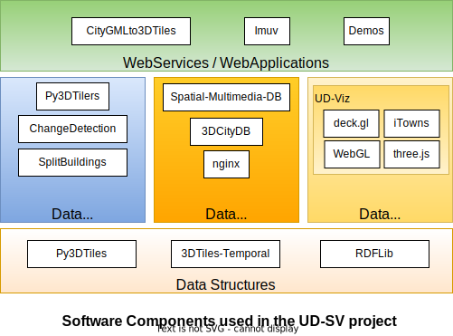

### With object and raw.githubusercontent.com : FAILS with nothing displayed
<object type="data:image/svg+xml" data="https://raw.githubusercontent.com/VCityTeam/UD-SV/master/SoftwareComponents/Diagrams/ComponentSortedByCategories.svg"></object>

### With object and relative path : FAILS with nothing displayed
<object type="data:image/svg+xml" data="/SoftwareComponents/Diagrams/ComponentSortedByCategories.svg"></object>

### With sanitize = true: FAILS image present but links are not clickable
As proposed by https://stackoverflow.com/questions/46381436/github-svg-not-rendering-at-all use sanitize=true

     
     
### With plain html img: FAILS image present but links are not clickable

